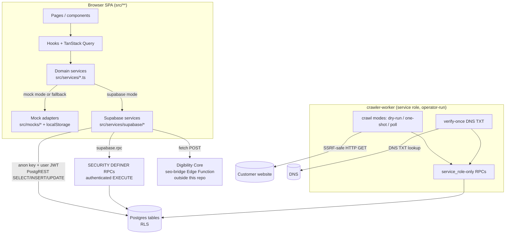
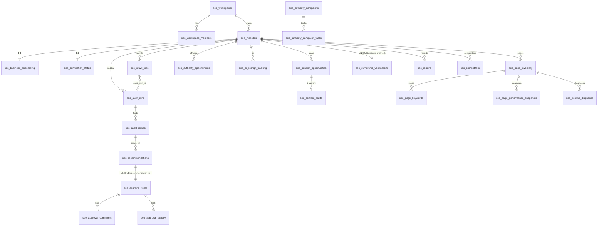
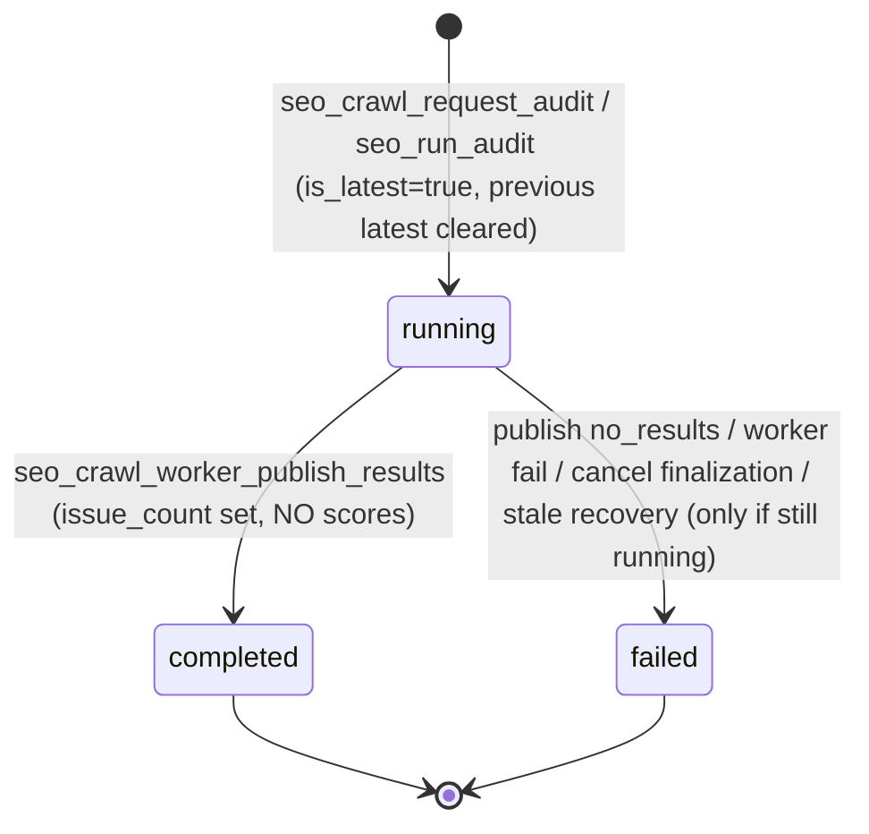
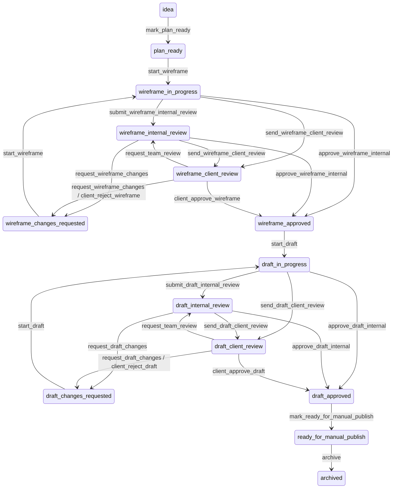

# Digibility SEO Module — Technical System Guide

> **Document type:** Canonical technical handover (companion to
> [`SEO_USER_PRODUCT_GUIDE.md`](SEO_USER_PRODUCT_GUIDE.md), abbreviated **UPG**).
> **Reconstructed from:** canonical `main` at `20bf76cbdab8b69e72966163d8b039ba502c37f1`
> (code/migration baseline `9cb3676`; later commits are documentation-only), by reading
> `src/**`, `crawler-worker/**`, all 42 files in `supabase/migrations/`, `supabase/test/**`,
> build/deploy files and the authoritative documentation package.
> **Written:** 2026-09-19. Local re-run during writing (read-only): root `vitest` **48/48
> pass**; `crawler-worker` `npm test` **74/74 pass**. No database, Supabase project or
> production system was contacted.
>
> **Evidence rule used throughout:** statements are derived from code/migrations/tests.
> Statements that come only from documentation are marked *(per docs)*. Anything that
> could not be proven is marked **UNKNOWN** or **UNVERIFIED**.
> **Status legend:** IMPLEMENTED · IMPLEMENTED — CONFIG/DATA DEPENDENT · MOCK/DEMO ·
> DESIGN ONLY · PLANNED · HISTORICAL/SUPERSEDED (definitions in UPG §0.1).

---

## Table of contents

1. [System purpose](#1-system-purpose)
2. [Current implementation status](#2-current-implementation-status)
3. [Technology stack](#3-technology-stack)
4. [Repository structure](#4-repository-structure)
5. [Architectural overview](#5-architectural-overview)
6. [Frontend architecture](#6-frontend-architecture)
7. [BFF / service-layer architecture](#7-bff--service-layer-architecture)
8. [Backend architecture](#8-backend-architecture)
9. [Database architecture and data map](#9-database-architecture-and-data-map)
10. [Authentication and authorization](#10-authentication-and-authorization)
11. [AI architecture](#11-ai-architecture)
12. [External data and integrations](#12-external-data-and-integrations)
13. [Background processing / workers](#13-background-processing--workers)
14. [Testing architecture](#14-testing-architecture)
15. [Deployment and environment model](#15-deployment-and-environment-model)
16. [Technical chains for every user action](#16-technical-chains-for-every-user-action)
17. [RPC / function catalog](#17-rpc--function-catalog)
18. [Permissions matrix](#18-permissions-matrix)
19. [State machines](#19-state-machines)
20. [Module-by-module technical map](#20-module-by-module-technical-map)
21. [End-to-end trace examples](#21-end-to-end-trace-examples)
22. [Business rules](#22-business-rules)
23. [Implementation status matrix](#23-implementation-status-matrix)
24. [System glossary](#24-system-glossary)
25. [Known gaps / unresolved items](#25-known-gaps--unresolved-items)
26. [How a Fresh Claude Agent Should Work on This Repository](#26-how-a-fresh-claude-agent-should-work-on-this-repository)

---

## 1. System purpose

A standalone SEO add-on for the Digibility platform that converts SEO findings into
approvable actions, scoped per workspace and per website, and designed to plug into the
main Digibility app later (shared identity via a cross-project SSO bridge). Hard product
rules enforced in code: every SEO record carries `website_id` + `website_url` snapshot;
nothing writes to a customer website/CMS; risky changes require human approval;
provenance is truthful (estimates labelled, unavailable areas reported as unavailable).

## 2. Current implementation status

| Area | State (canonical `main`) | Locked? |
|---|---|---|
| Frontend SPA, all 20 product routes | Present; every service has a mock adapter | — |
| Supabase schema | 42 migrations, 54 tables, 2 views, 59 functions, 1 storage bucket | — |
| Crawl control plane + worker + publishing (16C–16H) | IMPLEMENTED; worker not deployed | LOCKED |
| Domain ownership verification (P1a) | IMPLEMENTED; verify worker operator-run | LOCKED |
| Verified-only crawl enqueue (P1b) | IMPLEMENTED | LOCKED |
| Page Performance Tracker (read) | IMPLEMENTED — DATA DEPENDENT | LOCKED |
| Stage 6 Off-Page workflows + AI Visibility reads | IMPLEMENTED — DATA DEPENDENT | LOCKED |
| Reports v1 (read, generate, PDF) | IMPLEMENTED | LOCKED |
| Competitor Benchmarking (read + generate) | IMPLEMENTED (heuristic) | LOCKED |
| Recommendation Generation Stage 1 (backend) | IMPLEMENTED | LOCKED |
| Recommendation Generation Stage 2 (frontend) | IMPLEMENTED | LOCKED |
| Approval Queue, Content Studio, Decline Diagnosis read, Dashboard + Admin Preview, Website Setup, Business Onboarding, Technical Audit + Recommendations | IMPLEMENTED | **LOCKED under the general rule** — listed in `MODULE_LOCKS.md` "Other modules marked locked in `PROJECT_BOOTSTRAP.md`" (no formal per-file entry yet; no change without a proven defect + explicit approval) |
| Roadmap | Frontend MOCK/DEMO in every mode; **backend DESIGN ONLY** (plans → periods → items) | — |
| Expert Support Desk | MOCK/DEMO in every mode (no table) | — |
| Keyword Research, Content Gaps, Blog Briefs, Settings | PLANNED (placeholders) | — |
| AI/LLM | **None anywhere** | — |
| GSC/GA4/CMS/GBP integrations | PLANNED | — |
| Cross-project SSO | IMPLEMENTED IN SOURCE — CONFIG DEPENDENT; Core Edge Function outside repo, not deployed *(per docs)* | — |
| Environments | TEST `Digi_SEO_Test` only; 41/42 migrations recorded; `20260720121000` objects present but unrecorded *(per docs)*; **no production project, no rollout** | — |

(Authoritative current state: `SEO_CONTEXT_HANDOVER.md` §0. Lock registry:
`docs/markdown/MODULE_LOCKS.md`.)

## 3. Technology stack

| Layer | Technology (from `package.json` files) |
|---|---|
| Frontend | Vite 5, React 18, TypeScript 5, React Router 6, TanStack Query 5, Tailwind 3 + shadcn/Radix primitives (`src/components/ui/*`), lucide-react, jsPDF 4 (client PDF) |
| Data access | `@supabase/supabase-js` 2 (browser, anon key only) |
| Backend | Supabase Postgres (RLS, `SECURITY DEFINER` PL/pgSQL RPCs, triggers, views with `security_invoker`), Supabase Auth (GoTrue), Supabase Storage (private bucket, unused by UI) |
| Worker | Separate Node ≥20 package `crawler-worker/` (TypeScript via `tsx`), `@supabase/supabase-js` (service role), `node-html-parser`, `fast-xml-parser`, Node `dns`/`http(s)`/`zlib` |
| Tests | Vitest 3 (`src/**/*.test.ts`, node env); Node test runner for the worker; SQL verification scripts (`supabase/test/*.sql`) |
| Hosting (prepared, not deployed) | Docker multi-stage → nginx static SPA on Google Cloud Run; Cloud Build (`cloudbuild.yaml`) |

## 4. Repository structure

```
/                       Vite app root (package.json, vite.config.ts, index.html)
├─ src/
│  ├─ App.tsx, main.tsx          providers: QueryClient → Auth → ActiveWebsite → SessionSync → Router
│  ├─ routes/                    SeoRoutes.tsx (route table), ProtectedRoute.tsx, routeAccess.ts (+test)
│  ├─ config/runtimeConfig.ts    runtime (window.RUNTIME_CONFIG) / VITE_* config + data-mode resolution
│  ├─ integrations/supabase/     client.ts (anon-key client; placeholder URL when unconfigured)
│  ├─ contexts/                  AuthContext (session), ActiveWebsiteContext (localStorage id)
│  ├─ hooks/                     useSeoAccess, useResolvedActiveWebsite, useWebsiteCrawl,
│  │                             useOwnershipVerification, useSeoSignOut
│  ├─ services/                  domain services (mock/Supabase dispatch) — the "frontend BFF"
│  │  ├─ serviceAdapter.ts, dataMode.ts
│  │  └─ supabase/               Supabase implementations, table/RPC constants (supabaseTypes.ts)
│  ├─ mocks/                     mock adapters + seed data (persisted in localStorage)
│  ├─ lib/                       pure rules: approvalPermissions, safetyRules, crawlStatus,
│  │                             ownershipVerification, filters, localMockStore, supportLinking
│  ├─ pages/seo/**               product screens; pages/help/** Help Center screens
│  ├─ modules/seo-admin/**       admin preview shell
│  ├─ help/**                    Help Center content, search, validator
│  ├─ registry/                  moduleRegistry, navigationGroups, planRegistry, permissionRegistry
│  ├─ components/                layout (Sidebar, Header), auth route states, ui primitives
│  └─ types/**                   domain types
├─ crawler-worker/               isolated service-role worker (crawl + DNS ownership verify)
├─ supabase/migrations/          42 additive, immutable migrations (applied history)
├─ supabase/test/                TEST-only verification, rollback, seed and smoke SQL
├─ public/runtime-config.js      tracked runtime config (forces SEO_DATA_MODE "mock")
├─ Dockerfile, entrypoint.sh, nginx.conf, docker/, cloudbuild.yaml   container/hosting
├─ docs/                         docs/index.html (static HTML guide), docs/markdown/** (65 files)
└─ SEO_*.md                      authoritative package + design/planning/verification docs
```

There is **no** `supabase/functions/` directory: no Edge Function lives in this
repository. Several `*.bak` files (e.g. `src/pages/seo/WebsiteAuditPage.tsx.pre-audit-finalization-fix-20260715.bak`)
are tracked historical copies and are not imported by anything.

## 5. Architectural overview



Key properties: there is **no Node BFF**; the trusted boundary is Postgres (RLS +
guarded RPCs). The browser only ever holds the anon key. The service-role key exists only
in the worker's server-side environment.

## 6. Frontend architecture

### 6.1 Bootstrapping and providers
`src/main.tsx` renders `App` (`src/App.tsx`): `QueryClientProvider` → `AuthProvider`
(`src/contexts/AuthContext.tsx`, subscribes to `supabase.auth` session) →
`ActiveWebsiteProvider` (`src/contexts/ActiveWebsiteContext.tsx`, localStorage key
`seo_active_website_id`) → `SessionSync` (`src/components/auth/SessionSync.tsx`, clears
the query cache and active website when the user id changes A→B or A→null) →
`BrowserRouter` → `SeoRoutes`.

### 6.2 Routing and guards
`src/routes/SeoRoutes.tsx` defines public routes (`/seo/login`, `/seo/auth/bridge`,
`/seo/auth/logout`, `/help/*`), the shelled protected routes, dev-only routes
(`import.meta.env.DEV`) and a catch-all redirect to `/seo/dashboard`.
Exact count (re-derived from the file): **7 public** (3 auth + `/help`, `/help/search`,
`/help/category/:categorySlug`, `/help/article/:articleSlug`); **20 protected shelled pages**
(4 auth-only: dashboard, approvals, support, settings; 2 `allowSetup`: onboarding, websites;
13 `requireWebsite`: audit, keyword-research, competitor-analysis, content-gaps, blog-briefs,
content-studio, page-optimizer, page-performance, decline-diagnosis, off-page, ai-visibility,
roadmap, reports; 1 `requireGlobalAdmin`: admin-preview); **3 dev-only**
(`/seo/dev/supabase-readiness`, `/seo/dev/auth-test`, `/help/dev/content-check`); plus `/` →
`/seo/dashboard` and `*` → `/seo/dashboard` (the catch-all sits inside the shell, so an unknown
`/help/...` path also lands on the protected dashboard).
`ProtectedRoute` (`src/routes/ProtectedRoute.tsx`):
- **mock mode**: unconditional bypass;
- **supabase mode**: `useSeoAccess()` → `loading | no-session | no-module-access |
  no-workspace | error | ready`; `no-session` → `/seo/login?returnTo=<sanitized>`;
  `no-workspace` → render if `allowSetup` else `/seo/onboarding`; `requireGlobalAdmin`
  → `checkSeoGlobalAdmin()` RPC; `requireWebsite` → `useResolvedActiveWebsite()`, none →
  `/seo/websites`.
`routeAccess.ts` sanitizes return paths (must start `/seo/`, no `//`, `://`, `\`, `..`,
not login/bridge/logout) and builds Digibility login/logout-cascade URLs.

### 6.3 Access resolution (`src/hooks/useSeoAccess.ts`)
Session from `AuthContext` → `checkSeoModuleAccess()` (`has_seo_module_access` RPC,
staleTime 5 min) → `getCurrentSeoWorkspace()` (reads `seo_workspace_members` for
`status='active'` ordered by `created_at DESC LIMIT 1`, then `seo_workspaces`). Does
**not** resolve role; role gating is per page.

### 6.4 Active website (`src/hooks/useResolvedActiveWebsite.ts`)
Query key `["seo-websites", MOCK_WORKSPACE_ID]` → `websiteService.fetchWebsites()`. In
supabase mode the workspace argument is ignored and `fetchSupabaseWebsites()` calls
`getOrCreateDefaultSeoWorkspace()` (which may INSERT a workspace; §9.1). Auto-selects the
first website if the stored id is missing/stale. Four pages (Page Performance, Decline
Diagnosis, Off-Page, AI Visibility) add a supabase-mode "cross-workspace data search"
override (`findAccessibleWebsiteWith*Data()` in the respective Supabase services) that
iterates every workspace the user is an active member of (`listAccessibleSeoWorkspaces`) and
their websites, via a page-local `*OverrideWebsite` state (at most once per mount):
- **Page Performance** searches only when the active website's onboarding is completed and it
  has zero pages; it takes the **first** website found with snapshot rows.
- **Decline Diagnosis, Off-Page, AI Visibility** search when the active website has no rows
  **or its onboarding is not completed**; they take the website with the **most** rows. Because
  the onboarding query then targets the override website, this **bypasses the onboarding gate
  of the active website**, and Off-Page actions/role checks then operate on the override
  website's workspace.

### 6.5 Data mode resolution (`src/config/runtimeConfig.ts`)
Each config value is read from `window.RUNTIME_CONFIG` (injected by
`public/runtime-config.js` / container `entrypoint.sh`) and falls back to `VITE_*`.
`getSeoDataMode()`: unset/invalid → `mock`; `supabase` without URL+anon key → `mock`
(warning once). Config keys: `SUPABASE_URL`, `SUPABASE_ANON_KEY`, `SEO_DATA_MODE`,
`DIGIBILITY_APP_URL`, `DIGIBILITY_BRIDGE_URL`, `DIGIBILITY_ANON_KEY` (Vite equivalents
`VITE_SUPABASE_URL`, `VITE_SUPABASE_ANON_KEY`, `VITE_SEO_DATA_MODE`,
`VITE_DIGIBILITY_APP_URL`, `VITE_DIGIBILITY_BRIDGE_URL`, `VITE_DIGIBILITY_ANON_KEY`).
The tracked `public/runtime-config.js` sets `SEO_DATA_MODE: "mock"`; the container's
`entrypoint.sh` defaults to `"supabase"`. **Precedence matters:** `index.html` always loads
`/runtime-config.js`, and any non-empty runtime value wins over `VITE_*`. Because the tracked
file's `SEO_DATA_MODE` is the non-empty string `"mock"`, setting `VITE_SEO_DATA_MODE=supabase`
in `.env` alone does **not** enable live mode in `npm run dev`; the documented local procedure
(`SEO_LOCAL_DATABASE_SETUP.md` §8) is to edit `public/runtime-config.js` temporarily and revert
it byte-for-byte (it must stay `"mock"` with empty Supabase fields when committed). Empty
runtime values (the URL/keys in the tracked file) do fall back to `VITE_*`.

### 6.6 State layer conventions
TanStack Query with page-local `useQuery`/`useMutation`; mutations invalidate query keys
(for example `["seo-audits", websiteId]`, `["seo-recommendations", websiteId]`,
`["seo-approval-queue", websiteId, n]`, `["content-*", opportunityId]`). Polling only for
crawl status (4 s while non-terminal, `useWebsiteCrawlStatus`). Crawl and ownership query
keys include the user id.

### 6.7 Navigation and registries
`src/registry/moduleRegistry.ts` (17 modules; 15 `active`, 2 `later`),
`navigationGroups.ts` (7 groups + 5 extra items), `Sidebar.tsx` (desktop-only
`hidden md:block`; disclosure state in localStorage prefix `digibility_seo_nav:`).
`planRegistry.ts` (UI plan limits) and `permissionRegistry.ts` (a permission table that
**no screen consumes** — grep finds no importer other than itself).

### 6.8 UI role gating sources
- Real role: `getCurrentSeoRole(workspaceId)` (`seoWorkspaceService.ts`) used by crawl
  (`useCrawlRequestPermission`), ownership panel, Off-Page, Competitor and Recommendation
  generation — supabase mode only.
- Simulated role: `MOCK_CURRENT_ROLE = "owner"` (`src/mocks/mockContext.ts`) used by the
  Approval Queue `RoleSwitcher` initial value, Content Studio feedback, Support Desk.
- Pure rule tables: `lib/approvalPermissions.ts` (approval buttons), constants such as
  `CRAWL_REQUEST_ROLES`, `COMPETITOR_GENERATE_ROLES`, `RECOMMENDATION_GENERATE_ROLES`,
  `CAMPAIGN_SUBMIT_ROLES`.

### 6.9 File inventory (every tracked frontend source file — 276 files under `src/`, excluding `*.bak`)

Tracked `*.bak` files are excluded (historical copies, not imported). `components/ui/*` are
shadcn-style primitives. Page sub-components are rendered only by the page in the same
folder (e.g. `pages/seo/offpage/*` by `AuthorityBuilderPage`; `pages/seo/websites/*` by
`WebsiteCard`; `pages/help/*` by the Help routes; `modules/seo-admin/*` by
`SeoAdminPreviewPage`).

| Folder | Files |
|---|---|
| `src/` (root) | `App.tsx`, `main.tsx`, `index.css`, `vite-env.d.ts` |
| `src/config/` | `runtimeConfig.ts` |
| `src/contexts/` | `ActiveWebsiteContext.tsx`, `AuthContext.tsx` |
| `src/hooks/` | `useOwnershipVerification.ts`, `useResolvedActiveWebsite.ts`, `useSeoAccess.ts`, `useSeoSignOut.ts`, `useWebsiteCrawl.ts` |
| `src/integrations/supabase/` | `client.ts` |
| `src/lib/` | `approvalPermissions.ts`, `crawlStatus.ts`, `localMockStore.ts`, `mockAsync.ts`, `ownershipVerification.ts`, `pagePerformanceFilters.ts`, `roadmapFilters.ts`, `safetyRules.ts`, `supportLinking.ts`, `utils.ts` |
| `src/registry/` | `moduleRegistry.ts`, `navigationGroups.ts`, `permissionRegistry.ts` (unused), `planRegistry.ts` |
| `src/routes/` | `ProtectedRoute.tsx`, `SeoRoutes.tsx`, `routeAccess.ts`, `routeAccess.test.ts` |
| `src/components/auth/` | `RouteStates.tsx`, `SessionSync.tsx` |
| `src/components/layout/` | `Header.tsx`, `Layout.tsx`, `Sidebar.tsx` |
| `src/components/ui/` | `badge.tsx`, `button.tsx`, `card.tsx`, `input.tsx`, `label.tsx`, `select.tsx`, `separator.tsx`, `skeleton.tsx`, `textarea.tsx` |
| `src/help/` | `categories.ts`, `routes.ts`, `search.ts`, `synonyms.ts`, `types.ts`, `validate.ts` |
| `src/help/content/` | `academy.ts`, `crawl.ts`, `decline.ts`, `honesty.ts`, `index.ts`, `internal.ts`, `ownership.ts`, `setup.ts`, `startHere.ts`, `workflow.ts` |
| `src/mocks/` | `aiVisibilityMockData.ts`, `approvalMockData.ts`, `auditMockData.ts`, `businessOnboardingMockData.ts`, `competitorMockData.ts`, `contentStudioMockData.ts`, `crawlMockData.ts`, `dashboardMockData.ts`, `mockContext.ts`, `offPageMockData.ts`, `ownershipVerificationMockData.ts`, `performanceMockData.ts`, `recommendationMockData.ts`, `reportMockData.ts`, `roadmapMockData.ts`, `seoAdminMockData.ts`, `supportMockData.ts`, `websiteMockData.ts` |
| `src/modules/seo-admin/` | `SeoAdminShell.tsx`, `adminLabels.ts` |
| `src/modules/seo-admin/components/` | `AdminOperationsCard.tsx`, `AdminOperationsSections.tsx`, `AdminOverviewCards.tsx`, `AdminWebsiteDetailPanel.tsx`, `AdminWebsiteFilters.tsx`, `AdminWebsiteList.tsx` |
| `src/pages/help/` | `HelpArticlePage.tsx`, `HelpCategoryPage.tsx`, `HelpDevContentCheckPage.tsx`, `HelpHomePage.tsx`, `HelpNotFoundPage.tsx`, `HelpSearchPage.tsx`, `HelpShell.tsx` |
| `src/pages/help/components/` | `ArticleCard.tsx`, `BodyRenderer.tsx`, `CategoryCard.tsx`, `FeatureStatusBadge.tsx`, `HelpBreadcrumbs.tsx`, `HelpSearchBox.tsx`, `RelatedArticles.tsx`, `StillNeedHelp.tsx` |
| `src/pages/seo/` | `AiVisibilityPage.tsx`, `ApprovalQueuePage.tsx`, `AuthorityBuilderPage.tsx`, `BlogBriefsPage.tsx`, `BusinessOnboardingPage.tsx`, `CompetitorAnalysisPage.tsx`, `ContentGapsPage.tsx`, `ContentStudioPage.tsx`, `DeclineDiagnosisPage.tsx`, `ExpertSupportPage.tsx`, `KeywordResearchPage.tsx`, `ModulePlaceholderPage.tsx`, `PageOptimizerPage.tsx`, `PagePerformancePage.tsx`, `PlaceholderPage.tsx`, `ReportsPage.tsx`, `RoadmapPage.tsx`, `SeoAdminPreviewPage.tsx`, `SeoBridgePage.tsx`, `SeoDashboardPage.tsx`, `SeoLoginPage.tsx`, `SeoLogoutPage.tsx`, `SeoSettingsPage.tsx`, `WebsiteAuditPage.tsx`, `WebsiteCard.tsx`, `WebsiteConnectionHealth.tsx`, `WebsiteForm.tsx`, `WebsitesPage.tsx` |
| `src/pages/seo/ai-visibility/` | `AiContentGapCard.tsx`, `AiVisibilityHeader.tsx`, `BrandMentionCard.tsx`, `CompetitorMentionCard.tsx`, `PromptTrackingCard.tsx`, `aiVisibilityLabels.ts` |
| `src/pages/seo/approvals/` | `ApprovalFiltersBar.tsx`, `ApprovalItemCard.tsx`, `RoleSwitcher.tsx` |
| `src/pages/seo/audit/` | `AuditHeader.tsx`, `IssueCard.tsx`, `IssueCategorySummary.tsx`, `IssueSeveritySummary.tsx`, `RecommendationGenerationPanel.tsx` |
| `src/pages/seo/audit/crawl/` | `CrawlPanel.tsx`, `CrawlStatusBadge.tsx`, `CrawlStatusCard.tsx`, `StartCrawlControl.tsx` |
| `src/pages/seo/competitors/` | `BenchmarkComparisonSection.tsx`, `CompetitorCard.tsx`, `CompetitorGapSummary.tsx`, `CompetitorOverviewHeader.tsx`, `competitorLabels.ts` |
| `src/pages/seo/contentStudio/` | `CompetitorSummarySection.tsx`, `ContentOpportunityList.tsx`, `ContentStudioHeader.tsx`, `DraftReviewSection.tsx`, `FormatInputSection.tsx`, `KeywordPlanSection.tsx`, `PublishQueueSection.tsx`, `WireframeSection.tsx` |
| `src/pages/seo/dashboard/` | `AuthorityAiVisibilitySummaryCard.tsx`, `CompetitorRoadmapSummaryCard.tsx`, `DashboardHeader.tsx`, `PagePerformanceSummaryCard.tsx`, `PendingApprovalsCard.tsx`, `RecentActivityList.tsx`, `RecommendedNextStepCard.tsx`, `SetupChecklistCard.tsx`, `SupportReportsSummaryCard.tsx`, `TopPriorityFixes.tsx`, `VisibilityScoreCards.tsx` |
| `src/pages/seo/decline-diagnosis/` | `DiagnosisCard.tsx`, `RefreshRecommendationCard.tsx` |
| `src/pages/seo/dev/` | `SupabaseAuthTestPage.tsx`, `SupabaseReadinessPage.tsx` |
| `src/pages/seo/offpage/` | `AuthorityHeader.tsx`, `CampaignBuilder.tsx`, `CampaignList.tsx`, `OffPageFiltersBar.tsx`, `OpportunityCard.tsx`, `RoleGateTooltip.tsx`, `SpamRiskReviewSection.tsx`, `offPageLabels.ts` |
| `src/pages/seo/performance/` | `PageDetailPanel.tsx`, `PagePerformanceCard.tsx`, `PerformanceFiltersBar.tsx`, `PerformanceHeader.tsx`, `PerformanceSummaryCards.tsx`, `performanceLabels.ts` |
| `src/pages/seo/reports/` | `ReportExportActions.tsx`, `ReportHeader.tsx`, `ReportKeyStats.tsx`, `ReportPeriodSelector.tsx`, `ReportSectionCard.tsx`, `reportPdf.ts` |
| `src/pages/seo/roadmap/` | `RoadmapFiltersBar.tsx`, `RoadmapItemCard.tsx`, `RoadmapSummaryHeader.tsx`, `roadmapLabels.ts` |
| `src/pages/seo/shared/` | `SafetyNotice.tsx` |
| `src/pages/seo/support/` | `NewSupportRequestForm.tsx`, `SupportRequestCard.tsx`, `SupportSummaryHeader.tsx`, `supportLabels.ts` |
| `src/pages/seo/websites/` | `OwnershipVerificationPanel.tsx` |
| `src/services/` | `adminPreviewSummaryService.ts`, `aiVisibilityService.ts`, `approvalService.ts`, `auditService.ts`, `businessOnboardingService.ts`, `competitorService.test.ts`, `competitorService.ts`, `contentStudioService.ts`, `crawlService.ts`, `dashboardService.ts`, `dataMode.ts`, `offPageService.ts`, `ownershipVerificationService.ts`, `performanceService.ts`, `recommendationService.test.ts`, `recommendationService.ts`, `reportService.ts`, `roadmapService.ts`, `seoAdminService.ts`, `serviceAdapter.ts`, `supportService.ts`, `websiteService.ts` |
| `src/services/supabase/` | `seoAccessService.ts`, `seoAiVisibilitySupabaseService.ts`, `seoApprovalSupabaseService.ts`, `seoAuditSupabaseService.ts`, `seoBridgeService.test.ts`, `seoBridgeService.ts`, `seoBusinessOnboardingSupabaseService.ts`, `seoCompetitorSupabaseService.test.ts`, `seoCompetitorSupabaseService.ts`, `seoContentStudioSupabaseService.ts`, `seoCrawlSupabaseService.ts`, `seoDashboardSupabaseService.ts`, `seoDeclineDiagnosisSupabaseService.ts`, `seoOffPageAuthoritySupabaseService.ts`, `seoOwnershipVerificationSupabaseService.ts`, `seoPagePerformanceSupabaseService.ts`, `seoRecommendationSupabaseService.test.ts`, `seoRecommendationSupabaseService.ts`, `seoReportsSupabaseService.ts`, `seoWebsiteSupabaseService.ts`, `seoWorkspaceService.ts`, `supabaseDevAuthService.ts`, `supabaseErrors.ts`, `supabaseHealthService.ts`, `supabaseServiceUtils.ts`, `supabaseTypes.ts` |
| `src/types/` | `aiVisibility.ts`, `approval.ts`, `audit.ts`, `common.ts`, `competitor.ts`, `content.ts`, `crawl.ts`, `dashboard.ts`, `index.ts`, `module.ts`, `offpage.ts`, `onboarding.ts`, `ownershipVerification.ts`, `performance.ts`, `plan.ts`, `recommendation.ts`, `report.ts`, `roadmap.ts`, `role.ts`, `seoAdmin.ts`, `support.ts`, `website.ts` |

## 7. BFF / service-layer architecture

### 7.1 Intended model (per `SEO_PROJECT_CONTEXT.md` §4 and `SEO_DECISIONS.md` B1–B3)
There is **no Node BFF**. The "BFF" is split in two:
1. **Frontend service layer** (`src/services/*.ts`) — the only thing pages/hooks call.
   It chooses mock vs Supabase and hides data shapes.
2. **Trusted boundary inside Postgres** — RLS for reads; guarded `SECURITY DEFINER`
   RPCs for sensitive writes that resolve workspace/website/role server-side and accept
   minimal parameters.

### 7.2 Call layering (what may call what)

| Layer | Files | May call | Must not |
|---|---|---|---|
| Pages/components | `src/pages/**`, `src/modules/**` | domain services, hooks, pure `lib/*`, `getCurrentSeoRole` (read helper), `find*WithData()` helpers | the Supabase client directly |
| Hooks | `src/hooks/*` | domain services, Supabase access helpers (`seoAccessService`, `seoWorkspaceService`) | — |
| Domain services | `src/services/*.ts` | `runWithServiceAdapter` / write helpers, mock adapters, Supabase services, other domain services | — |
| Supabase services | `src/services/supabase/*.ts` (utilities: `supabaseServiceUtils.ts` — `requireAuthenticatedUser`, `requireValidUuid`, `safeSingle`, `safeList`; `supabaseErrors.ts` — error normalization; `supabaseTypes.ts` — table/RPC/bucket constants; dev-only `supabaseHealthService.ts`, `supabaseDevAuthService.ts`) | `supabase` client (anon), `SEO_TABLES`/`SEO_RPCS` constants | service-role credentials |
| Mock adapters | `src/mocks/*` via `lib/localMockStore.ts` | localStorage (prefix `digibility_seo_mock:`) | Supabase |

Deviations found (direct Supabase or bypass of the domain layer from UI code):
- `src/pages/seo/SeoLogoutPage.tsx` and `src/hooks/useSeoSignOut.ts` call
  `supabase.auth.signOut()` directly; `AuthContext` subscribes to `supabase.auth` directly.
- Pages import Supabase-layer helpers directly: `getCurrentSeoRole` (Audit, Competitor,
  Off-Page pages, ownership panel, crawl hook) and `findAccessibleWebsiteWith*Data`
  (Performance, Decline, Off-Page, AI Visibility pages). These bypass the mock/Supabase
  dispatcher (the pages guard them with `isSupabaseMode()`).
- Access/auth screens call Supabase-layer services directly (by design, no mock dispatcher):
  `SeoLoginPage` → `seoAccessService`, `SeoBridgePage` → `seoBridgeService`, `ProtectedRoute`
  and `useSeoAccess` → `seoAccessService`/`seoWorkspaceService`; `offpage/OpportunityCard.tsx`
  imports only a **type** (`AuthorityOpportunityTransitionAction`) from
  `seoOffPageAuthoritySupabaseService` (no runtime call).
- The dev harness `src/pages/seo/dev/SupabaseAuthTestPage.tsx` performs direct dev-only
  writes (dev builds only).

### 7.3 Dispatch helpers and the fallback matrix

`runWithServiceAdapter({label, mock, supabase, fallbackToMockOnError = true})`
(`src/services/serviceAdapter.ts`): if not in supabase mode (or config missing) → mock;
else run Supabase; **on any thrown error, fall back to mock unless
`fallbackToMockOnError: false`**. Non-masking write helpers (`runApprovalWrite`,
`runContentWrite`, `runOwnershipWrite`, `runAuthorityOpportunityWrite`,
`runAuthorityCampaignWrite`, `runAuthorityCampaignTransitionWrite`) rethrow only a
**specific typed error** raised when the RPC itself returns an error; any other error
(including the "no authenticated Supabase user" guard and plain PostgREST errors) still
falls back to mock.

| Service function(s) | Supabase path | On Supabase error |
|---|---|---|
| `websiteService.fetchWebsites/fetchWebsiteById/addWebsite` | `seoWebsiteSupabaseService` | **falls back to mock** |
| `businessOnboardingService.fetchOnboardingByWebsiteId/saveOnboarding` | `seoBusinessOnboardingSupabaseService` | **falls back to mock** |
| `auditService.fetchAudits/fetchLatestAudit/fetchAuditById/fetchIssuesForAudit/runAudit` | `seoAuditSupabaseService` | **falls back to mock** |
| `recommendationService.fetchRecommendations/fetchOnPageRecommendations/fetchRecommendationById` | `seoRecommendationSupabaseService` | **falls back to mock** |
| `recommendationService.generateRecommendations` | `generateSupabaseRecommendations` | throws (no fallback) |
| `recommendationService.generateRecommendationsFromAudit` | — | mock only (all modes) |
| `approvalService.fetchApprovalQueue/fetchApprovalItemById/ensureApprovalQueueGenerated` | `seoApprovalSupabaseService` | **falls back to mock** |
| `approvalService.updateApprovalItemFields/addApprovalComment` | RPC / direct UPDATE | RPC error → throws `ApprovalTransitionError`; direct-UPDATE error or auth guard → **mock** |
| `crawlService.*` (request, latest, publication, cancel) | `seoCrawlSupabaseService` | throws |
| `ownershipVerificationService.fetchOwnershipVerification` | RLS read | **falls back to mock** |
| `ownershipVerificationService.initiate/recheck/reverify/revoke` | Step 2A RPCs | RPC error → throws `OwnershipVerificationWriteError`; guard errors → **mock** |
| `dashboardService.fetchTopPriorityFixes/fetchPendingApprovalsSummary` | `seoDashboardSupabaseService` | **falls back to mock** |
| `dashboardService.fetchRecentActivity/logRecentActivity` | — | mock only (all modes) |
| `contentStudioService` reads + `createCustomContentOpportunity`, `generateWireframe`, `saveFormatInput`, `generateDraft`, `updateDraftSection`, `regenerateDraftSection` | `seoContentStudioSupabaseService` | **falls back to mock** (even a `ContentTransitionError` inside `generateWireframe`/`generateDraft`) |
| `contentStudioService.startContentPlan/approveWireframe/addDraftFeedback/updateContentStatus` | `seo_content_transition` RPC | RPC error → throws `ContentTransitionError`; others → **mock** |
| `performanceService.fetchPagePerformance/fetchPageDetail/fetchDeclineDiagnoses/fetchDiagnosisForPage` | Stage 4/5 services | **falls back to mock** |
| `performanceService.fetchRefreshRecommendations*`, `generateMockPerformanceRefresh` | — | mock only |
| `offPageService.fetchAuthorityOpportunities/fetchAuthorityCampaigns` | Stage 6 service | **falls back to mock** |
| `offPageService.transitionAuthorityOpportunity/createAuthorityCampaign/submit…/approve…/reject…/returnCampaignToDraft` | Stage 6 RPCs | typed RPC error → throws; others → **mock** |
| `aiVisibilityService` 4 reads | Stage 6 service | **falls back to mock** |
| `aiVisibilityService.updateAiVisibilityItemStatus`, `generateMockAiVisibilityRefresh` | — | mock only |
| `competitorService.fetchCompetitors/fetchCompetitorDetail/generateCompetitorBenchmarkData` | `seoCompetitorSupabaseService` | throws |
| `reportService.fetchProgressReports/fetchLatestProgressReport/fetchReportForExport/generateProgressReport` | `seoReportsSupabaseService` | throws |
| `roadmapService.*`, `supportService.*` | — | mock only (all modes) |

Derived (client-side computation over the above): `performanceService.fetchPerformanceSummary`,
`offPageService.fetchSpamRiskReview/fetchAuthorityOverview`,
`aiVisibilityService.fetchAiVisibilityOverview`,
`competitorService.fetchCompetitorOverview/fetchBenchmarkComparisons/fetchCompetitorGaps`,
`reportService.fetchReportForPeriod/fetchReportSections`,
`dashboardService.buildVisibilityScoreCards/buildSetupChecklist/resolveRecommendedNextStep`.

> **Architectural debt (demonstrable from code):** the default `fallbackToMockOnError =
> true` means a live-mode failure that **throws** (network error, PostgREST error, missing
> session, invalid UUID guard) on most reads and several writes silently renders or writes
> **mock sample data** (e.g., the sample "Acme Plumbing" websites) with only a single
> console warning per browser session (`logDataModeWarning` warns once, then is silent).
> Quantified (independently re-counted from `src/services/*.ts`): **31 live read functions
> fall back** (website 2, onboarding 1, audit 4, recommendation 3, approval 2, ownership 1,
> dashboard 2, content 6, performance/decline 4, off-page 2, AI visibility 4) versus **7 that
> do not** (`fetchLatestCrawl`, `fetchCrawlPublication`, `fetchCompetitors`,
> `fetchCompetitorDetail`, `fetchProgressReports`, `fetchLatestProgressReport`,
> `fetchReportForExport`). Fallback is per *operation*, not per service: e.g.
> `approvalService` reads fall back, its RPC transitions throw, its `suggested_change` edit
> falls back. An RLS *filter* (rows invisible to the caller) is **not** an error — it
> returns `[]`/no-op and never triggers fallback; an RLS `WITH CHECK` violation is an error
> and does. The authority docs' principle "never mask real backend failures with mock" is
> applied only to crawl, competitor, reports, recommendation generation, and the typed-error
> write paths.

### 7.4 Where business logic lives

| Logic | Location |
|---|---|
| Authorization (authoritative) | RLS policies + in-RPC role checks (Postgres) |
| Approval role/risk rules | `seo_approval_transition` (authoritative) and `lib/approvalPermissions.ts` (UI, stricter for team members) |
| Content workflow state machine | `seo_content_transition` (authoritative); app↔DB status mapping in `seoContentStudioSupabaseService.ts` |
| Off-page state machines | `seo_authority_opportunity_transition`, `seo_authority_campaign_transition` (authoritative); mirrored in `OpportunityCard.tsx` / `CampaignList.tsx` |
| Crawl lifecycle | 16C–16H RPCs + worker |
| Recommendation mapping/templates | `seo_recommendation_generate` (live); `mocks/recommendationMockData.ts` (mock, same mapping) |
| Competitor heuristic | `seo_competitor_generate` (live); `mocks/competitorMockData.ts` (mock) |
| Competitor 8-dimension comparison + gaps | **client-side** `competitorService.ts` |
| Report aggregation | `seo_report_generate` (live); `reportService.generateMockProgressReport` (mock) |
| Roadmap generation | **client-side only** `roadmapService.generateRoadmapFromFindings` |
| Content/keyword/wireframe/draft templates | **client-side** (`seoContentStudioSupabaseService.ts` and mock) — persisted via direct table writes |
| Page status derivation (movement/content) | client (`seoPagePerformanceSupabaseService.resolvePerformanceStatus`) and duplicated server-side in `seo_report_generate` |
| Approval-item creation | **client-side** mapping in `ensureSupabaseApprovalQueueGenerated` (direct upsert) |
| Onboarding completion % | **client-side** (`businessOnboardingService.calculateCompletionPercentage`), saved as provided |

### 7.5 Direct table writes from the browser (RLS-guarded, no RPC)
`seo_websites` + `seo_connection_status` (add website), `seo_workspaces` (default
workspace), `seo_business_onboarding` (save), `seo_approval_items` (queue creation;
`suggested_change` edit), `seo_content_opportunities` (custom title),
`seo_content_keyword_plans`, `seo_content_competitor_summaries`, `seo_content_wireframes`
(generate + `is_approved` flag), `seo_content_format_inputs`, `seo_content_drafts`,
`seo_content_draft_sections`, `seo_content_section_revisions`. Stage 6 and the crawl,
ownership, report, competitor and recommendation writes go through RPCs.

### 7.6 Backward compatibility being preserved
- Registry id `visibility-dashboard` kept although the label is "SEO Dashboard".
- App types kept flat while the DB is normalized (Stage 4/5 mapping layers; Stage 3
  14-status DB model mapped to a 12-status app model).
- `supabaseTypes.ts` lists RPCs not called by the UI (e.g. `seo_supersede_recommendation`,
  `seo_crawl_request` — called indirectly by `seo_crawl_request_audit`).
- `seo_run_audit` retained (reachable only via the mock-hidden branch / dev harness).
- Mock mode is permanent (`SEO_DECISIONS.md` A2, C4).

## 8. Backend architecture

- **Tenancy**: every business table carries `workspace_id` (FK `seo_workspaces`) and
  most carry `website_id` + `website_url` snapshot.
- **Membership helpers** (`SECURITY DEFINER`, `search_path=public`):
  `is_seo_workspace_member`, `seo_role_in(ws, roles[])`, `seo_role_of(ws)`,
  `can_manage_seo_workspace` (owner/admin or global admin), `seo_is_global_admin`,
  `has_seo_module_access`.
- **RLS pattern** (almost every table): SELECT = active member or global admin; write =
  owner/admin/team_member or global admin. Internal tables (crawl attempts, ownership
  claims) = global-admin SELECT only; crawler/ownership customer tables have no customer
  write policy.
- **RPC-only rules are not DB-enforced for managers.** Because most business tables grant
  managers (owner/admin/team_member) `FOR ALL` via RLS and no trigger guards status columns,
  a manager's session can UPDATE statuses directly through PostgREST, bypassing the
  role/state checks and activity logging that live only inside the transition RPCs. Proven
  from migrations: `seo_authority_campaigns.approval_status` (a **team_member** can set
  `approved`/`rejected`, which `seo_authority_campaign_transition` restricts to owner/admin);
  `seo_authority_opportunities.status` (team_member can set `rejected`; no state machine);
  `seo_recommendations.status`/`is_current` (`seo_recommendations_write` is `FOR ALL`
  managers); `seo_content_opportunities.status`; `seo_approval_items.status` (UPDATE policy
  lets owner/admin set anything and team_member anything except `completed` or approving a
  high-risk/HRC item — no from-status or activity). The UI never does this; the gap is a
  database-level enforcement gap, not a UI behaviour. Crawl, ownership and report/competitor
  tables have no customer write policy, so their RPC rules *are* authoritative.
- **Guarded RPC pattern**: `SECURITY DEFINER`, `SET search_path = public`, `auth.uid()`
  check, resolve workspace from `p_website_id`, role check, non-leaking errors
  (generation RPCs return the same message for "missing website" and "not authorized"),
  `REVOKE ... FROM PUBLIC, anon`, `GRANT EXECUTE TO authenticated` (worker RPCs: no grant
  to authenticated/anon — service role only).
- **Concurrency**: `pg_advisory_xact_lock` in report/competitor/recommendation generation;
  `FOR UPDATE SKIP LOCKED` leases for crawl and ownership claims; `FOR SHARE` on the
  ownership row in `seo_crawl_request` (P1b); partial unique indexes (one active crawl per
  website, one latest audit run per website, one current recommendation per identity, one
  open ownership claim).
- **Triggers**: `set_updated_at` everywhere; `seo_workspace_add_owner_member`;
  `seo_set_hrc_from_category` (audit issues), `seo_set_hrc_from_issue` (recommendations,
  approval items — derives `is_high_risk_category` and enforces same workspace/website as
  the linked issue); `seo_content_assert_same_workspace`;
  `seo_authority_campaign_opportunity_integrity`; `seo_crawl_job_integrity`;
  `seo_ownership_verification_integrity`.
- **Errors**: plain `RAISE EXCEPTION` (SQLSTATE `P0001`), no custom SQLSTATEs (S3).
- **Grants caveat** *(per docs)*: hosted Supabase provisions base table GRANTs to
  `anon/authenticated`; a local `supabase db reset` does not, hence
  `supabase/test/local_supabase_privilege_bootstrap.sql`.

## 9. Database architecture and data map

54 tables, 2 views, 59 functions, 1 private storage bucket — all created by the 42
migrations in `supabase/migrations/` (additive; applied migrations are immutable). All
primary keys are `uuid` `gen_random_uuid()` unless noted. "Member" = active
`seo_workspace_members` row; "managers" = owner/admin/team_member; "GA" = global admin.
Every table with `updated_at` has the `set_updated_at` trigger.



### 9.1 Access, workspaces and websites (Stage 1 — migrations `…120001`–`…120003`)

| Table | Purpose | Keys / relationships | Important fields & lifecycle | Uniqueness / indexes | RLS | Functions / triggers |
|---|---|---|---|---|---|---|
| `user_module_access` | Module entitlement (`seo`/`visibility`) per auth user | `user_id` → `auth.users`; `granted_by` | `module_name`, `is_active` | UNIQUE(user_id, module_name) | SELECT own row or GA; ALL: GA | `has_seo_module_access()` reads it |
| `seo_plan_limits` | Plan tier limits (seeded basic/standard/pro) | PK `plan_tier` | website/draft/page/keyword/competitor/AI-prompt/offpage/expert limits (−1 = unlimited) | — | SELECT authenticated; ALL GA | **Not read by frontend; no enforcement** |
| `seo_subscriptions` | Subscription placeholder | `user_id`, `workspace_id`, `plan_tier` → plan_limits | `status` trialing/active/past_due/cancelled/expired, `is_addon`, `external_ref` | — | SELECT own/GA/workspace managers; write GA | Unused by app |
| `seo_usage_events` | Append-style usage counter | `user_id`, `workspace_id`, `website_id`, `subscription_id` | `metric`, `amount`, period | indexes | SELECT own/GA; INSERT own + module access | Unused by app |
| `seo_workspaces` | Tenant | `owner_user_id`, `plan_tier`; seams `core_workspace_id`, `core_profile_id` | `status` active/inactive/archived | — | SELECT owner/member/GA; INSERT with module access (owner = self) or GA; UPDATE managers(owner/admin)/GA; DELETE owner/GA | Trigger `seo_workspace_add_owner_member` inserts owner membership |
| `seo_workspace_members` | Membership + role | `workspace_id`, `user_id`, `invited_by` | `seo_role` owner/admin/team_member/client; `status` active/invited/suspended/removed | UNIQUE(workspace_id, user_id) | SELECT members/GA; ALL `can_manage_seo_workspace` | Read by every role helper; **no UI writes** |
| `seo_websites` | The website every record hangs off | `workspace_id` | `website_url`, `website_name`, `business_name`, industry, location, `website_type`, `plan_snapshot`, `setup_status`, `is_high_risk_industry`, `is_active`, `archived_at` | UNIQUE(workspace_id, website_url) | SELECT member/GA; INSERT/UPDATE managers/GA; DELETE owner/admin/GA | Source of truth for workspace resolution in all RPCs |
| `seo_business_onboarding` | 1:1 onboarding | `website_id`, `workspace_id` | text fields, arrays `target_locations`, `competitors`, `important_pages`; `onboarding_status`, `completion_percentage` | UNIQUE(website_id) | SELECT member; ALL managers | `competitors[]` read by `seo_competitor_generate` |
| `seo_connection_status` | 1:1 integration placeholders | `website_id`, `workspace_id` | `website_reachable`, `sitemap_status`, `robots_status`, `gsc/ga4/cms/gbp_status` (not_connected/pending/connected/error), `last_checked_at` | UNIQUE(website_id) | SELECT member; ALL managers | No process updates it |
| `seo_identity_profiles` (`…121000`) | SSO identity mirror of Digibility Core users | PK `user_id` → auth.users | `email`, `core_role`, `core_status`, `synced_at` | index core_role | SELECT own only | Read by redefined `seo_is_global_admin`; written by the Core bridge *(per docs)* |

### 9.2 Audit, recommendations, approvals (Stage 2 — `…120004`–`…120006`, `…130000`)

| Table | Purpose | Keys | Important fields & lifecycle | Uniqueness / indexes | RLS | Functions / triggers |
|---|---|---|---|---|---|---|
| `seo_audit_runs` | One audit attempt | `workspace_id`, `website_id` | `status` not_started/running/completed/failed; 5 scores 0–100 (default 0); `issue_count`; `is_latest`; `frequency`; `started_at`, `completed_at`, `error_message` | partial UNIQUE(website_id) WHERE is_latest | SELECT member; INSERT/UPDATE managers; DELETE owner/admin | `seo_run_audit`, `seo_crawl_request_audit` (create + flip is_latest), `seo_crawl_worker_publish_results` (complete), `_seo_crawl_finalize_linked_audit_failed` |
| `seo_audit_issues` | Findings | `audit_run_id`, `website_id`, `workspace_id` | category (11), severity, texts, `affected_page_url`, impact/effort/risk, confidence, `fix_owner`, `is_high_risk_category`, `status` open/in_review/approved/fixed/ignored; crawler provenance: `source`, `crawl_job_id`, `source_issue_fingerprint`, `source_rule_version`, `issue_scope`, `source_category`, `source_severity` | partial UNIQUE(audit_run_id, source_issue_fingerprint) | SELECT member; ALL managers | Trigger `seo_set_hrc_from_category`; written by publish RPC |
| `seo_recommendations` | Governed recommendations | `audit_run_id`, `issue_id`, `superseded_by` (self) | `area` (8), title, `current_value`, `suggested_change`, `why_it_helps`, `action_type` (5), impact/effort/risk, confidence, `is_high_risk_category`, `status` (8), `is_current`, `source_issue_fingerprint`, `generation_method` (`rule_based_v1`) | partial UNIQUE(website_id, source_issue_fingerprint) WHERE is_current AND fp NOT NULL; partial UNIQUE(website_id, area) WHERE is_current AND issue_id IS NULL | SELECT member; ALL managers | Trigger `seo_set_hrc_from_issue`; `seo_recommendation_generate`; `seo_supersede_recommendation` (unused); status mirrored by `seo_approval_transition` |
| `seo_approval_items` | Queue item per recommendation | `recommendation_id` UNIQUE, `issue_id`, `assignee_user_id` (unused placeholder) | copies of rec fields + `page_url`, `simple_explanation`, `fix_owner`, `is_high_risk_category`, `status` (8) | UNIQUE(recommendation_id) | SELECT member; INSERT managers; UPDATE owner/admin, team_member with check (not completed, not approving high-risk); DELETE owner/admin | Trigger `seo_set_hrc_from_issue`; `seo_approval_transition` |
| `seo_approval_comments` | Append-only comments | `approval_item_id`, `author_user_id` | `actor_role_snapshot`, `comment_text` | index | SELECT member; INSERT self+member or GA | Written by `seo_approval_transition` |
| `seo_approval_activity` | Append-only audit trail | `approval_item_id`, `actor_user_id` | `activity_type` (8), `from_status`, `to_status`, `note` | index | SELECT member; INSERT self+manager or GA | Written by `seo_approval_transition`; **not read by UI** |

### 9.3 Content Studio (Stage 3 — `…120007`–`…120009`)

| Table | Purpose | Important fields & lifecycle | RLS | Notes |
|---|---|---|---|---|
| `seo_content_opportunities` | Content item anchor | `title`, `target_keyword`, `content_type`, intent, funnel, difficulty, `opportunity_score`, `reason`, `is_custom`, **`status` (14 values)** idea → plan_ready → wireframe_in_progress → wireframe_internal_review / wireframe_client_review → wireframe_changes_requested / wireframe_approved → draft_in_progress → draft_internal_review / draft_client_review → draft_changes_requested / draft_approved → ready_for_manual_publish → archived; `updated_by`, `archived_at` | SELECT member; ALL managers | Status changes only via `seo_content_transition` by convention (RLS would also permit a manager's direct UPDATE) |
| `seo_content_keyword_plans` | Keyword plan per opportunity | primary/secondary/semantic/question keywords, intent, difficulty | SELECT member; ALL managers | Same-workspace trigger |
| `seo_content_competitor_summaries` | Competitor content notes | competitor_title/url, covered/missed, opportunity, angle | same | Same-workspace trigger |
| `seo_content_wireframes` | Wireframe (1 per opportunity via upsert on `content_opportunity_id`) | suggested_h1, intro_angle, `section_outline[]`, `faq_section[]`, cta, internal links, schema, `is_approved`, `approved_at/by` | same | |
| `seo_content_format_inputs` | Format preference | `format_type`, `reference_url`, `custom_instructions`, `asset_id` → assets | same | |
| `seo_content_drafts` | Current draft (1 per opportunity) | title, … | SELECT `seo_content_client_can_see_draft()` (managers always; client only in draft_client_review/draft_approved/ready_for_manual_publish/archived); ALL managers | |
| `seo_content_draft_sections` | Draft sections | `position`, `heading`, `content`, `status` generated/approved/rejected/edited, `regeneration_count`, `updated_by` | same as drafts | |
| `seo_content_section_revisions` | Append-only regeneration trail | `revision_number`, `content`, `reason` | SELECT as drafts; INSERT managers only | |
| `seo_content_comments` | Append-only comments | author, role snapshot, text | SELECT member; INSERT self as manager or GA (client comments only via the RPC) | Written by `seo_content_transition` |
| `seo_content_activity` | Append-only activity | activity type, from/to status, note | SELECT member; INSERT self as manager or GA | Written by `seo_content_transition`; not read by UI |
| `seo_content_assets` | File metadata (never bytes) | scope, kind, `bucket_name`, `storage_path` UNIQUE, mime allowlist, soft delete | SELECT member; INSERT/UPDATE managers | **Unused by UI** |
| Storage bucket `seo-content-assets` | Private, 20 MB, PDF/DOCX/PNG/JPEG/WEBP; path `{workspace_id}/...` | — | object SELECT member; INSERT managers | **Unused by UI** |

### 9.4 Page performance and decline diagnosis (Stages 4–5 — `…120010`–`…120016`)

| Object | Purpose | Important fields | Uniqueness | Notes |
|---|---|---|---|---|
| `seo_page_inventory` | Pages of a website | `page_url`, `normalized_page_path`, title/meta, `page_type` (8), `indexability_status`, `canonical_url`, `content_status` fresh/aging/stale/unknown, `priority`, `is_tracked`, `is_active`, first/last seen; crawler-owned (16G): `http_status`, `word_count`, `content_type`, `first_h1`, `source`, `source_crawl_job_id`, `crawler_extracted_at`, `crawler_extractor_version` | partial UNIQUE(website_id, page_url) WHERE is_active | Crawler publishing upserts technical facts only; user-owned fields never overwritten |
| `seo_page_keywords` | Keyword→page mapping | `keyword`, `keyword_type`, intent, location, device, engine, `is_primary`, `is_tracked` | partial UNIQUE(page, keyword, location, device, engine) WHERE is_tracked | |
| `seo_page_performance_snapshots` | Time series of metrics | period, `source` manual_seed/gsc/ga4/system/import, clicks, impressions, ctr, position, previous_*, *_delta, `movement_status`, `diagnosis_hint`, `imported_at` | UNIQUE(page, keyword-or-null, snapshot_date, source) | No importer exists; data seeded (`supabase/test/seo_seed_*`) |
| view `seo_page_performance_latest` | Latest snapshot per (page, keyword) | `DISTINCT ON`, `security_invoker` | — | GRANT SELECT authenticated |
| `seo_decline_diagnoses` | Diagnosis per page/keyword/snapshot | `diagnosis_type` (12), severity, confidence, movement, `business_summary`, `likely_cause`, `technical_explanation`, `recommended_next_action`, `suggested_owner`, `priority`, **`status` open/in_review/action_planned/resolved/dismissed**, `linked_recommendation_id` | partial UNIQUE(page, keyword, type, snapshot) WHERE status live | No UI writes |
| `seo_decline_diagnosis_evidence` | Metric evidence rows | `evidence_type`, `metric_name`, current/previous/delta, summary, `source` | UNIQUE(diagnosis, type, metric) | Not read by UI (service function exists, no caller) |
| view `seo_decline_diagnoses_current` | Live diagnoses + page + latest perf context | `security_invoker` | — | Read by Decline page |

All Stage 4/5 tables: SELECT member; ALL managers.

### 9.5 Off-page authority and AI visibility (Stage 6 — `…120017`–`…120024`)

| Table | Purpose | Lifecycle / important fields | Uniqueness | Functions |
|---|---|---|---|---|
| `seo_authority_opportunities` | Candidate authority actions | `opportunity_type` (7), title, `source_platform`, target url/domain, suggested action, why, impact/effort/risk, confidence, `requires_approval`, `fix_owner`, **`status`** suggested/shortlisted/approval_required/in_progress/expert_review_requested/completed/rejected/avoided, `spam_risk_flags[]` (8 allowed), `source` manual_seed/import/system | partial UNIQUE(website, type, lower(target_url)) for live statuses | `seo_authority_opportunity_transition` |
| `seo_authority_campaigns` | Grouped campaign | `name`, `goal`, `campaign_type`, **`approval_status`** draft/pending_approval/approved/rejected, `owner`, `due_date`, started/completed_at, `source` | — | `seo_authority_campaign_create`, `seo_authority_campaign_transition` |
| `seo_authority_campaign_tasks` | Checklist | `label`, `opportunity_id`, `owner_type`, `is_complete`, `external_action_required`, `position` | UNIQUE(campaign, position) | created by create RPC; no completion path |
| `seo_authority_campaign_opportunities` | Junction | PK(campaign_id, opportunity_id) | — | trigger `seo_authority_campaign_opportunity_integrity` |
| `seo_authority_activity` | Append-only transition log | `subject_type` opportunity/campaign, activity, from/to, note, role snapshot | — | written by both transition RPCs; not read by UI |
| `seo_ai_prompt_tracking` | AI-answer observations (time series) | `prompt_text`, `topic`, `observed_on`, `visibility_status`, `brand_mentioned`, `brand_position`, `competitors_mentioned[]`, `citation_sources[]`, `our_site_cited`, gap summary, next step, `source` | none on prompt_text (by design) | read-only in UI |
| `seo_ai_content_gaps` | AI content gaps | topic, missing angle, content type, keyword/question, priority, next action, **`status`** open/planned/addressed/dismissed, `related_prompt_id` | — | read-only |
| `seo_ai_mentions` | Normalized mentions | `mention_type` brand/competitor/citation_source, entity, urls, `is_our_site`, position, sentiment, prominence, `where_appears` | — | preferred source for mention summaries |

All Stage 6 tables: SELECT member; ALL managers (activity: INSERT managers). Note that RLS
permits managers to UPDATE opportunity/campaign status directly; the transition RPCs are the
*sanctioned* path used by the UI, not the only possible path.

### 9.6 Crawler (16C–16H — `…120025`–`…120030`)

| Table | Purpose | Important fields / lifecycle | Uniqueness | RLS |
|---|---|---|---|---|
| `seo_crawl_jobs` | Crawl request + lifecycle | `requested_by`, `requested_role_snapshot`, **`status`** queued/claimed/running/retry_wait/cancellation_requested/completed/partially_completed/failed/cancelled, `trigger_source`, `idempotency_key`, `config` (normalized budget), attempts (max 3), pages discovered/crawled, lease fields (`lease_token`, `lease_expires_at`, `heartbeat_at`), `retry_after`, timestamps, customer-safe `error_code/message`, `correlation_id`, `discovery_stats`, `extraction_stats`, `audit_run_id` | UNIQUE(workspace, idempotency_key); partial UNIQUE(website) WHERE active | SELECT member; no customer writes |
| `seo_crawl_attempts` | Per-attempt internals | worker id, outcome, retry class, internal error | UNIQUE(job, attempt_number) | SELECT GA only |
| `seo_crawl_events` | Append-only lifecycle events | `event_type` (11), from/to, `actor` customer/worker/system | — | SELECT member |
| `seo_crawl_discovered_pages` | Discovery results | normalized/discovered/final url, source start/sitemap/html_link, depth, robots decision, fetch status, http status | UNIQUE(job, normalized_url) | SELECT member |
| `seo_crawl_sitemaps` | Sitemap fetch results | type, status, urls discovered | — | SELECT member |
| `seo_crawl_page_snapshots` | Extracted page facts (no full HTML) | title/description/lang, canonical, robots, word count, content hash, link/image counts, extraction status/version | — | SELECT member |
| `seo_crawl_issues` | Deterministic findings | `issue_code`, category, severity critical/error/warning/info, scope page/site, `rule_version`, `fingerprint`, evidence | — | SELECT member |
| `seo_crawl_issue_audit_map` | Reference: 29 issue codes → audit category + customer texts (map v1) | `publishable` | PK issue_code | RLS enabled, no policy (definer-only) |
| `seo_crawl_publications` | Publication evidence | status running/published/failed, pages/issues eligible/published, `crawl_partial`, `published_at` | UNIQUE(job, run, version) | SELECT member |

### 9.7 Ownership verification (P1a — `…120031`–`…120033`)

| Table | Purpose | Lifecycle / fields | Uniqueness | RLS |
|---|---|---|---|---|
| `seo_ownership_verifications` | One DNS-TXT verification per website | `verification_host`, `method` dns_txt, `ownership_source` standalone_dns, **`status`** pending/verified/failed/revoked (no row = unverified), `challenge_token`, challenge created/rotated, `last_checked_at`, `verified_at`, `failure_reason` | UNIQUE(website_id, method) | SELECT member (incl. client — token visible); no customer writes |
| `seo_ownership_verification_events` | Append-only audit | event type (9), actor customer/worker/system/global_admin | — | SELECT member |
| `seo_ownership_verification_claims` | Internal lease ledger | worker id, `lease_token`, lease expiry, outcome, internal errors | partial UNIQUE(verification) WHERE open | SELECT GA only |

### 9.8 Reports and competitors (`…120035`, `…123000`)

| Table | Purpose | Fields | Uniqueness | RLS | Functions |
|---|---|---|---|---|---|
| `seo_reports` | Canonical progress report | `report_type` progress, `period_key` current_month/last_month/last_90_days, label/start/end, title, `status` not_generated/generated/stale, `summary` jsonb (all rollup fields + `next_actions` + `data_provenance`), `generated_at`, reserved `generation_status/error` | UNIQUE(website, report_type, period_key) | SELECT member; ALL managers | `seo_report_generate`, `seo_report_export_data` |
| `seo_competitors` | Estimated competitor benchmark | name/url, `normalized_competitor_url`, 6 scores, `status` stronger/similar/weaker/unknown, opportunity arrays, next action, `data_provenance` CHECK = 'estimated', `generation_method` heuristic_v1 | UNIQUE(website, normalized_competitor_url) | SELECT member; ALL managers | `seo_competitor_generate` |

### 9.9 Tables and objects that do not exist
No roadmap tables (any shape), no support-request tables, no activity-feed table for the
dashboard, no notification tables, no billing tables beyond the unused Stage 1
placeholders, no keyword-research tables.

## 10. Authentication and authorization

### 10.1 Identity
- Supabase Auth (GoTrue) in the **dedicated SEO Supabase project** (TEST today). The
  frontend client is `src/integrations/supabase/client.ts` (anon key; placeholder URL if
  unconfigured so mock mode never crashes).
- **Standalone password sign-in** (`signInSeoCustomer` → `supabase.auth.signInWithPassword`)
  on `/seo/login` when SSO is not configured. No sign-up/reset flows.
- **Cross-project SSO bridge** (IMPLEMENTED IN SOURCE — CONFIG DEPENDENT): enabled only when
  `DIGIBILITY_APP_URL`, `DIGIBILITY_BRIDGE_URL` and `DIGIBILITY_ANON_KEY` are all set
  (`hasDigibilityBridgeConfig()`). `/seo/login` redirects to `<Digibility>/login?seoReturnTo=<path>`.
  Digibility sends the browser to `/seo/auth/bridge?code=…`; `redeemSeoLaunchCode(code)`
  POSTs `{action:"redeem", code}` to the Core `seo-bridge` Edge Function (Core anon key in
  headers) and receives `{tokenHash, verificationType:"magiclink", returnTo}`;
  `establishSeoSession` calls `supabase.auth.verifyOtp({token_hash, type:"magiclink"})`.
  The Edge Function and the Core entitlement/launch-code logic are **not in this repository**;
  per `docs/markdown/CROSS_PROJECT_SSO_IMPLEMENTATION.md` it has not been deployed.
  Migration `20260720121000` adds `seo_identity_profiles` and redefines
  `seo_is_global_admin` to also honour Core roles mirrored there. *(Per docs: its objects
  are physically present on TEST but the migration is unrecorded in history — do not repair
  without an explicit SSO task.)*
- **Sign-out**: `/seo/auth/logout` (`SeoLogoutPage`) signs out, clears query cache and active
  website, then continues to a sanitized Digibility `continue` URL, or to
  `<Digibility>/logout?source=seo&continue=/login`, or `/seo/login`.

### 10.2 Authorization layers
| Layer | Mechanism | Authoritative? |
|---|---|---|
| Route guard | `ProtectedRoute` + `useSeoAccess` (session, `has_seo_module_access`, workspace), `seo_is_global_admin` for admin preview | No (navigation UX) |
| Per-page affordances | `getCurrentSeoRole` + role constants; approval `getAvailableActions` with a simulated role | No |
| RLS | Per-table policies (§9) | **Yes** for direct reads/writes |
| RPC in-function checks | Role/risk/state checks inside `SECURITY DEFINER` functions | **Yes** for RPC writes |
| Grants | `REVOKE … FROM PUBLIC, anon`; `GRANT EXECUTE TO authenticated`; worker RPCs revoked from `authenticated` | **Yes** |

### 10.3 Workspace resolution
`getCurrentSeoWorkspace()` → most recent active membership. `getOrCreateDefaultSeoWorkspace()`
(used by website list/add and onboarding save) inserts `seo_workspaces{name:"My SEO
Workspace", owner_user_id: me}` **only** when the reason is "no membership"; the
`seo_workspaces_insert` policy requires `has_seo_module_access()`; the
`seo_workspace_add_owner_member` trigger adds the owner membership. No UI manages members.

### 10.4 Global admin
`seo_is_global_admin(uid)`: true if `public.profiles.role` ∈ {super_admin, admin} (shared
Core project case) **or** (after `…121000`) `seo_identity_profiles.core_role` ∈
{super_admin, admin} and status not suspended/inactive. Passes every RLS/RPC check.

## 11. AI architecture

**No AI/LLM integration exists anywhere in the repository** (verified by searching `src/`,
`crawler-worker/src/` and all migrations for provider SDKs, API calls and prompt
construction; the only hits are comments stating "no LLM"). No provider, model, API key
name, prompt template, output parser or AI cost tracking exists. The admin shell exposes
`ai_requests_placeholder` / `estimated_cost_placeholder` fields fixed at `null`.

| "AI-like" capability | Actual implementation | Classification |
|---|---|---|
| Recommendation generation | Deterministic SQL mapping + 7 fixed templates (`seo_recommendation_generate`, `generation_method='rule_based_v1'`) | IMPLEMENTED (rule-based) |
| Keyword plan, competitor content summary, wireframe, draft, section regeneration | Fixed TypeScript templates written to Stage 3 tables | IMPLEMENTED persistence; content is placeholder |
| Competitor scores | Deterministic hash heuristic (`seo_competitor_heuristic_score`, `heuristic_v1`), provenance `estimated` | IMPLEMENTED (heuristic) |
| Decline diagnoses | Rows supplied by seed/import or `seo_create_decline_diagnosis_from_snapshot` (caller-provided classification; no heuristics) | DATA DEPENDENT; no engine |
| AI Visibility / GEO | Stores observations of AI answers (`source` manual_seed/import/system); no querying of AI assistants | DATA DEPENDENT |
| Roadmap generation | Deterministic client-side selection | MOCK/DEMO persistence |
| "Real AI generation will come later" | Mentioned in UI copy | PLANNED (no design in repo) |

## 12. External data and integrations

| Integration | Input → Integration → Processing → Storage → Product use | Status |
|---|---|---|
| **Supabase (TEST)** | Browser (anon key + user JWT) → PostgREST/RPC → RLS/definer functions → Postgres → every live-mode screen | IMPLEMENTED (TEST only) |
| **Supabase Auth** | Email/password or magic-link token hash → GoTrue → session | IMPLEMENTED |
| **Digibility Core `seo-bridge` Edge Function** | One-time code → POST redeem → token hash → `verifyOtp` → SEO session | IMPLEMENTED IN SOURCE — CONFIG DEPENDENT (function outside repo; not deployed per docs) |
| **Customer websites (crawler)** | `seo_crawl_jobs` → worker SSRF-safe HTTP GET (robots.txt, sitemaps, BFS HTML, bounded size/time, MIME allowlist, fixed UA `DigibilitySEO-Crawler/0.1`) → extraction + 29 rule codes → `seo_crawl_*` tables → publish RPC → `seo_page_inventory`, `seo_audit_issues`, `seo_audit_runs` → Audit + Page Performance screens | IMPLEMENTED — CONFIG DEPENDENT (operator-run; non-test jobs refused without `CRAWLER_ALLOW_NON_TEST_JOBS=true`) |
| **DNS (ownership)** | Pending verification → worker `verify-once` → Node DNS TXT lookup of `_digibility-site-verification.<host>` (5 s timeout) → exact match → `seo_ownership_verification_record_result` → ownership panel; gates crawls | IMPLEMENTED — CONFIG DEPENDENT |
| **Google Search Console / GA4** | — (snapshot `source` enum allows `gsc`/`ga4`; `imported_at` column) | PLANNED |
| **CMS / Google Business Profile** | — (status columns only) | PLANNED |
| **SERP / rank tracking** | — | PLANNED |
| **Competitor data providers (SEMrush/Ahrefs)** | — (provenance CHECK allows only `estimated`) | PLANNED |
| **AI assistants / LLM providers** | — | PLANNED (no design in repo) |
| **Billing / payments** | — (`seo_subscriptions.external_ref` placeholder) | PLANNED |
| **Email / notifications** | — | PLANNED |
| **jsPDF (client library)** | Stored report → PDF rendering in browser → download | IMPLEMENTED |
| **Google Cloud Run / Cloud Build** | Image build + deploy with Secret Manager secrets | Prepared, not deployed |

Environment variable **names** (no values): frontend — `VITE_SUPABASE_URL`,
`VITE_SUPABASE_ANON_KEY`, `VITE_SEO_DATA_MODE`, `VITE_DIGIBILITY_APP_URL`,
`VITE_DIGIBILITY_BRIDGE_URL`, `VITE_DIGIBILITY_ANON_KEY` (runtime equivalents without the
`VITE_` prefix in `window.RUNTIME_CONFIG`); worker — `SUPABASE_URL`,
`SUPABASE_SERVICE_ROLE_KEY`, `CRAWLER_WORKER_ID`, `CRAWLER_POLL_INTERVAL_SECONDS`,
`CRAWLER_LEASE_SECONDS`, `CRAWLER_HEARTBEAT_SECONDS`, `CRAWLER_MAX_JOBS`,
`CRAWLER_ALLOW_NON_TEST_JOBS`, `CRAWLER_TEST_JOB_PREFIX`, `CRAWLER_LOG_LEVEL`, `CRAWLER_ENV`,
`CRAWLER_FIXTURE_TRANSPORT`, `CRAWLER_VERIFICATION_LEASE_SECONDS`,
`CRAWLER_VERIFICATION_FIXTURE_DNS`; Cloud Build secrets `seo-test-supabase-url`,
`seo-test-supabase-anon-key`, `seo-test-digibility-anon-key`.

## 13. Background processing / workers

There is exactly **one** background process: `crawler-worker/` (Node package, service-role
Supabase client, `src/supabaseClient.ts`). **No cron, scheduler, queue service, Edge
Function or database job** exists in this repository. The worker is **not deployed**
(container prepared: `crawler-worker/Dockerfile`, default `CMD --mode=poll`). Note: with the
default environment (`CRAWLER_ALLOW_NON_TEST_JOBS` unset) that default command **exits with
code 2 immediately** ("poll mode is disabled"), so the prepared container does no work unless
the dev flag is set or the mode is overridden.

| Mode (`src/modes.ts`) | Behaviour |
|---|---|
| `dry-run` (default) | Config validation, health check (`seo_crawl_recover_stale_jobs` with limit 0), no mutation. |
| `one-shot` | Startup stale recovery, claim one job, process, exit. |
| `poll` | **Refuses to run** (exit 2) unless `CRAWLER_ALLOW_NON_TEST_JOBS=true`; then loops up to `CRAWLER_MAX_JOBS` with idle back-off. |
| `verify-once` | Independent ownership path: claim one pending/failed verification, DNS TXT lookup, record verified/failed, exit. |

**Crawl processing** (`src/worker.ts` → `src/discovery/discoveryProcessor.ts`):
1. `seo_crawl_claim_job(worker_id, lease_seconds)` (`FOR UPDATE SKIP LOCKED`, lease token).
2. Refuse non-test jobs (idempotency key not starting with `CRAWLER_TEST_JOB_PREFIX`,
   default `PHASE16D-VERIFY-`) unless the dev flag is set → `NonRetryableExecutionError
   "crawler_not_implemented"` → `seo_crawl_worker_fail`. **Customer crawls created by the UI
   use an auto-generated `auto-<uuid>` key, so they are refused by default.**
3. Heartbeats (`seo_crawl_worker_heartbeat`) on a timer; lease loss stops ownership.
4. `DiscoveryEngine`: robots.txt → sitemaps → BFS HTML links (same-origin), budgets from
   job config, SSRF/DNS-rebinding-safe transport (`safeHttpTransport.ts`, `ipSafety.ts`,
   `urlSafety.ts`); persists via `seo_crawl_worker_record_discovery` /
   `…_update_discovery_progress`.
5. Extraction (`extraction/pageExtractor.ts`) and deterministic issue detection
   (`extraction/issueDetector.ts`, registry `issueRegistry.ts`, `RULESET_VERSION 1.0.0`,
   26 page rules + 3 site duplicate rules) → `seo_crawl_worker_record_snapshots`,
   `…_record_issues`, `…_update_extraction_progress`.
6. Cancellation checkpoint, then `seo_crawl_worker_publish_results` (see §17) — if
   `no_results`, the job fails.
7. `seo_crawl_worker_complete` or `…_partial`; errors → `…_schedule_retry` (retryable;
   job fails after `max_attempts` 3) or `…_fail`; cancellation →
   `…_acknowledge_cancellation`.
8. `seo_crawl_recover_stale_jobs` at startup reclaims expired leases.

**Worker file map (`crawler-worker/src`)**: `index.ts` (CLI entry), `modes.ts`, `config.ts`
(env parsing, redaction), `supabaseClient.ts`, `logger.ts` (JSON logs, secret-shaped field
redaction), `errors.ts` (retryable / non-retryable / cancellation / lease-lost),
`util.ts` (retry back-off), `jobGateway.ts` (all crawl RPC calls), `worker.ts` (claim/process
loop), `processor.ts` (legacy Phase 1B `SkeletonProcessor`, **not used by `worker.ts`**),
`discovery/` (`discovery.ts` engine, `discoveryProcessor.ts` pipeline, `budgets.ts`,
`robots.ts`, `sitemap.ts`, `htmlLinks.ts`, `charset.ts`, `transport.ts`,
`safeHttpTransport.ts`, `fixtureTransport.ts` (TEST env only), `urlSafety.ts`,
`ipSafety.ts`), `extraction/` (`pageExtractor.ts`, `issueDetector.ts`, `issueRegistry.ts`,
`textNormalize.ts`), `publishing/publisher.ts`, `verification/` (`runner.ts`, `dns.ts`,
`verificationGateway.ts`).

## 14. Testing architecture

| Suite | Location | What it covers | Last run |
|---|---|---|---|
| Frontend unit (Vitest, node env) | `src/routes/routeAccess.test.ts` (14), `src/services/competitorService.test.ts` (9), `src/services/recommendationService.test.ts` (9), `src/services/supabase/seoBridgeService.test.ts` (3), `…/seoCompetitorSupabaseService.test.ts` (7), `…/seoRecommendationSupabaseService.test.ts` (6) | Return-path sanitizing; bridge response parsing; competitor/recommendation role gates, dispatch args, error propagation, read-back behaviour | **48/48 pass** (re-run 2026-09-19 during this task) |
| Worker (node:test) | `crawler-worker/test/discovery.test.ts` (12), `extraction.test.ts` (10), `ownershipVerification.test.ts` (27), `publishing.test.ts` (15), `worker.test.ts` (10) | Discovery, extraction, publishing, worker lifecycle, ownership verification | **74/74 pass** (re-run 2026-09-19) |
| SQL verification | `supabase/test/*_verification.sql`, `*_smoke_test.sql` | Contracts, RLS/authz matrices, idempotency, state machines, concurrency setup — single-transaction, self-cleaning, **TEST-only** | Per docs (not executed in this task) |
| Rollback scripts | `supabase/test/*_rollback_TEST_ONLY.sql` | Reversal of individual migrations on TEST | Not executed |
| Seed data | `seo_seed_ui_test_dataset.sql`, `seo_seed_stage4/5/6_*` | TEST data for Page Performance, Decline, Off-Page/AI Visibility screens | Not executed |
| Local DB bootstrap | `supabase/test/local_supabase_privilege_bootstrap.sql` | Re-grant base table privileges after local `db reset` | — |
| Help content validator | `/help/dev/content-check` (dev build) | Help Center content rules | Manual |

There is no frontend component/E2E test runner and no lint configuration. `tsc`/`vite
build` are the other gates *(per docs)*. Tests prove the tested units only — they do not
prove production readiness.

## 15. Deployment and environment model

| Environment | Facts |
|---|---|
| Local development | `npm run dev` (port 8090). Default mock mode (tracked `public/runtime-config.js`). Supabase mode needs URL/anon key (from `.env` or runtime config) **and** a temporary, reverted edit of `public/runtime-config.js` setting `SEO_DATA_MODE: "supabase"` — `.env` alone cannot override the tracked `"mock"` value (§6.5). Local Supabase via Docker is documented in `SEO_LOCAL_DATABASE_SETUP.md` (requires temporarily excluding the SSO migration during `db reset`). |
| TEST | Supabase project `Digi_SEO_Test` *(per docs)*: `ACTIVE_HEALTHY`, 41 of 42 migrations recorded; `20260720121000` unrecorded but its objects present. Migrations are applied **in isolation** (`supabase db query --linked -f` then `supabase migration repair`), never via `db push` (which would try to apply the SSO migration). |
| Production | **None.** No SEO production Supabase project exists or has been identified; nothing deployed. |
| Frontend container | `Dockerfile` (node:20 build → nginx:alpine, port 8080, `nginx.conf` SPA fallback, `runtime-config.js` no-store) + `entrypoint.sh` (writes `runtime-config.js` from env; `SEO_DATA_MODE` defaults to `supabase`). `docker/nginx.conf.template` and `docker/security-headers.conf` exist but are not referenced by the root Dockerfile. `cloudbuild.yaml` targets Cloud Run service `digi-seo-frontend-test` (asia-southeast1) with a TEST bridge URL. **Not deployed, not runtime-verified.** |
| Worker container | `crawler-worker/Dockerfile` (node:22-slim, non-root, healthcheck = dry-run). Not deployed. |
| Delivery sequence (governance) | local development → full local verification → TEST → production (production requires a separately approved promotion task; `SEO_PRODUCTION_PROMOTION_PLAN.md` is planning only). |

## 16. Technical chains for every user action

`TC-nn` corresponds to `UA-nn` in UPG §9. Generic chain:
**Page/component → hook/`useQuery`/`useMutation` → domain service (`src/services`) →
dispatch (`runWithServiceAdapter` or write helper) → Supabase service → PostgREST table or
RPC → Postgres (RLS / definer function / triggers) → persistence → response → query
invalidation → re-render.** Mock branch: domain service → `src/mocks/*` → localStorage.
"Fallback" column refers to §7.3.

### 16.1 Access (TC-01 … TC-06)
| TC | Component | Service / call | Backend | Persistence | Notes |
|---|---|---|---|---|---|
| 01 | `SeoLoginPage` form | `signInSeoCustomer` (`seoAccessService.ts`) | GoTrue `signInWithPassword` | Session (local storage by supabase-js) | Then `ProtectedRoute` → `useSeoAccess` → `has_seo_module_access` RPC → `seo_workspace_members`/`seo_workspaces` SELECT |
| 02 | `SeoBridgePage` | `redeemSeoLaunchCode` (fetch POST Core bridge) → `establishSeoSession` (`verifyOtp`) | Core Edge Function (external) + GoTrue | Session | Error codes mapped to messages (`seoBridgeService.ts`) |
| 03 | `SeoLoginPage` (mock) | — | — | — | `isMockMode()` |
| 04 | `Header` → `useSeoSignOut` / `SeoLogoutPage` | `supabase.auth.signOut` | GoTrue | Cleared | `queryClient.clear()`, `setActiveWebsiteId(null)`, redirect via `routeAccess` builders |
| 05 | `RouteStates` | `useSeoAccess().refetch` | RPC + SELECT | — | — |
| 06 | `SeoLoginPage`/`RouteStates` help links | navigation to `/help/article/…` (`HELP_ROUTES`) | — | — | static content |

### 16.2 Websites and onboarding (TC-07 … TC-17)
| TC | Component | Hook/state | Domain service | Supabase service → backend | Persistence | Fallback |
|---|---|---|---|---|---|---|
| 07 | `WebsitesPage`, `useResolvedActiveWebsite` | `["seo-websites", MOCK_WORKSPACE_ID]` | `websiteService.fetchWebsites` | `fetchSupabaseWebsites` → `getOrCreateDefaultSeoWorkspace` (SELECT members/workspaces; INSERT `seo_workspaces` if no membership) → SELECT `seo_websites`, `seo_connection_status` | possible workspace + owner membership (trigger) | mock |
| 08 | `WebsiteForm` → `WebsitesPage` mutation | invalidate `seo-websites` | `websiteService.addWebsite` | `addSupabaseWebsite` → INSERT `seo_websites` (RLS managers) → INSERT `seo_connection_status` | 2 rows | **mock** |
| 09 | `WebsiteCard` | `ActiveWebsiteContext` | — | — | localStorage `seo_active_website_id` | — |
| 10 | `WebsiteCard` "Manage business onboarding" | set active + `navigate('/seo/onboarding')` | — | — | localStorage | — |
| 11 | `WebsiteConnectionHealth` | props | — | (data from TC-07) | — | — |
| 12–16 | `OwnershipVerificationPanel` | `useOwnershipVerification*` hooks (key `["seo-ownership-verification", websiteId, userId]`), role via `getCurrentSeoRole` | `ownershipVerificationService.initiate/recheck/reverify/revoke` (`runOwnershipWrite`) | `callOwnershipRpc` → RPC `seo_ownership_verification_initiate|recheck|reverify|revoke(p_website_id)` → `_seo_ownership_authorize` (auth, module access, website, owner/admin) | `seo_ownership_verifications` upsert/update + `…_events` insert | typed RPC error rethrown; guard errors → mock |
| 12r | panel status | same hook | `fetchOwnershipVerification` | SELECT `seo_ownership_verifications` (method dns_txt) | — | mock |
| 17 | `BusinessOnboardingPage` | `["seo-onboarding", websiteId]` | `businessOnboardingService.saveOnboarding` | `saveSupabaseOnboarding` → `getOrCreateDefaultSeoWorkspace` → SELECT by website → UPDATE or INSERT `seo_business_onboarding` (RLS managers) | 1 row | **mock** |

### 16.3 Dashboard (TC-18 … TC-20)
`SeoDashboardPage` issues parallel queries (enabled only when onboarding completed):
`fetchAudits` (→ `seo_audit_runs`), `fetchTopPriorityFixes` (→ `seo_recommendations`
`is_current`, sorted, top 5, `seoDashboardSupabaseService`), `fetchPendingApprovalsSummary`
(→ `seo_approval_items` status/fix_owner), `fetchRecentActivity` (**mock only**),
`fetchPerformanceSummary` (derived from Stage 4 reads), `fetchAuthorityOverview` (Stage 6 +
latest audit), `fetchAiVisibilityOverview` (Stage 6 + latest audit), `fetchCompetitorGaps`
(`seo_competitors` + latest audit, computed client-side), `fetchRoadmapSummary` (**mock
only**), `fetchSupportSummary` (**mock only**), `fetchLatestProgressReport`
(`seo_reports`). Pure builders: `buildVisibilityScoreCards`, `buildSetupChecklist`,
`resolveRecommendedNextStep` (`dashboardService.ts`). No writes.

### 16.4 Audit and crawl (TC-21 … TC-26)
| TC | Component | Hook | Service → backend | Persistence | UI update |
|---|---|---|---|---|---|
| 21 | `StartCrawlControl` (in `CrawlPanel`) | `useRequestWebsiteCrawl`, gate `useCrawlRequestPermission` (`CRAWL_REQUEST_ROLES`) | `crawlService.requestAuditCrawl` (no fallback) → `requestSupabaseAuditCrawl` → RPC `seo_crawl_request_audit(p_website_id, p_idempotency_key=null, p_config={})` → internally `seo_crawl_request` (module access, role, **FOR SHARE ownership verified**, eligibility, idempotency, config normalize, INSERT job, event) → UPDATE old `is_latest`, INSERT `seo_audit_runs` (running, latest) → bind `audit_run_id` | `seo_crawl_jobs`, `seo_crawl_events`, `seo_audit_runs` | invalidate `seo-crawl-status`, `seo-audits` |
| 22 | `CrawlStatusCard` | `useWebsiteCrawlStatus` (4 s poll while active), `useCrawlPublication` when terminal | SELECT `seo_crawl_jobs` (customer-safe columns, latest by `requested_at`); SELECT `seo_crawl_publications` (latest version) | — | on `published`: invalidate `seo-audits`, `seo-issues`, `seo-page-performance`, `seo-page-inventory` |
| 23 | `CrawlStatusCard` Cancel | `useCancelWebsiteCrawl` | `crawlService.cancelCrawl` → RPC `seo_crawl_cancel(p_job_id)` (role check; queued/retry_wait → cancelled + finalize linked running audit as failed; claimed/running → cancellation_requested) | job/events/audit run | invalidate status + audits |
| 24 | `WebsiteAuditPage`, `IssueCard` | `["seo-audits"]`, `["seo-issues", auditId]` | `fetchAudits` → SELECT `seo_audit_runs`; `fetchIssuesForAudit` → SELECT `seo_audit_issues` by run | — | result audit = latest **completed** (live) |
| 25 | `AuditHeader` Run Audit (mock only) | mutation | `auditService.runAudit` mock (1.4 s, 15% fail) then `generateRecommendationsFromAudit` (mock). Supabase branch (`seo_run_audit`) exists but is **unreachable from product UI** (button hidden in live mode; reachable from dev harness) | localStorage | invalidate audits/issues/recs |

### 16.5 Recommendations and Page Optimizer (TC-27 … TC-29)
| TC | Chain |
|---|---|
| 27 | `RecommendationGenerationPanel` → `WebsiteAuditPage.generateRecommendationsMutation` → `recommendationService.generateRecommendations(website)` → `runWithServiceAdapter(fallbackToMockOnError:false)` → `generateSupabaseRecommendations(websiteId)` (`requireAuthenticatedUser`, `requireValidUuid`) → `supabase.rpc('seo_recommendation_generate', {p_website_id})` → definer function (auth; resolve website; role owner/admin/team_member/GA; advisory lock; latest completed run; temp desired set; replace-to-match; retire) → `RETURNS SETOF seo_recommendations` (validated as array) → **re-read** `fetchSupabaseRecommendations` (`is_current`) → invalidate `seo-recommendations`, `seo-onpage-recommendations`, `seo-approval-queue`. Role gate: `canGenerateRecommendations(getCurrentSeoRole(...), true)`. |
| 29 | `PageOptimizerPage` → `fetchOnPageRecommendations` → SELECT `seo_recommendations` `is_current` AND `area IN (title, meta_description, h1, faq, schema, internal_links, content)` (fallback mock). `recommendationRequiresApproval()` (`lib/safetyRules.ts`) computes the badge. |

### 16.6 Approval Queue (TC-30 … TC-39)
| TC | Chain |
|---|---|
| 30 | `ApprovalQueuePage` queries `fetchLatestAudit` (`is_latest` run), `fetchIssuesForAudit`, `fetchRecommendations`; then query `["seo-approval-queue", websiteId, recs.length]` runs `ensureApprovalQueueGenerated` (`runWithServiceAdapter`, **fallback mock**) → `ensureSupabaseApprovalQueueGenerated` → SELECT existing `recommendation_id`s → build payload client-side (fix_owner from issue or `FIX_OWNER_BY_ACTION_TYPE`) → `upsert(onConflict: recommendation_id, ignoreDuplicates)` into `seo_approval_items` (RLS INSERT managers; trigger derives `is_high_risk_category`) → then `fetchApprovalQueue` (SELECT all items for the website + `seo_approval_comments`). Filtering is client-side (`filterApprovalItems`). **Issue context caveat:** the `issues` passed in come from `fetchLatestAudit` (the `is_latest` run) and are loaded only when that run is `completed`; the queue query key (`[…, recs.length]`) does not wait for them. If they are not loaded (a newer crawl is running/failed, the issues query has not resolved yet, or the recommendation's `issue_id` belongs to an older run because an unchanged recommendation is kept across crawls), the item is created with `page_url = website_url`, `simple_explanation = why_it_helps` and `fix_owner` from `FIX_OWNER_BY_ACTION_TYPE` — and, because of `ignoreDuplicates`, keeps those values. A client's page load fails the INSERT (RLS) → falls back to the mock ensure (local only), then reads live items. |
| 31 | `RoleSwitcher` → local `useState` → `getAvailableActions(role, item)` (`lib/approvalPermissions.ts`). No backend. |
| 32, 33, 35, 36, 37 | `ApprovalItemCard` → `statusMutation` → `approvalService.updateApprovalItemFields(id, {status})` → `runApprovalWrite` → `updateSupabaseApprovalItemFields` maps status→action (`approve`, `reject`, `expert_review`, `developer_needed`, `completed`) → RPC `seo_approval_transition(p_approval_item_id, p_action, p_comment=null)` → role/risk check → UPDATE `seo_approval_items.status`, UPDATE linked `seo_recommendations.status`, INSERT `seo_approval_activity` → re-read item → invalidate `seo-approval-queue`, `seo-approvals-summary`. RPC rejection → `ApprovalTransitionError` thrown; **the page renders no error**. |
| 34 | `editMutation` → `updateApprovalItemFields(id, {suggested_change})` → direct `UPDATE seo_approval_items SET suggested_change` (RLS: owner/admin; team_member with check) → re-read. Error → **falls back to mock** (not a typed error). A client's UPDATE matches zero rows under RLS `USING` (no error) → re-read returns the unchanged item; a team member editing a `completed` item violates `WITH CHECK` → error → mock fallback. The UI's edit button follows the simulated role. |
| 38 | `commentMutation` → `addApprovalComment` → RPC `seo_approval_transition(id, 'comment', text)` → INSERT `seo_approval_comments` + `comment_added` activity; role stamped server-side from `seo_role_of` (the UI's `author_role` is ignored). |
| 39 | `buildSupportRequestLink` (`lib/supportLinking.ts`) → `/seo/support?prefill…` → TC-80. |

### 16.7 Content Studio (TC-40 … TC-54)
| TC | Chain (Supabase branch; all via `contentStudioService`) | Backend objects |
|---|---|---|
| 40 | `fetchContentOpportunities` → SELECT `seo_content_opportunities` + comments; DB status → app status map | fallback mock |
| 41 | `createCustomContentOpportunity` → INSERT opportunity (`is_custom`, fixed defaults) | RLS managers; fallback mock |
| 42 | `startContentPlan` → `runContentWrite` → RPC `seo_content_transition(id,'mark_plan_ready')` (idea → plan_ready) → re-read | + `seo_content_activity` |
| 43 | `fetchKeywordPlan` / `fetchCompetitorContentSummary` → SELECT; if none, INSERT template rows (read-with-create) | fallback mock |
| 44 | `generateWireframe` → `upsert seo_content_wireframes (onConflict content_opportunity_id)` with template → `tryTransition('start_wireframe')` (ignores "Invalid transition") | fallback **mock** even on transition denial |
| 45 | `approveWireframe` → RPC `approve_wireframe_internal` (from wireframe_in_progress/internal_review → wireframe_approved) → UPDATE wireframe `is_approved/approved_at/approved_by` | typed error rethrown |
| 46 | `saveFormatInput` → upsert `seo_content_format_inputs` (format, reference_url, custom_instructions; **no file name, no asset**) | fallback mock |
| 47 | `generateDraft` → return null unless wireframe approved → `tryTransition('start_draft')` → SELECT/INSERT `seo_content_drafts` → INSERT sections (outline + FAQ, placeholder text) on first generation | fallback mock |
| 48 | `updateDraftSection` → UPDATE `seo_content_draft_sections` status/content | fallback mock |
| 49 | `regenerateDraftSection` → UPDATE section (variant text, `regeneration_count`+1) → INSERT `seo_content_section_revisions` | fallback mock |
| 50 | `updateContentStatus('draft_approved')` → `tryTransition('submit_draft_internal_review')` → RPC `approve_draft_internal` | typed error |
| 51 | `updateContentStatus('rejected')` → `tryTransition(submit…)` → RPC `request_draft_changes` | typed error |
| 52 | `updateContentStatus('expert_review_requested')` → **throws `ContentTransitionError`** (no mapping) | — (error **not rendered**) |
| 53 | `addDraftFeedback` → RPC `seo_content_transition(id,'comment',text)` → INSERT `seo_content_comments` + activity | typed error |
| 54 | `updateContentStatus('ready_for_publish')` → RPC `mark_ready_for_manual_publish` (from draft_approved); `('completed')` → RPC `archive` | typed error |

**Error rendering (Content Studio):** `ContentStudioPage` defines `onError` only for the
section-regenerate mutation. Every other mutation (start plan, add title, wireframe, approve
wireframe, format, draft, section update, feedback, status changes) has **no error display**:
a thrown `ContentTransitionError` (e.g. TC-52, a client's denied action, an invalid
transition such as clicking "Ready for publish" twice) leaves the UI unchanged with no message.

### 16.8 Performance, decline, off-page, AI visibility (TC-55 … TC-71)
| TC | Chain |
|---|---|
| 55–56 | `PagePerformancePage` → `fetchPagePerformance` → `fetchSupabasePagePerformance`: SELECT active `seo_page_inventory` → SELECT `seo_page_keywords` (by page ids) → SELECT `seo_page_performance_latest` (by website) → in-memory join (`pickLatestSnapshotForPage`, `resolvePerformanceStatus`) → `PagePerformance[]`; summary derived client-side; if empty, `findAccessibleWebsiteWithPerformanceData()` scans all memberships/websites. Related issue/recommendation matched client-side by URL/issue id. |
| 57 | Link `/seo/decline-diagnosis?pageId=<page_inventory.id>` |
| 58 | `generateMockPerformanceRefresh` → mock only |
| 59 | `DeclineDiagnosisPage` → `fetchDeclineDiagnoses` → SELECT `seo_decline_diagnoses_current` → map `diagnosis_type` → app `likely_cause`, `suggested_owner` → `fix_owner`; refresh recommendations **mock only** (`listRefreshRecommendations`). Cross-workspace override as above. |
| 60 | `buildSupportRequestLink` → TC-80 |
| 62 | `AuthorityBuilderPage` → `fetchAuthorityOpportunities` (SELECT `seo_authority_opportunities`), `fetchAuthorityCampaigns` (SELECT campaigns + junction + tasks; progress = completed tasks / tasks), derived overview/spam review; role via `getCurrentSeoRole` |
| 63 | `OpportunityCard` → `transitionMutation` → `offPageService.transitionAuthorityOpportunity(id, action)` → `transitionSupabaseAuthorityOpportunity` → RPC `seo_authority_opportunity_transition(p_opportunity_id, p_action, p_note)` → state check + role check (reject = owner/admin) → UPDATE status → INSERT `seo_authority_activity` → re-read by id → invalidate 4 keys; error shown verbatim |
| 64 | `CampaignBuilder` → `createAuthorityCampaign` → RPC `seo_authority_campaign_create(p_website_id, p_name, p_goal, p_owner, p_due_date, p_opportunity_ids)` → INSERT campaign (draft) + junction rows + one task per opportunity (single transaction) → re-read campaigns |
| 65–68 | `CampaignList` → `submitAuthorityCampaignForApproval` / `approve…` / `reject…` / `returnCampaignToDraft` → RPC `seo_authority_campaign_transition(p_campaign_id, action, note)` → UPDATE `approval_status` + activity → re-read |
| 69 | `AiVisibilityPage` → SELECT `seo_ai_prompt_tracking` (observed_on DESC), `seo_ai_content_gaps`, `seo_ai_mentions` (preferred for brand/competitor summaries; falls back to deriving from prompt arrays) + latest audit score |
| 70 | `generateMockAiVisibilityRefresh` → mock store only (no effect on live reads) |

### 16.9 Competitors, roadmap, support, reports, help, admin (TC-72 … TC-97)
| TC | Chain |
|---|---|
| 72 | `CompetitorAnalysisPage` → `fetchCompetitors` (SELECT `seo_competitors` ordered by strength; **no fallback**) → client-side `fetchCompetitorOverview`, `fetchBenchmarkComparisons` (our scores from the `is_latest` audit run via `fetchLatestAudit` — the latest *attempt*, whatever its status, unlike the server RPC which reads the latest *completed* run), `fetchCompetitorGaps` |
| 73 | Generate/Refresh → `competitorService.generateCompetitorBenchmarkData` (no fallback) → `generateSupabaseCompetitors` → RPC `seo_competitor_generate(p_website_id)` (auth; role; advisory lock; onboarding `competitors[]`; latest completed audit; deterministic heuristic; upsert; delete stale) → returns integer (validated) → re-read `seo_competitors`. Gate `canGenerateCompetitorBenchmarks`. |
| 76–79 | `RoadmapPage` → `roadmapService.*` → `src/mocks/roadmapMockData.ts` (localStorage). `generateRoadmapFromFindings` reads live data through other services, then `replaceRoadmapForWebsite` (local). **No backend.** |
| 80–85 | `ExpertSupportPage`, `NewSupportRequestForm`, `SupportRequestCard` → `supportService.*` → `src/mocks/supportMockData.ts` (localStorage). **No backend.** |
| 87 | `ReportsPage` → `fetchReportForPeriod` → `fetchProgressReports` (SELECT `seo_reports` report_type progress; **no fallback**) → find by period → `fetchReportSections` (client-side wording) |
| 88 | `generateProgressReport(website, period)` → `generateSupabaseReport` → RPC `seo_report_generate(p_website_id, p_period_key)` (auth; role; period derivation; advisory lock; aggregation; provenance; upsert) → re-read period row |
| 89 | `ReportExportActions` → `fetchReportForExport` → RPC `seo_report_export_data(p_website_id, p_period_key)` (STABLE; owner/admin/team_member) → `downloadReportPdf` (`reportPdf.ts`, jsPDF) |
| 93–94 | `src/pages/help/**` → static `src/help/content/*` (+`search.ts`, `synonyms.ts`); `publicArticles()` filter (published && public) |
| 95 | `SeoAdminPreviewPage` (guard `checkSeoGlobalAdmin` → RPC `seo_is_global_admin`) → `SeoAdminShell` → `seoAdminService` → composes domain services for `fetchWebsites(MOCK_WORKSPACE_ID)` (= resolved workspace in live mode) + mock-only services; admin notes from `seoAdminMockData` |
| 97 | `WebsitesPage` (`getPlanConfig(MOCK_CURRENT_PLAN_TIER)`), `ContentStudioHeader` (`getPlanConfig(website.plan)`) — no backend |

**Navigation-only or non-backend actions:** TC-19/20 (dashboard links), TC-26 (crawl card
links), TC-28 (Review in Approval Queue link), TC-61/71 (Open Content Studio links), TC-74/75
(competitor gap and onboarding links), TC-86 (Help Center link), TC-90 (disabled export
buttons — no handler), TC-91 (report Retry → `refetch` of TC-87), TC-92 (placeholder pages —
static `PlaceholderPage`), TC-96 (dev harness, dev builds only: `SupabaseReadinessPage` uses
`supabaseHealthService.checkSupabaseReadiness`; `SupabaseAuthTestPage` uses
`supabaseDevAuthService` plus domain services, including `seo_run_audit` via `runAudit`).

## 17. RPC / function catalog

All functions are in schema `public`. "Auth" = requires `auth.uid()`. Errors are `RAISE
EXCEPTION` (P0001). "Frontend caller" is the Supabase service function; "—" means no
product-screen caller.

### 17.1 Customer-callable RPCs (EXECUTE `authenticated`)

| Name (migration) | Purpose | Frontend caller | Inputs → output | Tables touched | Security / permission | Failure behaviour | Module |
|---|---|---|---|---|---|---|---|
| `has_seo_module_access(uid)` (`…120001`) | Module entitlement | `checkSeoModuleAccess` | uid default auth.uid() → boolean | reads `user_module_access` | definer, STABLE; default PUBLIC execute | false when no row | Access |
| `seo_is_global_admin(uid)` (`…120001`, redefined `…121000`) | Global-admin check | `checkSeoGlobalAdmin`; used by RLS | → boolean | reads `profiles` (if present), `seo_identity_profiles` | definer; `…121000` revokes PUBLIC, grants authenticated + service_role | false on missing table/column | Access |
| `seo_run_audit(p_website_id)` (`…120004`) | Create a running audit run (no crawl) | `runSupabaseAudit` (reachable only from dev harness) | → (audit_run_id, run_status) | UPDATE/INSERT `seo_audit_runs` | definer; **any member incl. client** | Not authenticated / website not found / not member | Audit |
| `seo_supersede_recommendation(p_old, p_new)` (`…120005`) | Mark a recommendation superseded | — | → void | UPDATE `seo_recommendations` | definer; managers/GA | not found / cross-website / not permitted | Recommendations |
| `seo_approval_transition(p_approval_item_id, p_action, p_comment)` (`…120006`) | Approval status changes + comments | `callApprovalTransition` | action ∈ comment, approve, reject, expert_review, developer_needed, completed → (approval_item_id, new_status) | UPDATE `seo_approval_items`, `seo_recommendations`; INSERT `seo_approval_activity`, `seo_approval_comments` | definer; role/risk matrix (§18); no from-status checks | "Not permitted: …", "Only owner/admin can mark an item completed", "Unknown action" | Approvals |
| `seo_content_transition(p_opportunity_id, p_action, p_note)` (`…120009`) | Content workflow | `callContentTransition` | 13 manager actions, 6 client actions, `comment` → (opportunity_id, new_status) | UPDATE `seo_content_opportunities`; INSERT `seo_content_activity`, `seo_content_comments` | definer; managers for manager actions; client (or GA) for client actions only in client-review states | "Invalid transition % from %", "Not permitted…", "Clients can only comment while…" | Content |
| `seo_create_decline_diagnosis_from_snapshot(…)` (`…120016`) | Create diagnosis + evidence from a snapshot | — | snapshot id + caller classification → uuid | INSERT `seo_decline_diagnoses`, `…_evidence` | definer; managers/GA | snapshot missing / not permitted / unique conflict | Decline |
| `seo_authority_opportunity_transition(p_opportunity_id, p_action, p_note)` (`…120020`) | Off-page opportunity workflow | `callAuthorityOpportunityTransition` | shortlist, request_approval, request_expert_review, start, complete, reject, avoid → text (new status) | UPDATE `seo_authority_opportunities`; INSERT `seo_authority_activity` | definer; managers; `reject` owner/admin | "Illegal transition: …", "Only owner/admin may reject…" | Off-page |
| `seo_authority_campaign_transition(p_campaign_id, p_action, p_note)` (`…120020`) | Campaign approval workflow | `callAuthorityCampaignTransition` | submit_for_approval, approve, reject, return_to_draft → text | UPDATE `seo_authority_campaigns`; INSERT activity | definer; managers; approve/reject owner/admin | "Illegal transition…", "Only owner/admin may approve/reject…" | Off-page |
| `seo_authority_campaign_create(p_website_id, p_name, p_goal, p_owner, p_due_date, p_opportunity_ids)` (`…120024`) | Atomic draft campaign | `createSupabaseAuthorityCampaign` | → uuid | INSERT campaign, junction, tasks | definer; managers; PUBLIC/anon revoked | empty name/goal, invalid owner, foreign opportunities → whole call rolled back | Off-page |
| `seo_crawl_normalize_config(p_config)` (`…120025`) | Validate crawl budget | internal (via `seo_crawl_request`) | jsonb → jsonb | — | IMMUTABLE; authenticated | unsupported key / out-of-range | Crawl |
| `seo_crawl_request(p_website_id, p_idempotency_key, p_config)` (`…120025`, replaced `…120034` P1b) | Create crawl job | indirect (via `seo_crawl_request_audit`) | → uuid | INSERT `seo_crawl_jobs`, `seo_crawl_events` | definer; module access; managers/GA; **verified ownership (FOR SHARE)**; active/non-archived; http(s) | "Domain ownership must be verified…", "An active crawl already exists…", eligibility errors | Crawl |
| `seo_crawl_request_audit(p_website_id, p_idempotency_key, p_config)` (`…120029`) | Crawl + audit run orchestration | `requestSupabaseAuditCrawl` | → (audit_run_id, crawl_job_id, job_status) | via `seo_crawl_request`; UPDATE/INSERT `seo_audit_runs`; UPDATE job | definer; same as above | same; "Crawl job already finished…" | Crawl/Audit |
| `seo_crawl_cancel(p_job_id)` (`…120025`, replaced `…120030`) | Cancel | `cancelSupabaseCrawl` | → text (status) | UPDATE job, INSERT event, finalize linked running audit | definer; managers/GA | idempotent on terminal | Crawl |
| `seo_ownership_verification_initiate`, `seo_ownership_verification_recheck`, `seo_ownership_verification_reverify`, `seo_ownership_verification_revoke` (each `(p_website_id)`, `…120032`) | Ownership lifecycle | `callOwnershipRpc` | → `seo_ownership_verifications` row | upsert/UPDATE verification; INSERT events | definer; `_seo_ownership_authorize` (auth, module access, owner/admin) | "initiate first", "Re-check applies only to pending or failed…" | Ownership |
| `seo_ownership_verification_admin_override(…)` (`…120033`) | Global-admin override | — | (uuid, text, text) → row | verification + events | definer; internally GA only | not GA → error | Ownership |
| `seo_report_generate(p_website_id, p_period_key)` (`…120036`/`…120037`) | Generate canonical report | `generateSupabaseReport` | → uuid | reads audit/approval/content/page/authority/AI tables; upsert `seo_reports` | definer; managers/GA; advisory lock; anon/PUBLIC revoked | "Not authorized to generate a report for this website.", "Unsupported report period" | Reports |
| `seo_report_export_data(p_website_id, p_period_key)` (`…120038`) | Read stored report for PDF | `fetchSupabaseReportForExport` | → SETOF `seo_reports` (0/1) | SELECT `seo_reports` | definer STABLE; managers/GA | non-leaking denial | Reports |
| `seo_competitor_generate(p_website_id)` (`…120040`) | Estimated competitor set | `generateSupabaseCompetitors` | → integer | reads websites/onboarding/audit; upsert/delete `seo_competitors` | definer; managers/GA; advisory lock | non-leaking denial; empty list → 0 (no change) | Competitors |
| `seo_recommendation_generate(p_website_id)` (`…130000`) | Rule-based recommendations | `generateSupabaseRecommendations` | → SETOF `seo_recommendations` (current set) | reads websites, audit runs/issues; insert/update `seo_recommendations` | definer; managers/GA; advisory lock; PUBLIC/anon revoked | "Not authorized to generate recommendations for this website." | Recommendations |

### 17.2 Service-role-only worker RPCs (EXECUTE revoked from PUBLIC/anon/authenticated)

| Name | Purpose | Caller (`crawler-worker/src`) | Key inputs | Tables |
|---|---|---|---|---|
| `seo_crawl_claim_job(p_worker_id, p_lease_seconds)` | Claim one queued/retry-due job (`SKIP LOCKED`), open attempt, issue lease token | `JobGateway.claim` | worker id, lease | jobs, attempts, events |
| `seo_crawl_worker_heartbeat` | Renew lease, progress counters | `heartbeat` | job, worker, token, lease, counters | jobs |
| `seo_crawl_worker_complete` / `seo_crawl_worker_partial` | Terminal success / partial | `complete` / `partial` | job, worker, token, pages | jobs, attempts, events |
| `seo_crawl_worker_fail` | Terminal failure (+finalize linked audit) | `fail` | codes, messages, retry class, internal detail | jobs, attempts, events, audit runs |
| `seo_crawl_worker_schedule_retry` | retry_wait or fail at max attempts | `scheduleRetry` | retry_after, codes | jobs, attempts, events, audit runs |
| `seo_crawl_worker_acknowledge_cancellation` | cancellation_requested → cancelled | `acknowledgeCancellation` | job, worker, token | jobs, events, audit runs |
| `seo_crawl_recover_stale_jobs(p_now, p_limit)` | Expired-lease recovery | `recoverStale`, `healthCheck` | now, limit | jobs, attempts, events, audit runs |
| `seo_crawl_worker_record_discovery` / `seo_crawl_worker_update_discovery_progress` | Persist discovery | `recordDiscovery`, `updateDiscoveryProgress` | pages/sitemaps json, stats | discovered_pages, sitemaps, jobs |
| `seo_crawl_worker_record_snapshots` / `seo_crawl_worker_record_issues` / `seo_crawl_worker_update_extraction_progress` | Persist extraction | `recordSnapshots`, `recordIssues`, `updateExtractionProgress` | json arrays, stats | page_snapshots, crawl_issues, jobs |
| `seo_crawl_worker_publish_results` | Publish to Page Inventory + Audit (idempotent, stale-safe, no scoring) | `publishResults` (`publishing/publisher.ts`) | job, worker, token, version | page_inventory, audit_issues, audit_runs, publications |
| `seo_ownership_verification_claim(p_worker_id, p_lease_seconds)` | Claim one pending/failed verification | `VerificationGateway.claim` | worker, lease | claims |
| `seo_ownership_verification_record_result(…)` | Persist verified/failed | `VerificationGateway.recordResult` | verification, worker, token, outcome, reason, code, internal | verifications, events, claims |

### 17.3 Internal helpers and triggers
`set_updated_at`, `is_seo_workspace_member`, `seo_role_in`, `seo_role_of`,
`can_manage_seo_workspace`, `seo_workspace_add_owner_member` (trigger),
`seo_is_high_risk_category` (IMMUTABLE: robots_txt, canonical, redirects, sitemap,
indexability), `seo_set_hrc_from_category` (trigger), `seo_set_hrc_from_issue` (trigger,
definer), `seo_content_assert_same_workspace` (trigger), `seo_content_client_can_see_draft`,
`seo_authority_campaign_opportunity_integrity` (trigger), `seo_crawl_job_integrity`
(trigger), `_seo_crawl_assert_owner`, `_seo_crawl_finalize_linked_audit_failed`,
`seo_ownership_verification_integrity` (trigger), `seo_ownership_extract_host`,
`seo_ownership_new_challenge_token`, `_seo_ownership_authorize`,
`seo_competitor_heuristic_score` (IMMUTABLE, PUBLIC revoked).

### 17.4 API routes, Edge Functions, jobs
No HTTP API routes, no Edge Functions and no scheduled jobs exist in this repository. The
only non-Supabase HTTP call from the browser is the Core `seo-bridge` redeem POST.

## 18. Permissions matrix

Legend: ✅ allowed · ❌ denied · ⚠ conditional (see note) · UI-only differences in the
last column. "Mgr" = owner/admin/team_member. Global admin passes every server check.
Mock mode: no real roles (almost all UI enabled).
**Caveat:** rows whose enforcement is "RPC" describe the sanctioned path. Where the
underlying table also has a manager `FOR ALL`/UPDATE RLS policy (approval items,
recommendations, content opportunities, authority opportunities/campaigns), a team member can
bypass owner/admin-only RPC rules by a direct table UPDATE (see §8). Client restrictions *are*
DB-enforced (clients have no write policy on these tables).

| Action | Owner/Admin | Team member | Client | Service role | Server enforcement | UI gating (live mode) |
|---|---|---|---|---|---|---|
| View any workspace data | ✅ | ✅ | ✅ (drafts only in client-visible states) | ✅ | RLS SELECT member | route guard |
| Create workspace (default) | ✅ with module access | ✅ with module access | ✅ with module access | — | RLS INSERT | implicit |
| Manage members | ✅ (RLS) | ❌ | ❌ | ✅ | RLS | **no UI** |
| Add/update website | ✅ | ✅ | ❌ | ✅ | RLS | not gated |
| Delete website | ✅ | ❌ | ❌ | ✅ | RLS | no UI |
| Save onboarding | ✅ | ✅ | ❌ | ✅ | RLS | not gated |
| Ownership initiate/recheck/reverify/revoke | ✅ | ❌ | ❌ | claim/result RPCs | RPC | gated (owner/admin) |
| Request / cancel crawl | ✅ | ✅ | ❌ | claim/lifecycle | RPC (+ verified ownership) | gated |
| Run (create) audit via `seo_run_audit` | ✅ | ✅ | ✅ ⚠ any member (callable directly via PostgREST; creates an orphan `running` run that becomes `is_latest` and is never completed or finalized) | — | RPC | not reachable in product UI |
| Generate recommendations | ✅ | ✅ | ❌ | — | RPC | gated |
| Create approval items | ✅ | ✅ | ❌ | — | RLS INSERT | implicit on page load |
| Approve | ✅ | ⚠ not if risk=high or high-risk category | ⚠ only low-risk, non-HRC, auto_suggest/manual_support | — | RPC | UI stricter for team member (any non-low risk) |
| Reject | ✅ | ✅ | ⚠ low-risk simple only | — | RPC | via simulated role |
| Edit suggestion | ✅ | ⚠ RLS check: row not completed and not (approved & high-risk) | ❌ | — | RLS UPDATE | via simulated role |
| Request expert review | ✅ | ✅ | ✅ | — | RPC | via simulated role |
| Send to developer | ✅ | ✅ | ⚠ only high-risk items | — | RPC | via simulated role |
| Mark approval completed | ✅ | ❌ | ❌ | — | RPC | via simulated role |
| Comment on approval item | ✅ | ✅ | ✅ | — | RPC | always |
| Content workflow actions (plan, wireframe approve, draft approve/reject, ready, archive) | ✅ | ✅ | ❌ | — | RPC | **not gated** |
| Content direct writes (custom title, keyword plan, wireframe, format, draft, sections) | ✅ | ✅ | ❌ | — | RLS | **not gated** |
| Content client-review actions | ❌ (not client) | ❌ | ✅ in client-review states | — | RPC | **no UI** |
| Content comment | ✅ | ✅ | ⚠ only in client-review states | — | RPC | not gated |
| Off-page opportunity transitions | ✅ | ✅ (except reject) | ❌ | — | RPC | gated per action |
| Off-page reject opportunity | ✅ | ❌ | ❌ | — | RPC | gated |
| Create campaign / submit / return to draft | ✅ | ✅ | ❌ | — | RPC | gated |
| Approve / reject campaign | ✅ | ❌ | ❌ | — | RPC | gated |
| Generate competitors | ✅ | ✅ | ❌ | — | RPC | gated |
| Generate report | ✅ | ✅ | ❌ | — | RPC | **not gated** |
| Export report (PDF data) | ✅ | ✅ | ❌ | — | RPC | **not gated** |
| Create decline diagnosis | ✅ | ✅ | ❌ | — | RPC | no UI |
| Page performance / AI visibility writes | ✅ (RLS) | ✅ (RLS) | ❌ | — | RLS | **no UI** |
| Roadmap / support desk actions | local only | local only | local only | — | none | not gated (support "complete" uses mock owner role) |
| Admin preview route | — | — | — | — | `seo_is_global_admin` (GA only) | guard |
| Publish to website/CMS | ❌ nobody | ❌ | ❌ | ❌ | no capability exists | — |

## 19. State machines

### 19.1 Audit run

Completed/failed rows are never overwritten (16H). Mock: `generateAuditRun` / `recordFailedAudit`.

### 19.2 Crawl job

```mermaid
stateDiagram-v2
  [*] --> queued: seo_crawl_request (customer)
  queued --> running: seo_crawl_claim_job (worker; event 'claimed', lease token issued)
  retry_wait --> running: claim after retry_after
  running --> completed: worker_complete
  running --> partially_completed: worker_partial
  running --> retry_wait: schedule_retry (attempt_count < max_attempts=3)
  running --> failed: worker_fail / schedule_retry at max attempts
  queued --> cancelled: seo_crawl_cancel
  retry_wait --> cancelled: seo_crawl_cancel
  running --> cancellation_requested: seo_crawl_cancel
  cancellation_requested --> cancelled: worker_acknowledge_cancellation
  running --> retry_wait: recover_stale_jobs (lease expired, attempts remain)
  running --> failed: recover_stale_jobs (lease expired, attempts exhausted)
  cancellation_requested --> retry_wait: recover_stale_jobs (lease expired, attempts remain)
  cancellation_requested --> failed: recover_stale_jobs (attempts exhausted)
```

Notes from code: the claim RPC (`…120026`) moves the job straight to `running`; the
`claimed` status exists in the CHECK constraint and in lifecycle guards (`fail`/`retry`
accept `claimed` or `running`) but the current claim path does not leave jobs in it.
Stale recovery (`…120030`) marks the attempt `lease_expired` and sets `retry_wait`
(`retry_after = now`) or `failed` (`error_code lease_expired`, linked running audit
finalized as failed) — including for jobs in `cancellation_requested`. Terminal failures
and cancellations finalize a still-running linked audit run as failed. Only one
non-terminal job per website (partial unique index).

### 19.3 Ownership verification
| From | Action | To | Actor | Handler |
|---|---|---|---|---|
| (no row) | initiate | pending (new token) | owner/admin | `seo_ownership_verification_initiate` |
| pending (same host) / verified | initiate | unchanged | owner/admin | idempotent |
| failed / revoked / pending (host changed) | initiate | pending (new token) | owner/admin | same |
| pending / failed | recheck | pending (same token) | owner/admin | `…_recheck` |
| any existing | reverify | pending (new token) | owner/admin | `…_reverify` |
| any non-revoked | revoke | revoked | owner/admin | `…_revoke` (idempotent) |
| pending / failed (claimed) | DNS match | verified | worker | `…_record_result` |
| pending / failed (claimed) | DNS miss/error | failed (+reason) | worker | `…_record_result` |
| any | override | as specified | global admin | `…_admin_override` (no UI) |

### 19.4 Recommendation (versioning + status)
- Versioning (`seo_recommendation_generate`): *absent* → insert (`suggested`,
  `is_current`); *changed & status ∈ {suggested, needs_review}* → old `is_current=false`,
  `superseded_by=new`; *changed & human-acted* → untouched; *unchanged* → no write;
  *issue gone & untouched* → `is_current=false`, `superseded_by=NULL`.
- Status is changed only through `seo_approval_transition` (mirrors the approval item):
  `approved | rejected | expert_review_requested | developer_needed | completed`.
  `needs_review` and `ready_to_publish` have no writer.

### 19.5 Approval item
| Action | Target status | Allowed from | Actor rule |
|---|---|---|---|
| approve | approved | **any** | owner/admin; team member if not dangerous; client if low-simple |
| reject | rejected | any | owner/admin/team; client if low-simple |
| expert_review | expert_review_requested | any | all roles |
| developer_needed | developer_needed | any | owner/admin/team; client if high-risk |
| completed | completed | any | owner/admin |
| comment | (unchanged) | any | all roles |
No from-status guard exists; initial status = recommendation status at creation (`suggested`).

### 19.6 Content opportunity (DB statuses; app label in brackets)

`archive` is allowed from any non-archived status. `request_expert_review` (client, in
client review) logs activity without a status change. **UI-reachable** in live mode:
mark_plan_ready, start_wireframe (tolerant), approve_wireframe_internal, start_draft
(tolerant), submit_draft_internal_review (tolerant), approve_draft_internal,
request_draft_changes, mark_ready_for_manual_publish, archive, comment. Client-review and
wireframe-changes actions have **no UI**. App mapping: idea→idea_suggested;
plan_ready/wireframe_in_progress→plan_started; wireframe_*_review→wireframe_ready;
*_changes_requested→rejected; draft_in_progress→draft_ready;
draft_*_review→draft_in_review; ready_for_manual_publish→ready_for_publish;
archived→completed.

### 19.7 Off-page opportunity and campaign
Opportunity: suggested →(shortlist) shortlisted →(request_approval) approval_required
→(start) in_progress →(complete) completed; request_expert_review from
shortlisted/approval_required/in_progress → expert_review_requested →(start) in_progress;
reject (owner/admin) / avoid from any non-terminal → rejected / avoided. Terminal:
completed, rejected, avoided.
Campaign: draft →(submit_for_approval) pending_approval →(approve, owner/admin) approved;
pending_approval →(reject, owner/admin) rejected; rejected or pending_approval
→(return_to_draft) draft (UI exposes it only from rejected). No transitions out of
approved. Mock-mode quirk: new campaigns start as pending_approval.

### 19.8 Other status fields
- Decline diagnosis `status` (open/in_review/action_planned/resolved/dismissed): **no writer
  in app code** (seed/import or direct DB).
- AI content gap `status` (open/planned/addressed/dismissed): no writer.
- Report `status`: generation sets `generated`; `stale`/`not_generated` have no writer.
- Crawl publication: running → published | failed.
- Draft section: generated / approved / rejected / edited (direct updates, no guard).
- Roadmap item (local): planned/in_progress/blocked/completed/skipped (free choice).
- Support request (local): submitted/in_review/assigned/waiting_for_client/in_progress/completed/cancelled.

## 20. Module-by-module technical map

Each module lists: (1) purpose · (2) pages · (3) frontend files · (4) services · (5)
backend/RPC · (6) tables · (7) integrations · (8) AI · (9) permissions · (10) workflow ·
(11) tests · (12) classification · (13) limitations · (14) dependencies. UPG section in
brackets. "LOCKED" = formal per-file entry in `docs/markdown/MODULE_LOCKS.md`. "LOCKED —
general rule" = listed in that file's "Other modules marked locked in `PROJECT_BOOTSTRAP.md`"
section (Website Setup + Business Onboarding; Technical Audit + Recommendations — which covers
the Page Optimizer read path; Approval Queue; Content Studio; Dashboard + Admin Preview; Decline
Diagnosis Engine): no formal file list yet, but **no change without a proven defect and
explicit approval**. Unmarked modules (Roadmap, Support Desk, Help Center, placeholders, plans)
carry no lock.

### 20.1 Access & authentication [UPG §8.1]
1 Sign-in/SSO/sign-out, route protection. 2 `/seo/login`, `/seo/auth/bridge`,
`/seo/auth/logout`, guard states. 3 `SeoLoginPage`, `SeoBridgePage`, `SeoLogoutPage`,
`ProtectedRoute`, `RouteStates`, `SessionSync`, `Header`, `AuthContext`, `useSeoAccess`,
`useSeoSignOut`, `routeAccess.ts`. 4 `seoAccessService`, `seoBridgeService`,
`seoWorkspaceService`. 5 `has_seo_module_access`, `seo_is_global_admin`. 6
`user_module_access`, `seo_workspace_members`, `seo_workspaces`, `seo_identity_profiles`.
7 Supabase Auth; Core `seo-bridge` (external). 8 None. 9 Any account can authenticate;
module access required. 10 Access status machine (`useSeoAccess`). 11
`routeAccess.test.ts` (14), `seoBridgeService.test.ts` (3). 12 IMPLEMENTED (password);
SSO IMPLEMENTED IN SOURCE — CONFIG DEPENDENT. 13 No sign-up/reset; not locked (Phase 16B,
deferred lock). 14 Everything.

### 20.2 Workspace & websites (LOCKED — general rule) [UPG §8.2]
1 Tenancy, website registry. 2 `/seo/websites`. 3 `WebsitesPage`, `WebsiteForm`,
`WebsiteCard`, `WebsiteConnectionHealth`, `useResolvedActiveWebsite`,
`ActiveWebsiteContext`. 4 `websiteService` → `seoWebsiteSupabaseService`,
`seoWorkspaceService`. 5 none (direct RLS). 6 `seo_workspaces`, `seo_workspace_members`,
`seo_websites`, `seo_connection_status`. 7 none. 8 none. 9 insert managers (RLS). 10 website
`is_active`/`archived_at` (no UI to change). 11 none. 12 IMPLEMENTED; connection checks
not run; third-party connections PLANNED. 13 No workspace switcher/member management;
mock plan limit; mock fallback on error. 14 All website-scoped modules.

### 20.3 Domain ownership verification (P1a, LOCKED) [UPG §8.3]
1 DNS-TXT proof gating crawl. 2 panel on `/seo/websites`. 3 `OwnershipVerificationPanel`,
`useOwnershipVerification`, `lib/ownershipVerification.ts`. 4
`ownershipVerificationService` → `seoOwnershipVerificationSupabaseService`; mock
`ownershipVerificationMockData`. 5 initiate/recheck/reverify/revoke; worker
claim/record_result; admin_override. 6 `seo_ownership_verifications`, `…_events`,
`…_claims`. 7 DNS (worker). 8 none. 9 owner/admin. 10 §19.3. 11 worker
`ownershipVerification.test.ts` (27); SQL `seo_p1a_*`. 12 IMPLEMENTED — CONFIG DEPENDENT
(worker run). 13 No scheduler; no auto-retry; read falls back to mock on error. 14 Crawl (P1b).

### 20.4 Business onboarding (LOCKED — general rule) [UPG §8.4]
1 Business context + completion gate. 2 `/seo/onboarding`. 3 `BusinessOnboardingPage`.
4 `businessOnboardingService` → `seoBusinessOnboardingSupabaseService`. 5 none. 6
`seo_business_onboarding`. 7–8 none. 9 managers write. 10 not_started/in_progress/completed
(client-computed). 11 none. 12 IMPLEMENTED. 13 Only `competitors[]` and summary text are
consumed downstream. 14 Gates Dashboard, Content, Performance, Decline, Off-Page, AI
Visibility, Competitors, Roadmap, Support, Reports; feeds `seo_competitor_generate`.

### 20.5 SEO Dashboard (LOCKED — general rule) [UPG §8.5]
1 Summary + next step. 2 `/seo/dashboard`. 3 `SeoDashboardPage`, `pages/seo/dashboard/*`.
4 `dashboardService` (+ perf/offpage/AI/competitor/roadmap/support/report services). 5
none. 6 reads audit runs, recommendations, approval items, Stage 4/6, competitors, reports.
7–8 none. 9 member read. 10 — 11 none. 12 IMPLEMENTED with MOCK cards (recent activity,
support, roadmap). 13 Scores 0 for crawl-published audits. 14 Most modules.

### 20.6 Technical audit & crawl (16C–16H + P1b, LOCKED) [UPG §8.6]
1 Crawl public pages, publish audit + inventory. 2 `/seo/audit`. 3 `WebsiteAuditPage`,
`audit/AuditHeader`, `IssueCard`, `IssueSeveritySummary`, `IssueCategorySummary`,
`audit/crawl/*`, `useWebsiteCrawl`, `lib/crawlStatus.ts`. 4 `crawlService` →
`seoCrawlSupabaseService`; `auditService` → `seoAuditSupabaseService`; mocks
`crawlMockData`, `auditMockData`. 5 `seo_crawl_request_audit`, `seo_crawl_request`,
`seo_crawl_cancel`, worker RPCs, `seo_crawl_worker_publish_results`,
`seo_run_audit` (legacy). 6 crawl tables (§9.6), `seo_audit_runs`, `seo_audit_issues`,
`seo_page_inventory`. 7 Customer websites (HTTP), DNS. 8 none (deterministic rules). 9
managers request/cancel; members read. 10 §19.1, §19.2. 11 worker `discovery` (12),
`extraction` (10), `publishing` (15), `worker` (10); SQL `seo_phase16c–h_*`,
`seo_p1b_*`. 12 IMPLEMENTED — CONFIG DEPENDENT. 13 Worker not deployed; non-test jobs
refused without dev flag; no scoring; no speed/mobile/schema/broken-link rules; mock-mode
Run Audit only. 14 Ownership (precondition); feeds Recommendations, Page Performance.

### 20.7 Recommendation generation (Stage 1 + Stage 2, LOCKED) [UPG §8.7]
1 Issues → governed recommendations. 2 panel on `/seo/audit`. 3
`RecommendationGenerationPanel`, `WebsiteAuditPage`. 4 `recommendationService`
(`generateRecommendations`, `canGenerateRecommendations`,
`RECOMMENDATION_GENERATE_ROLES`) → `seoRecommendationSupabaseService`
(`generateSupabaseRecommendations`, `fetchSupabaseRecommendations`); mock
`recommendationMockData`. 5 `seo_recommendation_generate`. 6 `seo_recommendations`,
`seo_audit_issues`, `seo_audit_runs`, `seo_websites`. 7–8 none (rule-based). 9 managers. 10
§19.4. 11 `recommendationService.test.ts` (9), `seoRecommendationSupabaseService.test.ts`
(6); SQL `seo_recommendation_generate_verification.sql`. 12 IMPLEMENTED (live UI→TEST
write not verified *(per docs)*). 13 Only crawler-sourced issues (fingerprint) qualify; all
get `auto_suggest` (fix owner system_suggestion); superseded/retired recommendations keep
their old approval items (queue lists all items — §25). 14 Audit; feeds Approval Queue,
Page Optimizer, Dashboard fixes, Roadmap.

### 20.8 Page Optimizer [UPG §8.8]
1 On-page recommendation list. 2 `/seo/page-optimizer`. 3 `PageOptimizerPage`. 4
`fetchOnPageRecommendations`. 5 none. 6 `seo_recommendations`. 7–8 none. 9 member read.
10 — 11 none. 12 IMPLEMENTED (read-only). 13 No actions; "Autopilot" is a name only. 14 §20.7.

### 20.9 Approval Queue (LOCKED — general rule) [UPG §8.9]
1 Human review of recommendations. 2 `/seo/approvals`. 3 `ApprovalQueuePage`,
`approvals/*`, `lib/approvalPermissions.ts`, `lib/supportLinking.ts`. 4 `approvalService`
→ `seoApprovalSupabaseService`; mock `approvalMockData`. 5 `seo_approval_transition`. 6
`seo_approval_items`, `…_comments`, `…_activity`, `seo_recommendations`. 7–8 none. 9 §18.
10 §19.5. 11 none (frontend); SQL `seo_stage2_smoke_test.sql`. 12 IMPLEMENTED. 13 Role
switcher is simulation; errors not rendered; no from-status guard; `ready_to_publish` has no
action; activity not displayed; item creation is client-side. 14 Recommendations; feeds
Dashboard, Reports, Support links.

### 20.10 Content Studio (LOCKED — general rule) [UPG §8.10]
1 Content planning workflow. 2 `/seo/content-studio`. 3 `ContentStudioPage`,
`contentStudio/*`. 4 `contentStudioService` → `seoContentStudioSupabaseService`; mock
`contentStudioMockData`. 5 `seo_content_transition`. 6 11 Stage 3 tables (+ bucket unused).
7 none. 8 none (templates). 9 managers (server); UI ungated. 10 §19.6. 11 none; SQL
`seo_stage3_content_studio_smoke_test.sql`. 12 IMPLEMENTED workflow / placeholder content.
13 No opportunity discovery, no AI, no file upload, no client-review UI, expert review
unsupported live, feedback not displayed, plan limits informational. 14 Onboarding; linked
from AI Visibility, Decline refresh cards, Competitors.

### 20.11 Page Performance Tracker (LOCKED) [UPG §8.11]
1 Page metrics. 2 `/seo/page-performance`. 3 `PagePerformancePage`, `performance/*`,
`lib/pagePerformanceFilters.ts`. 4 `performanceService` → `seoPagePerformanceSupabaseService`;
mock `performanceMockData`. 5 none. 6 `seo_page_inventory`, `seo_page_keywords`,
`seo_page_performance_snapshots`, view `seo_page_performance_latest`. 7 none (GSC/GA4
PLANNED). 8 none. 9 member read. 10 status derivation (§22 BR-PERF). 11 none; SQL
`seo_stage4_*`, seed extension. 12 IMPLEMENTED — DATA DEPENDENT. 13 No importer;
data-source text says "mock" even over live data; cross-workspace override. 14 Crawler
(inventory), Decline.

### 20.12 Decline Diagnosis (LOCKED — general rule) [UPG §8.12]
1 Explain declines. 2 `/seo/decline-diagnosis`. 3 `DeclineDiagnosisPage`,
`decline-diagnosis/*`. 4 `performanceService.fetchDeclineDiagnoses` →
`seoDeclineDiagnosisSupabaseService`. 5 (`seo_create_decline_diagnosis_from_snapshot`
unused). 6 `seo_decline_diagnoses`, `…_evidence`, view `seo_decline_diagnoses_current`. 7–8
none. 9 member read. 10 §19.8. 11 none; SQL `seo_stage5_*`. 12 IMPLEMENTED — DATA DEPENDENT
(read-only). 13 No engine; refresh recommendations mock-only; evidence not shown. 14 Page
Performance, Support.

### 20.13 Off-Page Authority Builder (Stage 6, LOCKED) [UPG §8.13]
1 Safe authority workflow. 2 `/seo/off-page`. 3 `AuthorityBuilderPage`, `offpage/*`. 4
`offPageService` → `seoOffPageAuthoritySupabaseService`; mock `offPageMockData`. 5
`seo_authority_opportunity_transition`, `seo_authority_campaign_transition`,
`seo_authority_campaign_create`. 6 §9.5 authority tables. 7 none. 8 none. 9 §18. 10 §19.7.
11 none; SQL `seo_stage6_*`. 12 IMPLEMENTED — DATA DEPENDENT. 13 No discovery/outreach;
tasks cannot be completed; campaign edit/delete absent; RLS allows direct status UPDATE by
managers. 14 Audit (authority score), Roadmap, Reports.

### 20.14 AI Visibility / GEO (Stage 6 reads, LOCKED) [UPG §8.14]
1 AI-answer visibility. 2 `/seo/ai-visibility`. 3 `AiVisibilityPage`, `ai-visibility/*`. 4
`aiVisibilityService` → `seoAiVisibilitySupabaseService`; mock `aiVisibilityMockData`. 5
none. 6 `seo_ai_prompt_tracking`, `seo_ai_content_gaps`, `seo_ai_mentions`. 7 none (no AI
provider). 8 none. 9 member read. 10 gap status (no writer). 11 none; SQL stage6. 12
IMPLEMENTED — DATA DEPENDENT (read-only). 13 Generate button is mock-only even in live
mode. 14 Content Studio, Reports, Roadmap.

### 20.15 Competitor Benchmarking (LOCKED) [UPG §8.15]
1 Estimated benchmarks. 2 `/seo/competitor-analysis`. 3 `CompetitorAnalysisPage`,
`competitors/*`. 4 `competitorService` → `seoCompetitorSupabaseService`; mock
`competitorMockData`. 5 `seo_competitor_generate` (+ `seo_competitor_heuristic_score`). 6
`seo_competitors`, `seo_business_onboarding`, `seo_audit_runs`. 7 none. 8 none
(heuristic). 9 managers generate. 10 replace-to-match. 11 `competitorService.test.ts` (9),
`seoCompetitorSupabaseService.test.ts` (7); SQL verification. 12 IMPLEMENTED. 13 No real
data provider; comparison logic client-side; reports mark competitor "unavailable". 14
Onboarding, Audit scores; feeds Roadmap.

### 20.16 90-Day Roadmap [UPG §8.16]
1 12-week plan. 2 `/seo/roadmap`. 3 `RoadmapPage`, `roadmap/*`, `lib/roadmapFilters.ts`. 4
`roadmapService` → `roadmapMockData` only. 5 none. 6 **none**. 7–8 none. 9 not gated. 10
local statuses. 11 none. 12 **MOCK/DEMO; backend DESIGN ONLY** (`SEO_DECISIONS.md` A19;
`SEO_ROADMAP_BACKEND_ARCHITECTURE.md` banner). The flat single-table design in that
document's §3–§7/§10 (`seo_roadmap_items`, `seo_roadmap_generate … RETURNS SETOF
seo_roadmap_items`) is marked **SUPERSEDED** there — do not implement it. 13 Browser-local,
per-device (localStorage `digibility_seo_mock:*`); regeneration resets statuses. 14 Reads Audit, Recommendations, Decline, Off-Page, AI Visibility,
Competitors.

### 20.17 Expert Support Desk [UPG §8.17]
1 Help requests. 2 `/seo/support`. 3 `ExpertSupportPage`, `support/*`. 4 `supportService`
→ `supportMockData` only. 5–6 **none**. 7 none. 8 none. 9 not gated. 10 local. 11 none. 12
MOCK/DEMO. 13 Nothing sent to Digibility. 14 Linked from Approvals, Decline, Roadmap.

### 20.18 Progress Reports (Reports v1, LOCKED) [UPG §8.18]
1 Client-friendly reports + PDF. 2 `/seo/reports`. 3 `ReportsPage`, `reports/*`,
`reportPdf.ts`. 4 `reportService` → `seoReportsSupabaseService`; mock `reportMockData`. 5
`seo_report_generate`, `seo_report_export_data`. 6 `seo_reports` (+ sources). 7 jsPDF. 8
none. 9 managers generate/export (server); UI ungated. 10 report status. 11 none (frontend);
SQL `seo_reports_*`, `seo_report_*`. 12 IMPLEMENTED. 13 CSV/share/email/history/schedule
PLANNED; competitor/roadmap/expert "unavailable". 14 All source modules.

### 20.19 Help Center [UPG §8.20]
1 Public docs. 2 `/help`, `/help/category/:categorySlug`, `/help/article/:articleSlug`,
`/help/search`, `/help/dev/content-check` (dev). 3 `src/pages/help/*`, `src/help/*`. 4–8 none (static). 9 public.
11 content validator (dev). 12 IMPLEMENTED. 13 Locked-module contextual links deferred
*(per docs)*.

### 20.20 SEO Admin Preview (LOCKED — general rule) [UPG §8.21]
1 Internal ops overview. 2 `/seo/admin-preview`. 3 `SeoAdminPreviewPage`,
`modules/seo-admin/*`. 4 `seoAdminService` (composition); `adminPreviewSummaryService`
(dev harness only). 5 `seo_is_global_admin` (guard). 6 via services. 9 GA. 12 MOCK/DEMO
composition. 13 Resolved workspace only; mock inputs.

### 20.21 Plans & limits [UPG §8.23]
`planRegistry.ts`, `MOCK_CURRENT_PLAN_TIER='standard'`; DB `seo_plan_limits`,
`seo_subscriptions`, `seo_usage_events` unused. MOCK/DEMO.

### 20.22 Placeholders [UPG §8.19]
`KeywordResearchPage`, `ContentGapsPage`, `BlogBriefsPage`, `SeoSettingsPage` →
`PlaceholderPage`. PLANNED. Registry "later": `seo-guardrail-monitor`,
`content-trust-review` (no route). PLANNED.

### 20.23 Developer diagnostics [UPG §8.22]
`/seo/dev/supabase-readiness` (`SupabaseReadinessPage` → `supabaseHealthService`),
`/seo/dev/auth-test` (`SupabaseAuthTestPage` → `supabaseDevAuthService` + domain services;
dev-only direct inserts/transitions), `/help/dev/content-check` (`HelpDevContentCheckPage`
→ `src/help/validate.ts`). Mounted only when `import.meta.env.DEV`. Not product features.

### 20.24 Crawler / verification worker
See §13 (file map, modes, pipeline). Classification: IMPLEMENTED, not deployed,
operator-run; tests 74/74.

## 21. End-to-end trace examples

### 21.1 Run SEO audit (live)
```
UA-21 Start crawl → Confirm crawl
 ↓ StartCrawlControl.onConfirm → CrawlPanel → useRequestWebsiteCrawl.mutate()
 ↓ crawlService.requestAuditCrawl(websiteId)  [no mock fallback]
 ↓ seoCrawlSupabaseService.requestSupabaseAuditCrawl
 ↓ supabase.rpc('seo_crawl_request_audit', {p_website_id, p_idempotency_key:null, p_config:{}})
 ↓ seo_crawl_request: auth → has_seo_module_access → website → role (owner/admin/team/GA)
     → SELECT … FROM seo_ownership_verifications WHERE status='verified' FOR SHARE
     → active/not archived → http(s) → key 'auto-<uuid>' → normalize config
     → INSERT seo_crawl_jobs(status queued) → INSERT seo_crawl_events('queued')
 ↓ seo_crawl_request_audit: UPDATE seo_audit_runs SET is_latest=false; INSERT seo_audit_runs(running, latest);
     UPDATE seo_crawl_jobs SET audit_run_id
 ↓ returns {audit_run_id, crawl_job_id, job_status}
 ↓ invalidate ['seo-crawl-status', …], ['seo-audits', websiteId]; poll every 4 s
--- operator: crawler-worker --mode=one-shot (service role) ---
 ↓ seo_crawl_claim_job → running + lease → (non-test job & no dev flag → worker_fail
     'crawler_not_implemented' → linked audit finalized failed)
 ↓ [dev flag or TEST-prefixed job] discovery → record_discovery → extraction → record_snapshots/issues
 ↓ seo_crawl_worker_publish_results: upsert seo_page_inventory (crawler facts), insert mapped
     seo_audit_issues (source 'crawler', confidence 90, fix_owner system_suggestion),
     seo_audit_runs → completed (issue_count; scores untouched = 0), publication 'published'
 ↓ seo_crawl_worker_complete / _partial
 ↓ UI: status terminal → publication query → published → invalidate audits/issues/page lists
 ↓ WebsiteAuditPage shows latest COMPLETED audit + issues
```

### 21.2 Generate recommendations (live)
```
UA-27 Generate Recommendations
 ↓ RecommendationGenerationPanel.onGenerate → WebsiteAuditPage.generateRecommendationsMutation
 ↓ recommendationService.generateRecommendations(website)  [fallbackToMockOnError:false]
 ↓ seoRecommendationSupabaseService.generateSupabaseRecommendations(websiteId)
 ↓ supabase.rpc('seo_recommendation_generate', {p_website_id})
 ↓ auth → website→workspace → role check (non-leaking error) → pg_advisory_xact_lock
 ↓ latest completed seo_audit_runs → open/in_review issues with fingerprint → map area/action_type
 ↓ + 7 on-page templates (business_name/industry/target_location from seo_websites)
 ↓ per item: insert | no-op | supersede (untouched only) | leave (human-acted)
 ↓ retire untouched issue-derived items no longer desired
 ↓ RETURN current set → client validates Array → re-read SELECT is_current
 ↓ invalidate seo-recommendations, seo-onpage-recommendations, seo-approval-queue
```

### 21.3 Approve / reject recommendation (live)
```
UA-32/33 Approve|Reject on ApprovalItemCard (enabled per getAvailableActions(simulatedRole))
 ↓ statusMutation → approvalService.updateApprovalItemFields(id,{status}) → runApprovalWrite
 ↓ updateSupabaseApprovalItemFields: status→action ('approve'|'reject')
 ↓ supabase.rpc('seo_approval_transition', {p_approval_item_id, p_action, p_comment:null})
 ↓ role = seo_role_of(workspace) (real); risk checks (§18)
     → denied: RAISE 'Not permitted: …' → ApprovalTransitionError → mutation error (not rendered)
     → allowed: UPDATE seo_approval_items.status; UPDATE seo_recommendations.status;
                INSERT seo_approval_activity(from,to)
 ↓ re-read item → invalidate queue + dashboard summary
```

### 21.4 Send to expert review / mark developer needed (live)
Same chain as 21.3 with actions `expert_review` / `developer_needed`; activity types
`expert_review_requested` / `developer_needed`. **No notification, ticket or assignment**
is created. The separate **Send to Expert Support Desk** link only pre-fills the local mock
support form (21.10).

### 21.5 Content Studio (live)
```
Start plan: RPC mark_plan_ready (idea→plan_ready)
View: fetchKeywordPlan/fetchCompetitorContentSummary → SELECT, else INSERT templates
Generate wireframe: upsert seo_content_wireframes (template) → tryTransition start_wireframe
Approve wireframe: RPC approve_wireframe_internal → UPDATE wireframe is_approved
Generate draft: (requires is_approved) tryTransition start_draft → INSERT seo_content_drafts
                → INSERT sections (outline + FAQ placeholders)
Section actions: UPDATE sections / regenerate: UPDATE + INSERT seo_content_section_revisions
Approve draft: tryTransition submit_draft_internal_review → RPC approve_draft_internal
Ready: RPC mark_ready_for_manual_publish ; Complete: RPC archive
Every RPC: INSERT seo_content_activity (+ comment when note)
```

### 21.6 Page performance retrieval (live)
`PagePerformancePage` → `performanceService.fetchPagePerformance` →
`fetchSupabasePagePerformance`: SELECT `seo_page_inventory` (active) → SELECT
`seo_page_keywords` IN page ids → SELECT `seo_page_performance_latest` by website → join in
memory (primary keyword snapshot → page aggregate → any) → status (content aging/stale →
needs_refresh; else movement) → summary computed client-side. If zero rows: scan all
accessible workspaces/websites (`findAccessibleWebsiteWithPerformanceData`) and display the
first with data.

### 21.7 Competitor flow (live)
Onboarding `competitors[]` saved (direct upsert) → Generate → RPC `seo_competitor_generate`
(normalize URLs, dedupe, heuristic score per dimension, status vs our audit-derived score,
upsert, delete stale, `data_provenance='estimated'`, `generation_method='heuristic_v1'`) →
integer → re-read `seo_competitors` → client computes overview, 8-dimension comparison
(our proxies from the `is_latest` audit run's sub-scores, any status) and gaps (≥5 medium, ≥15 high) → gap links to
modules.

### 21.8 Off-page flow (live)
Seeded `seo_authority_opportunities` → SELECT → `OpportunityCard` legal actions → RPC
`seo_authority_opportunity_transition` (state + role) → UPDATE + activity. Campaign:
select → RPC `seo_authority_campaign_create` (atomic draft + junction + tasks) → RPC
`seo_authority_campaign_transition` (submit/approve/reject/return) → UPDATE + activity →
re-read campaigns (progress = complete tasks / total).

### 21.9 AI Visibility flow (live)
Seeded/imported `seo_ai_prompt_tracking`, `seo_ai_mentions`, `seo_ai_content_gaps` → SELECT
(no writes) → brand/competitor summaries prefer `seo_ai_mentions`, else derive from prompt
arrays → overview adds latest audit `ai_discovery_score` → gap card links to Content Studio.
No external call.

### 21.10 Support desk and roadmap (all modes)
Pure localStorage: `supportService`/`roadmapService` → `src/mocks/*MockData.ts` →
`localMockStore` (`digibility_seo_mock:*`). Roadmap generation reads the live services above
but writes locally.

### 21.11 Report generation and PDF (live)
Generate → RPC `seo_report_generate(website, period)` → auth/role → period dates → advisory
lock → aggregate (§22 BR-REP) → `summary` jsonb with `data_provenance` → upsert on
(website, type, period) → re-read. PDF → RPC `seo_report_export_data` (managers, STABLE,
returns stored row) → `downloadReportPdf` (jsPDF, "Not connected" for unavailable areas).

## 22. Business rules

Each rule states where it is enforced. "UI" rules are not security boundaries.

### 22.1 Scoping and tenancy
- **BR-SCOPE-1** Every business record has `workspace_id`; website-scoped records have
  `website_id` + `website_url` snapshot (`website_id` is the source of truth). *(schema)*
- **BR-SCOPE-2** RPCs resolve workspace from `p_website_id` server-side and never trust a
  client workspace/URL/role. *(all guarded RPCs)*
- **BR-SCOPE-3** Linked rows must share workspace/website with their parent (triggers on
  recommendations/approval items vs issue, content children, campaign junction, crawl jobs,
  ownership). *(triggers)*
- **BR-SCOPE-4** The UI works on one resolved workspace (most recent active membership) and
  one active website (browser preference). *(UI)*

### 22.2 Roles
- **BR-ROLE-1** Owner and admin are equivalent for almost all checks; only workspace delete
  is owner-only. *(RLS)*
- **BR-ROLE-2** Clients never write through RLS; client capabilities exist only inside
  `seo_approval_transition` (limited) and `seo_content_transition` (client-review actions
  and comments). *(RLS + RPC)*
- **BR-ROLE-3** Crawl request/cancel, generation (recommendations, competitors, reports),
  report export, campaign create/submit/return: owner/admin/team_member or GA. *(RPC)*
- **BR-ROLE-4** Ownership verification lifecycle: owner/admin only. *(RPC)*
- **BR-ROLE-5** Off-page opportunity reject and campaign approve/reject: owner/admin only. *(RPC)*
- **BR-ROLE-6** Global admin passes every check. *(helpers)*

### 22.3 Approval and risk
- **BR-APR-1** High-risk category = robots_txt, canonical, redirects, sitemap, indexability;
  derived server-side from the linked issue, not forgeable. *(`seo_is_high_risk_category`, triggers)*
- **BR-APR-2** "High risk" (for client/team rules) = risk ≠ low OR high-risk category;
  "dangerous" = risk = high OR high-risk category; "low-risk simple" = risk low AND not HRC
  AND action_type ∈ {auto_suggest, manual_support}. *(`seo_approval_transition`)*
- **BR-APR-3** Approve: owner/admin always; team member if not dangerous; client if
  low-risk simple. Reject: owner/admin/team; client if low-risk simple. Developer: client
  only when high risk. Completed: owner/admin only. *(RPC)* UI (`approvalPermissions.ts`)
  blocks team-member approval for any high-risk (stricter).
- **BR-APR-4** Approval status changes mirror onto the linked recommendation. *(RPC)*
- **BR-APR-5** No from-status constraints on approval actions. *(RPC — observation)*
- **BR-APR-6** Comments are append-only and stamped with the real role. *(RPC + no UPDATE/DELETE policy)*
- **BR-APR-7** Nothing is applied to a website on approval; there is no publish capability. *(absence in code)*

### 22.4 Recommendations
- **BR-REC-1** Candidate issues: latest **completed** audit run; issue status open/in_review;
  non-null `source_issue_fingerprint` (i.e., crawler-published). *(`seo_recommendation_generate`)*
- **BR-REC-2** Mapping: category schema→schema, duplicate_content→content, else technical;
  fix_owner→action_type (client_action→manual_support, developer_needed→approval_required,
  digibility_expert→expert_review, system_suggestion→auto_suggest). *(RPC; mirrored in mock)*
- **BR-REC-3** 7 on-page templates always included, personalised from `seo_websites`
  (business_name, industry, target_location). *(RPC)*
- **BR-REC-4** Identity: issue fingerprint (issue-derived) or area (on-page); one current row
  per identity. *(partial unique indexes)*
- **BR-REC-5** Human decisions are never overwritten: only `suggested`/`needs_review`
  rows are superseded or retired. On-page rows are never auto-retired. *(RPC)*
- **BR-REC-6** "Current" = `is_current = true`; all reads filter on it. *(services)*
- **BR-REC-7** Generation is manual and never auto-publishes; mock mode auto-generates after
  a mock audit. *(UI/services)*

### 22.5 Audit and crawl
- **BR-AUD-1** Crawl enqueue requires verified DNS-TXT ownership, checked with `FOR SHARE`
  after authorization (P1b, locked). *(`seo_crawl_request`)*
- **BR-AUD-2** One non-terminal crawl job per website; idempotency per (workspace, key). *(indexes)*
- **BR-AUD-3** Crawl budget keys/bounds validated (max_pages 1–5000, max_depth 1–10,
  timeout 30–3600 s, per-host delay 0–60000 ms, …); unknown keys rejected. *(`seo_crawl_normalize_config`)*
- **BR-AUD-4** Publishing never computes scores; audit runs completed by the crawler keep
  score columns at 0. *(`seo_crawl_worker_publish_results`)*
- **BR-AUD-5** Publishing updates only crawler-owned inventory facts; user-owned fields
  untouched; unseen pages never deactivated; failed/cancelled attempts never overwrite a
  completed audit; a still-running linked audit is finalized as failed. *(16G/16H)*
- **BR-AUD-6** Every crawler issue code must be mapped or publishing refuses. *(publish RPC)*
- **BR-AUD-7** One `is_latest` audit run per website; the UI displays the newest
  **completed** run (live). *(index + `WebsiteAuditPage`)*
- **BR-AUD-8** The committed worker refuses non-test jobs unless the dev flag is set. *(worker)*

### 22.6 Content
- **BR-CON-1** Workflow transitions only through `seo_content_transition` with its state
  matrix; clients act only during client review. *(RPC)*
- **BR-CON-2** Draft generation requires an approved wireframe. *(service, both modes)*
- **BR-CON-3** Clients can read drafts only in client-visible statuses. *(RLS helper)*
- **BR-CON-4** Section revisions are append-only. *(RLS)*
- **BR-CON-5** No action publishes content; "ready for manual publish" is a marker. *(RPC)*

### 22.7 Off-page
- **BR-OFF-1** `start` only from approval_required or expert_review_requested (external
  action must pass approval/expert review). *(RPC)*
- **BR-OFF-2** Terminal statuses: completed, rejected, avoided. *(RPC)*
- **BR-OFF-3** Campaigns are created only as `draft`, atomically, with opportunities from
  the same website. *(RPC)*
- **BR-OFF-4** Spam-risk review = risk high or any spam flag; recommended action avoid (high)
  else expert review. *(client-side derivation)*

### 22.8 Reports
- **BR-REP-1** One canonical report per (website, type, period); regeneration upserts;
  concurrent generations serialize (advisory lock). *(RPC + unique)*
- **BR-REP-2** Server derives period dates, title, actor, figures; client sends only website
  + period. *(RPC)*
- **BR-REP-3** Competitor, roadmap and expert-support areas are `unavailable` in
  `data_provenance` and render "Not connected" in the PDF. *(RPC + `reportPdf.ts`)*
- **BR-REP-4** Export never regenerates; export restricted to managers. *(RPC)*

### 22.9 Competitors
- **BR-COMP-1** Provenance is always `estimated`; method `heuristic_v1`; deterministic. *(CHECK + RPC)*
- **BR-COMP-2** Competitor list comes only from onboarding; empty list is non-destructive;
  stale competitors removed (replace-to-match, this website only). *(RPC)*
- **BR-COMP-3** Gap level: competitor average − our score ≥15 high, ≥5 medium. *(client)*

### 22.10 Page performance
- **BR-PERF-1** Status: content aging/stale → needs_refresh; else movement
  improving/stable/declining; new/no_data/missing → not_enough_data. *(client; duplicated in `seo_report_generate`)*
- **BR-PERF-2** Snapshot pick: primary keyword → page aggregate → any (report RPC uses a
  deterministic order for the last case; the client uses array order). *(both)*

### 22.11 Plans / usage
- **BR-PLAN-1** Website limit enforced only in the UI against the mock Standard plan (3). *(UI)*
- **BR-PLAN-2** Content/draft limits are informational; no usage metering. *(UI)*

### 22.12 Governance / change control (from authoritative docs)
- **BR-GOV-1** Migrations are additive; applied migrations immutable (C1).
- **BR-GOV-2** Locked modules change only via the lock's additive-extension + evidence
  procedure with explicit approval (L2); adding a link into a locked file counts (L3).
- **BR-GOV-3** Mock mode must never be removed; service-role never in the frontend (C4).
- **BR-GOV-4** New migrations are applied to TEST in isolation (`db query -f` + `migration
  repair`) to avoid touching `20260720121000` (A14).
- **BR-GOV-5** Production untouched until a separately approved promotion task (P1).

## 23. Implementation status matrix

| Capability | Frontend | Service/BFF | Backend | Database | AI/Integration | Tests | Current status | Known gap |
|---|---|---|---|---|---|---|---|---|
| Password sign-in / route guard | ✅ | ✅ | GoTrue + RPC | ✅ | — | routeAccess (14) | IMPLEMENTED | No signup/reset |
| SSO bridge | ✅ | ✅ | Core Edge Fn (external) | `seo_identity_profiles` | Core | bridge (3) | CONFIG DEPENDENT | Not deployed; migration history unrecorded |
| Workspace/websites | ✅ | ✅ (mock fallback) | RLS | ✅ | — | — | IMPLEMENTED | No switcher/member mgmt |
| Connection health | ✅ | read only | — | ✅ | none | — | IMPLEMENTED (static) / PLANNED integrations | No checks run |
| Ownership verification | ✅ | ✅ | 4 RPCs + worker RPCs | ✅ | DNS | worker 27 + SQL | IMPLEMENTED — CONFIG DEPENDENT | Operator-run worker |
| Onboarding | ✅ | ✅ | RLS | ✅ | — | — | IMPLEMENTED | Limited downstream use |
| Dashboard | ✅ | ✅ mixed | reads | ✅ | — | — | IMPLEMENTED + MOCK cards | Scores 0 for crawl audits |
| Crawl request/status/cancel | ✅ | ✅ (no fallback) | 16C–16H RPCs | ✅ | Websites via worker | worker + SQL | IMPLEMENTED — CONFIG DEPENDENT | Worker not deployed; non-test refusal |
| Mock "Run Audit" | ✅ | mock | (`seo_run_audit` unused) | — | — | — | MOCK/DEMO | — |
| Audit issues view | ✅ | ✅ | RLS | ✅ | — | — | IMPLEMENTED | No issue actions |
| Recommendation generation | ✅ | ✅ (no fallback) | `seo_recommendation_generate` | ✅ | rule-based | 15 unit + SQL | IMPLEMENTED (LOCKED) | Live UI→TEST click unverified |
| Page Optimizer | ✅ | ✅ | RLS | ✅ | — | — | IMPLEMENTED (read) | No actions |
| Approval Queue | ✅ | ✅ | `seo_approval_transition` | ✅ | — | SQL smoke | IMPLEMENTED (LOCKED — general rule) | Simulated role; errors hidden; stale items after supersede; RLS allows direct status UPDATE |
| Content Studio workflow | ✅ | ✅ | `seo_content_transition` | ✅ | templates | SQL smoke | IMPLEMENTED (placeholder content; LOCKED — general rule) | No AI/upload/client review/expert review; errors not rendered |
| Page Performance | ✅ | ✅ | RLS/view | ✅ | none (GSC/GA4 planned) | SQL | IMPLEMENTED — DATA DEPENDENT (LOCKED) | No importer |
| Decline Diagnosis | ✅ | ✅ | view | ✅ | none | SQL | IMPLEMENTED — DATA DEPENDENT | No engine/writes; refresh recs mock |
| Off-page workflows | ✅ | ✅ | 3 RPCs | ✅ | none | SQL | IMPLEMENTED — DATA DEPENDENT (LOCKED) | No discovery; tasks not completable |
| AI Visibility | ✅ | ✅ | RLS | ✅ | none | SQL | IMPLEMENTED — DATA DEPENDENT (LOCKED) | No tracking; generate is mock |
| Competitor benchmarking | ✅ | ✅ (no fallback) | `seo_competitor_generate` | ✅ | heuristic | 16 unit + SQL | IMPLEMENTED (LOCKED) | Estimates only |
| Roadmap | ✅ | mock only | — | — | — | — | MOCK/DEMO; backend DESIGN ONLY | Everything server-side |
| Expert Support Desk | ✅ | mock only | — | — | — | — | MOCK/DEMO | No backend/notifications |
| Reports generate + PDF | ✅ | ✅ (no fallback) | 2 RPCs | ✅ | jsPDF | SQL | IMPLEMENTED (LOCKED) | CSV/share/email/history PLANNED; 3 areas unavailable |
| Help Center | ✅ | static | — | — | — | validator | IMPLEMENTED | — |
| Admin preview | ✅ | composition | GA RPC | — | — | — | MOCK/DEMO composition | Single workspace |
| Plans/limits/billing | badges | mock | — | unused tables | — | — | MOCK/DEMO | No enforcement/billing |
| Keyword Research, Content Gaps, Blog Briefs, Settings | placeholder | — | — | — | — | — | PLANNED | — |
| Guardrail Monitor, Content Trust Review | registry only | — | — | — | — | — | PLANNED | — |
| Content asset storage | — | — | — | table + bucket | Storage | — | IMPLEMENTED in DB, unused | No UI |
| Crawl worker deployment | — | — | container prepared | — | — | 74 | Not deployed | Scheduling/hosting |
| Frontend hosting | — | — | Cloud Run prepared | — | — | — | Not deployed | Runtime verification deferred |
| AI/LLM anywhere | — | — | — | — | — | — | Not present | — |

## 24. System glossary

| Term | Meaning |
|---|---|
| **Active website** | The website the UI is working on (localStorage `seo_active_website_id`). |
| **Advisory lock** | `pg_advisory_xact_lock` used to serialize concurrent generations. |
| **Action type** | auto_suggest / approval_required / manual_support / expert_review / avoid. |
| **Audit run / latest / latest completed** | `seo_audit_runs` row; `is_latest` = most recent attempt; UI results use the most recent `completed`. |
| **Canonical set** | The persisted current rows after a generation (re-read by the client). |
| **Client** | Workspace role with read access and limited approvals. |
| **Data mode** | `mock` or `supabase` (`SEO_DATA_MODE`). |
| **Data provenance** | Truthfulness marker: competitor `estimated`; report areas `live`/`unavailable`. |
| **Dev flag** | `CRAWLER_ALLOW_NON_TEST_JOBS=true`. |
| **Fingerprint** | `source_issue_fingerprint` = `<ISSUE_CODE>::<crawler fingerprint>`, identity of a crawler issue/recommendation. |
| **Fix owner / owner type** | client_action / developer_needed / digibility_expert / system_suggestion. |
| **Global admin (GA)** | Core admin/super_admin via `seo_is_global_admin`. |
| **Guarded RPC** | `SECURITY DEFINER` function with server-side authorization. |
| **High-risk category (HRC)** | robots_txt, canonical, redirects, sitemap, indexability. |
| **Lease / lease token** | Worker ownership of a claimed job/verification until expiry. |
| **Lock (module lock)** | Change-control state in `docs/markdown/MODULE_LOCKS.md`. |
| **Managers** | owner/admin/team_member. |
| **Mock adapter / localMockStore** | Browser-local implementations (`src/mocks`, prefix `digibility_seo_mock:`). |
| **Non-masking write** | Write helper that rethrows a typed RPC error instead of falling back to mock. |
| **P1a / P1b** | Ownership verification / verified-only crawl enqueue. |
| **Publication** | Crawl results written into Page Inventory + Audit (`seo_crawl_publications`). |
| **Replace-to-match** | Generation strategy: insert new, keep unchanged, supersede/retire untouched, preserve human-acted. |
| **Stage 1–6, 16C–16H** | Historical delivery phases (access, audit/approval, content, performance, decline, off-page/AI; crawler phases). |
| **TEST / `Digi_SEO_Test`** | The only SEO Supabase project. |
| **Visibility (product)** | The separate Digibility Visibility Management module (not SEO). |
| **Workspace** | Tenant (`seo_workspaces`) with members and websites. |

## 25. Known gaps / unresolved items

Only items demonstrable from code or authoritative current documentation.

### 25.1 Implementation gaps
1. Roadmap backend absent (DESIGN ONLY; plans → periods → items; details TBD).
2. Expert Support Desk has no backend; requests never leave the browser.
3. No GSC/GA4/CMS/GBP/SERP/competitor-provider/AI-provider integrations.
4. Crawl worker refuses non-test jobs unless `CRAWLER_ALLOW_NON_TEST_JOBS=true`; `poll` mode
   refuses to start otherwise.
5. Crawl publishing does not compute audit scores (dashboard/authority/AI/competitor "our
   score" read 0 for crawl-published audits).
6. Decline diagnoses have no creation/update UI or engine; refresh recommendations mock-only.
7. Content Studio: expert review unsupported live; no client-review UI; no file upload
   (format file name dropped live); feedback not displayed; opportunity discovery absent.
8. Off-page: no opportunity discovery; campaign task completion, edit, delete absent.
9. AI Visibility: no writes; "Generate AI visibility data" writes mock only in live mode.
10. Approval queue: no `ready_to_publish` action; errors not rendered; activity log not shown;
    no assignment despite `assignee_user_id`.
11. After recommendation supersede/retire, the old recommendation's approval item remains
    (queue reads all `seo_approval_items` for the website, not only current recommendations),
    so superseded items can coexist with their replacements. *(derived from
    `fetchSupabaseApprovalQueue` + RPC logic; not covered by a test)*
11a. Approval items can be created without issue context (website URL as page, generic
    explanation) and keep it permanently — see TC-30 caveat.
11b. Content Studio renders no mutation errors except section regeneration (§16.7), so
    expert-review, client denials and invalid transitions fail silently.
11c. Decline Diagnosis, Off-Page and AI Visibility bypass the active website's onboarding gate
    through the cross-workspace override (§6.4).
12. Reports: CSV/share/email/history/scheduling/comparison absent; competitor reported
    "unavailable" although `seo_competitors` exists (Reports v1 locked).
13. Dashboard Recent Activity mock-only in all modes.
14. No mobile navigation (sidebar `hidden md:block`).
15. No workspace switcher or member/role management UI.
16. Plan limits, subscriptions and usage metering not enforced or connected.

### 25.2 Architectural debt
1. Default `fallbackToMockOnError=true` masks live read/write failures with mock data for most
   services (§7.3).
2. UI role gating uses a simulated role in the Approval Queue and mock owner role in Support;
   Content Studio and Reports controls are not role-gated.
3. Business logic duplicated client/server (page-status derivation; recommendation/competitor
   mappings in mocks; approval permission rules — with a team-member discrepancy).
4. Several writes are client-constructed direct inserts (approval items, content templates)
   rather than guarded RPCs. Manager `FOR ALL`/UPDATE RLS on approval items, recommendations,
   content opportunities and Stage 6 opportunities/campaigns allows direct status UPDATE that
   bypasses the transition RPCs' role/state checks and activity logs — including a
   **team_member approving/rejecting a campaign** (RPC: owner/admin only) (§8).
4a. `seo_run_audit` (legacy, EXECUTE granted to `authenticated`, any member incl. client) can
   be called directly to create an orphan `running` audit run that takes `is_latest` and is
   never completed/finalized; screens that read the `is_latest` run (Approval Queue issue
   context, Roadmap Month 1, Off-Page/AI overview scores) are affected until the next crawl.
5. `useResolvedActiveWebsite` uses `MOCK_WORKSPACE_ID` in its query key in every mode;
   website reads can create a workspace as a side effect.
6. Cross-workspace "find website with data" overrides on four pages can display a different
   website than the active one (TEST convenience).
7. Data-source status strings say "Mock … data" even when live data is displayed
   (Performance, Off-Page, AI Visibility).
8. `permissionRegistry.ts` is unused; `seo_run_audit` and `seo_supersede_recommendation`
   are unused by product UI; tracked `*.bak` files.

### 25.3 Configuration dependencies
1. Live mode requires `SEO_DATA_MODE=supabase` + URL + anon key; the tracked runtime config
   forces mock and wins over `VITE_SEO_DATA_MODE` (§6.5).
1a. The prepared worker container's default `--mode=poll` exits 2 without the dev flag (§13).
2. SSO requires the three Digibility variables and a deployed Core `seo-bridge`.
3. Crawls and ownership verification require an operator-run worker with service-role
   credentials.
4. Page Performance, Decline Diagnosis, Off-Page and AI Visibility require seeded/imported data.
5. User access requires `user_module_access(module='seo', is_active)` rows granted outside the UI.

### 25.4 Intentionally deferred work *(per authoritative docs)*
Production promotion (planning only); Cloud Run runtime verification; locked-UI crawl
pre-block (D1); Wave-3 contextual help links in locked modules; Reports CSV/share/email/
history/scheduling/comparison; competitor real-provider integration, scheduling, plan limits,
CSV, history; mobile navigation drawer.

### 25.5 Unresolved governance / history items *(per authoritative docs)*
1. Migration `20260720121000` (SSO identity bridge): objects physically present on TEST and
   semantically canonical, **migration history unrecorded**; who applied it is not
   established; reconciliation is a separate, unstarted task. **Do not repair it.**
2. Optional live frontend write verification of Recommendation Generation against TEST not
   performed.
3. `origin/release` (`c9d840b`) is non-canonical and differs from `main` by docs only;
   realignment undecided.
4. `docs/pages/markdown-index.html` is a stale hand-maintained page.
5. `CURRENT_PROJECT_STATUS.md` and several entry docs still call the ledger "authoritative"
   — superseded wording (the ledger is historical).

## 26. How a Fresh Claude Agent Should Work on This Repository

1. **Establish canonical Git state first.** `git fetch origin`, then compare
   `git rev-parse HEAD` with `git rev-parse origin/main` and confirm a clean working tree.
   Canonical state is **`origin/main`**, not any local branch, worktree or `release`. As of this
   guide the code/migration baseline is `9cb3676` and the tip is `20bf76c` (docs-only on top).
   Stop if the task's expected SHA differs.
2. **Authoritative documents (read in order):** `SEO_CONTEXT_HANDOVER.md` (§0 is the current
   state table) → `SEO_IMPLEMENTATION_STATUS.md` → `SEO_PROJECT_CONTEXT.md` →
   `SEO_DECISIONS.md` → `docs/markdown/MODULE_LOCKS.md` → module sign-off/verification records.
   These two guides (`SEO_USER_PRODUCT_GUIDE.md`, `SEO_TECHNICAL_SYSTEM_GUIDE.md`) are
   code-derived reference maps; if they conflict with code, **code wins**; if they conflict
   with the authority package on status/governance, the authority package wins.
3. **Historical / non-authoritative:** `docs/markdown/CURRENT_PROJECT_STATUS.md` (historical
   ledger), `CHATGPT_CONTEXT_HANDOVER.md`, `BACKEND_MILESTONE_HANDOFF.md` (except its §5
   production gates), phase notes/plans (`PHASE_*`, `SUPABASE_MIGRATION_STAGE_*`,
   `CRAWLER_PHASE_*`), `*.bak` files. Design/planning only: `SEO_ROADMAP_BACKEND_ARCHITECTURE.md`
   (DESIGN ONLY), `SEO_RECOMMENDATION_GENERATION_ARCHITECTURE.md` (historical design),
   `SEO_RELEASE_ROADMAP.md`, `SEO_PRODUCTION_PROMOTION_PLAN.md`. The classification table is
   in `docs/markdown/PROJECT_DOCUMENTATION_INDEX.md`.
4. **Never infer implementation from design documents.** Roadmap Backend is DESIGN ONLY
   (plans → periods → items, details TBD) — there is no Roadmap table, RPC or Supabase service,
   and none should be assumed or "recovered" from history. Verify every claim in
   `src/**`, `supabase/migrations/**`, `crawler-worker/**`.
5. **Determine a module's status** by checking, in order: (a) does its domain service use
   `runWithServiceAdapter`/a Supabase service, or only `src/mocks`? (b) do the tables/RPCs it
   calls exist in `supabase/migrations`? (c) is there a write path (RPC or RLS policy) for the
   action? (d) does it depend on data nothing in the app creates? (e) is it listed in
   `MODULE_LOCKS.md`? (f) what does `SEO_CONTEXT_HANDOVER.md` §0 say about TEST? Use the
   §0.1 legend of the user guide.
6. **Check locks before editing.** If a file is listed under a LOCKED entry in
   `docs/markdown/MODULE_LOCKS.md`, you need that entry's evidence + additive-extension
   procedure and explicit human approval — even for adding a link. Also read that file's
   "Other modules marked locked in `PROJECT_BOOTSTRAP.md`" section: Website Setup + Business
   Onboarding, Technical Audit + Recommendations, Approval Queue, Content Studio, Dashboard +
   Admin Preview and Decline Diagnosis are locked under the general rule even though they have
   no per-file list. Modules in neither list (Roadmap, Support Desk, Help Center,
   placeholders, plans) carry no module lock, but shared files they touch may belong to a
   locked module — check before editing.
7. **Inspect implementation before changing behaviour.** Read the page, its service, its
   Supabase service, and the migration(s) defining the RPC/table/RLS. Check the mock branch
   too — mock mode is permanent and must keep working.
8. **BFF expectation.** Pages call domain services only; domain services dispatch through
   `runWithServiceAdapter` (use `fallbackToMockOnError: false` for real-data paths) or a
   typed non-masking write helper; Supabase access lives only in `src/services/supabase/*`;
   sensitive writes go through guarded `SECURITY DEFINER` RPCs that accept minimal
   parameters and resolve workspace/role server-side; the frontend never holds a
   service-role key. Follow the "RPC then re-read the canonical set" pattern used by
   reports/competitors/recommendations.
9. **Backward compatibility.** Preserve RPC names/parameters/return types/grants, status
   strings, query keys, read-shape types, role behaviour and idempotency; keep registry ids;
   add optional props rather than changing existing ones.
10. **Database safety.** Additive migrations only; never edit an applied migration; new
    migrations get a new timestamp; include `SET search_path = public`, explicit
    REVOKE/GRANT and non-leaking errors; write a `supabase/test/*_verification.sql` and a
    `*_rollback_TEST_ONLY.sql`. Verify locally first (`SEO_LOCAL_DATABASE_SETUP.md`), then TEST.
11. **TEST vs production boundary.** Only `Digi_SEO_Test` exists. Never contact any database
    in a documentation/planning task. Apply to TEST only with explicit approval, in isolation
    (`supabase db query --linked -f <file>` then `supabase migration repair --status applied
    <version>`), **never `db push`** (it would treat `20260720121000` as pending). Do not touch
    SSO migration history without a dedicated SSO task. There is no production project;
    production work requires a separately approved promotion task.
12. **Verification toolchain:** `npx tsc --noEmit -p tsconfig.app.json`, `npm run build`,
    `npm test` (Vitest), `cd crawler-worker && npm test`, SQL verification scripts on the
    approved target. Report evidence; do not claim readiness from tests alone.
13. **Collaboration and scope.** Execute exactly the approved scope, report evidence, and
    stop. Do not commit, push, merge, or clean worktrees/historical files unless instructed.
    State "Docs updated:" or "Docs not changed and why:" per `DOCUMENTATION_WORKFLOW_RULES.md`.
14. **Secrets.** Never print or commit keys/tokens; document environment variable names only.
