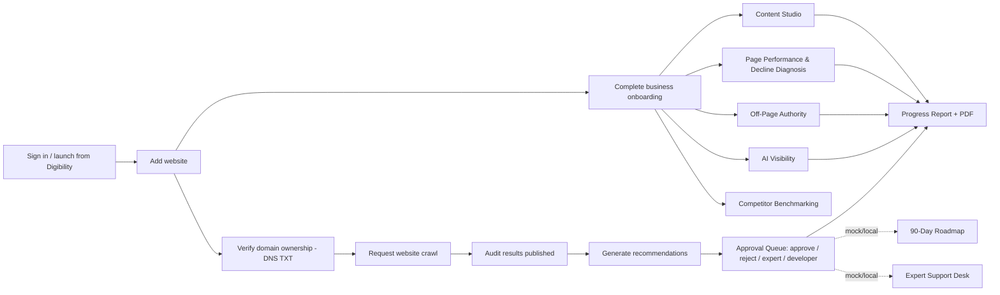

# Digibility SEO Module — User & Product Guide

> **Document type:** Canonical user/product reference (companion to
> [`SEO_TECHNICAL_SYSTEM_GUIDE.md`](SEO_TECHNICAL_SYSTEM_GUIDE.md)).
> **Reconstructed from:** canonical `main` at `20bf76cbdab8b69e72966163d8b039ba502c37f1`
> (code/migration baseline `9cb3676`, plus documentation-only commits), by reading the
> source code, migrations, tests and the authoritative documentation package.
> **Written:** 2026-09-19. **Scope:** what a user can see and do today, and what they cannot.
>
> This guide describes **behaviour found in the code**. Where the code and older design
> documents disagree, the code wins. Every capability carries an implementation status
> (legend below). Technical references for every action are in the companion guide
> (section numbers of the form "TSG §16.x" point there).

---

## Table of contents

- [0. How to read this guide](#0-how-to-read-this-guide)
- [1. What the SEO Module is](#1-what-the-seo-module-is)
- [2. Who it is for](#2-who-it-is-for)
- [3. The business problem it solves](#3-the-business-problem-it-solves)
- [4. User roles](#4-user-roles)
- [5. High-level user journey](#5-high-level-user-journey)
- [6. Navigation and module map](#6-navigation-and-module-map)
- [7. Concepts every user meets](#7-concepts-every-user-meets)
- [8. Modules, screens and actions](#8-modules-screens-and-actions)
  - [8.1 Sign-in, launch, sign-out and access states](#81-sign-in-launch-sign-out-and-access-states)
  - [8.2 Websites (SEO Setup & Connections)](#82-websites-seo-setup--connections)
  - [8.3 Domain ownership verification](#83-domain-ownership-verification)
  - [8.4 Business Onboarding](#84-business-onboarding)
  - [8.5 SEO Dashboard](#85-seo-dashboard)
  - [8.6 Technical SEO Audit and Website Crawl](#86-technical-seo-audit-and-website-crawl)
  - [8.7 Recommendations and Recommendation Generation](#87-recommendations-and-recommendation-generation)
  - [8.8 Page Optimizer (On-Page SEO Autopilot)](#88-page-optimizer-on-page-seo-autopilot)
  - [8.9 Approval Queue](#89-approval-queue)
  - [8.10 Content Studio](#810-content-studio)
  - [8.11 Page Performance Tracker](#811-page-performance-tracker)
  - [8.12 Decline Diagnosis](#812-decline-diagnosis)
  - [8.13 Off-Page Authority Builder](#813-off-page-authority-builder)
  - [8.14 AI Visibility / GEO Engine](#814-ai-visibility--geo-engine)
  - [8.15 Competitor Benchmarking](#815-competitor-benchmarking)
  - [8.16 90-Day SEO Roadmap](#816-90-day-seo-roadmap)
  - [8.17 Expert Support Desk](#817-expert-support-desk)
  - [8.18 Progress Reports](#818-progress-reports)
  - [8.19 Placeholder pages](#819-placeholder-pages)
  - [8.20 Help Center](#820-help-center)
  - [8.21 SEO Admin Preview (internal)](#821-seo-admin-preview-internal)
  - [8.22 Developer diagnostics (development builds only)](#822-developer-diagnostics-development-builds-only)
  - [8.23 Plans, usage limits and subscriptions](#823-plans-usage-limits-and-subscriptions)
- [9. User Action Catalog](#9-user-action-catalog)
- [10. User journeys](#10-user-journeys)
- [11. What the user cannot currently do](#11-what-the-user-cannot-currently-do)
- [12. Cross-reference to the technical guide](#12-cross-reference-to-the-technical-guide)

---

## 0. How to read this guide

### 0.1 Implementation status legend

| Status | Meaning |
|---|---|
| **IMPLEMENTED** | Works end to end against the real backend (Supabase) in *live mode*, with real persistence and server-side authorization. |
| **IMPLEMENTED — CONFIG/DATA DEPENDENT** | The code path is real, but a useful outcome depends on configuration or data that the product does not create by itself (for example, a background worker that an operator must run, or data that must be seeded/imported). |
| **MOCK/DEMO** | Works only against browser-local sample data (the "mock adapter"). Nothing reaches the backend, nothing is shared between users or devices. |
| **DESIGN ONLY** | Exists as an approved design document only. No code, table or RPC. |
| **PLANNED** | Mentioned in the product (for example "Coming soon" labels or placeholder pages) but no design or implementation exists in the repository. |
| **HISTORICAL/SUPERSEDED** | Described in older documents; no longer the current behaviour or design. |

### 0.2 The two data modes (important for everyone)

The application runs in one of two **data modes**, chosen by deployment configuration
(`SEO_DATA_MODE` in the served `runtime-config.js`, falling back to `VITE_SEO_DATA_MODE`),
never by the user. The runtime value wins: the tracked `public/runtime-config.js` pins
`"mock"`, so a local `.env` alone cannot switch a development server to live mode
(TSG §6.5):

| Mode | What the user experiences |
|---|---|
| **Mock (preview) mode** — the default for local development | No sign-in is required. The app is filled with sample websites ("Acme Plumbing", "Bright Smile Dental") and sample data kept in the browser's local storage. Every button "works", but only against that local sample data. Some panels show a "Preview" badge. |
| **Live (Supabase) mode** | The user must sign in. Data is real, workspace-scoped, and protected by the database. Some modules still operate only on local sample data even in live mode — each section below says so explicitly. |

> **Environment fact (from the authoritative documents):** live mode has only ever been
> exercised against the TEST project `Digi_SEO_Test`. **No SEO production project exists
> and nothing has been rolled out to production.** The frontend container has not been
> deployed. Statements such as "IMPLEMENTED" therefore mean *implemented and verified on
> TEST*, not *available to paying customers today*.

### 0.3 Terminology

"SEO Dashboard" is the user-facing name of the main dashboard. "Visibility" is a
**separate** Digibility product (Visibility Management) and is not a synonym for SEO.
The header "Visibility" button (when configured) returns the user to the main Digibility
app. "AI Visibility / GEO" is an SEO module about appearing in AI answers.

---

## 1. What the SEO Module is

Digibility SEO Intelligence is a standalone, paid SEO add-on module for the Digibility
platform. It is a web application (React single-page app) that turns SEO findings into
**clear, reviewable actions**. For every website a customer adds, the module can:

- verify that the customer controls the domain (DNS TXT record);
- run (request) a bounded crawl of the site's public pages and publish technical
  findings into an audit;
- convert audit findings into governed recommendations;
- route every recommendation through an approval queue with role-based permissions;
- plan content through a guided keyword-plan → wireframe → draft → publish-queue workflow;
- show page performance, decline diagnoses, off-page authority opportunities and
  AI-answer visibility — where that data exists;
- estimate competitor benchmarks;
- generate and export client-friendly progress reports.

Its guiding safety rule, shown on most screens: *Digibility never auto-changes URLs,
redirects, canonical tags, noindex tags, robots.txt or sitemap rules, and never publishes
content live on its own. Every risky change needs approval first.* The code honours this:
**no action in the module writes to a customer's website or CMS.**

The module is being built separately and is designed to plug into the main Digibility
platform later (shared sign-in, shared workspaces).

## 2. Who it is for

| Audience | How they use it |
|---|---|
| **SEO-only customers** | A business that buys only the SEO module. Signs in, adds its website, completes onboarding, reviews findings and approves changes. |
| **Visibility Management + SEO customers** | Same, launched from the main Digibility app (single sign-on bridge, see §8.1). |
| **Team members** | Staff who do the work: request crawls, generate recommendations, move items through workflows, build campaigns. |
| **Clients** | The customer's client (or an agency's client) who mostly *views* and approves low-risk items. |
| **Agencies** | Manage websites for several clients. Today one user works within one resolved workspace at a time (see §7.1 and §11). |
| **Digibility operators / global admins** | Internal staff with global-admin rights; can open the internal admin preview and act across workspaces. |

## 3. The business problem it solves

SEO work is usually fragmented: audits in one tool, recommendations in spreadsheets,
approvals in email, content in documents, reports assembled by hand. Business owners
cannot tell what matters most, and risky technical changes (redirects, canonicals,
robots rules) are sometimes pushed live without anyone signing off.

The SEO Module addresses this by:

1. keeping **every record tied to one website URL** (an explicit product rule);
2. explaining every finding in plain language (what it means, why it matters, who
   should fix it, how risky it is);
3. forcing **human approval** before anything risky proceeds, with role-aware
   permissions;
4. connecting modules so findings flow into recommendations, approvals, roadmap,
   support requests and reports;
5. being honest about data provenance (for example, competitor scores are labelled as
   *estimates*; unavailable report sections say *Not connected*).

## 4. User roles

Roles are held per workspace in the database (`owner`, `admin`, `team_member`,
`client`), plus a separate **global admin** capability. The database is the real
authority; the screens add convenience gating (buttons disabled with a tooltip).

| Role | In one sentence | Typical permissions (details in §9 and TSG §18) |
|---|---|---|
| **Owner** | Created the workspace (automatically added as owner). | Everything in the workspace, including approving high-risk items, marking items completed, managing ownership verification, approving/rejecting campaigns. |
| **Admin** | Workspace manager. | Same as owner for almost all actions (the database treats owner and admin together for most checks). Cannot delete the workspace (owner only). |
| **Team member** | Does the SEO work. | Request crawls, generate recommendations/competitor benchmarks/reports, approve non-dangerous items, reject, edit suggestions, send to expert/developer, run content and off-page workflows. Cannot mark approval items completed, cannot approve/reject campaigns, cannot reject off-page opportunities, cannot manage ownership verification. |
| **Client** | Views progress; limited approvals. | Read everything in the workspace (drafts only once they reach client-visible stages); approve/reject only **low-risk simple** suggestions; request expert review; send high-risk items to a developer; comment. Cannot crawl, generate, edit or run workflows. |
| **Global admin** | Digibility-internal super user. | Passes every workspace check; can open `/seo/admin-preview`. |
| *(No system role)* **Digibility expert / developer** | Labels, not accounts. | "Digibility expert" and "Developer needed" are *fix-owner* labels on items. There is no expert user role or expert work queue in the module. |

> **UI vs backend:** in *mock mode* there is no real role; almost every control is
> enabled. The Approval Queue offers a "Viewing as" role switcher that **simulates**
> roles in the UI in every mode; in live mode the database still applies the user's
> **real** role, so a simulated role can see an enabled button that the server then
> rejects (see §8.9).

## 5. High-level user journey

Solid arrows are implemented in live mode (some are data/config dependent);
dotted arrows go to modules that work only on browser-local data today.

## 6. Navigation and module map

The left sidebar (desktop only — hidden on small screens, see §11) shows one
collapsible **SEO** section: the SEO Dashboard link first, then seven collapsible groups.
Group and module collapse state is remembered in the browser.

| Group | Sidebar item | Route | Needs active website? | Live-mode status |
|---|---|---|---|---|
| — | SEO Dashboard | `/seo/dashboard` | No (shows setup prompts) | IMPLEMENTED (some cards MOCK, see §8.5) |
| Setup | SEO Setup & Connections | `/seo/websites` | No (setup route) | IMPLEMENTED (third-party connections PLANNED) |
| Setup | Business Onboarding | `/seo/onboarding` | No (setup route) | IMPLEMENTED |
| Research & Strategy | Competitor Benchmarking | `/seo/competitor-analysis` | Yes | IMPLEMENTED (heuristic estimates) |
| Research & Strategy | 90-Day SEO Roadmap | `/seo/roadmap` | Yes | MOCK/DEMO (backend DESIGN ONLY) |
| Research & Strategy | Keyword Research | `/seo/keyword-research` | Yes | PLANNED (placeholder page) |
| Research & Strategy | Content Gaps | `/seo/content-gaps` | Yes | PLANNED (placeholder page) |
| Audit & Optimization | Technical SEO Audit | `/seo/audit` | Yes | IMPLEMENTED — CONFIG/DATA DEPENDENT (crawl worker) |
| Audit & Optimization | On-Page SEO Autopilot (Page Optimizer) | `/seo/page-optimizer` | Yes | IMPLEMENTED (read-only list) |
| Audit & Optimization | Page Performance Tracker | `/seo/page-performance` | Yes | IMPLEMENTED — DATA DEPENDENT |
| Audit & Optimization | Decline Diagnosis Engine | `/seo/decline-diagnosis` | Yes | IMPLEMENTED — DATA DEPENDENT (read-only) |
| Content | Content Studio | `/seo/content-studio` | Yes | IMPLEMENTED workflow; generated text is template/placeholder |
| Content | Blog Briefs | `/seo/blog-briefs` | Yes | PLANNED (placeholder page) |
| Off-Page & AI Visibility | Off-Page Authority Builder | `/seo/off-page` | Yes | IMPLEMENTED — DATA DEPENDENT |
| Off-Page & AI Visibility | AI Visibility / GEO Engine | `/seo/ai-visibility` | Yes | IMPLEMENTED — DATA DEPENDENT (read-only) |
| Reports & Workflow | Approval Queue | `/seo/approvals` | No* | IMPLEMENTED |
| Reports & Workflow | Progress Reports | `/seo/reports` | Yes | IMPLEMENTED (CSV/share/email PLANNED) |
| Settings & Support | Settings | `/seo/settings` | No | PLANNED (placeholder page) |
| Settings & Support | Expert Support Desk | `/seo/support` | No* | MOCK/DEMO |
| Settings & Support | Help Center | `/help` | No (public) | IMPLEMENTED (static content) |

\* These routes do not force a website at the route level, but the page itself asks
the user to add a website if none exists.

Routes not in the sidebar: `/seo/login`, `/seo/auth/bridge`, `/seo/auth/logout`,
`/seo/admin-preview` (global admin only), `/help/search`, `/help/category/:slug`,
`/help/article/:slug`, and development-only `/seo/dev/*` and `/help/dev/content-check`.
Any unknown path redirects to `/seo/dashboard`.

The registry also lists two modules marked **"later"** that never appear in navigation
and have no route: *SEO Guardrail Monitor* and *Content Trust Review* (PLANNED).

## 7. Concepts every user meets

### 7.1 Workspace and active website

- A **workspace** holds websites and members. In live mode, the app resolves the
  user's workspace automatically: the **most recently joined active membership**. If the
  user has SEO access but no workspace yet, they are routed to the setup pages; the first
  page that lists websites (Business Onboarding or Websites), adding a website, or saving
  onboarding **creates a workspace named "My SEO Workspace"** with the user as owner.
  There is **no workspace switcher**.
- The **active website** is the website every page works on. It is remembered in the
  browser. If none is chosen, the first website is used automatically. The user changes
  it with **Set active** on a website card (§8.2). There is no website picker in the header.
- On four live-mode pages (Page Performance, Decline Diagnosis, Off-Page, AI Visibility),
  if the active website has no data, the page **searches every workspace the user is an
  active member of** and silently displays another website that has data (a testing safety
  net). The page header shows that other website's name. Details that matter:
  **Page Performance** does this only when the active website's onboarding is complete and it
  has no pages, and takes the first match; **Decline Diagnosis, Off-Page and AI Visibility**
  also do it when the active website's **onboarding is not complete** — so they can display a
  different website's data instead of the "Complete business onboarding first" card — and they
  pick the website with the most data. On Off-Page, the workflow buttons and the role check
  then apply to that other website.

### 7.2 Business onboarding gate

Most analysis pages (Dashboard detail, Content Studio, Page Performance, Decline
Diagnosis, Off-Page, AI Visibility, Competitors, Roadmap, Support, Reports) show
"Complete business onboarding first" until the active website's onboarding status is
**completed** (all five required fields filled — §8.4). Exception: on Decline Diagnosis,
Off-Page and AI Visibility the cross-workspace search in §7.1 can replace the active website
with one that does have data and completed onboarding, so the gate is not shown.

### 7.3 The standard finding labels

| Label | Meaning to the user |
|---|---|
| **Severity** (critical/high/medium/low) | How serious a technical issue is. |
| **Impact** (high/medium/low) | Expected effect on visibility if fixed. |
| **Effort** (high/medium/low) | Rough work needed. |
| **Risk** (high/medium/low) | Chance that changing it could hurt the site. For clients, anything not "low" counts as high-risk; for team members only "high" (or a high-risk category) blocks approval on the server (§8.9). |
| **Confidence %** | How sure the system is. Crawler-published issues always show 90%. |
| **Owner / Fix owner** | Who should act: *Client action*, *Developer needed*, *Digibility expert*, *System suggestion*. |
| **Action type** | *Auto Suggest*, *Approval Required*, *Manual Support*, *Expert Review*, *Avoid*. |
| **High-risk category** | Crawl/indexability, canonical, redirects, sitemap, robots.txt changes — always need owner/admin (or expert) sign-off regardless of the stated risk. Shown with a red border and warning text. |

### 7.4 Safety notices

Almost every module shows a shield-icon safety notice (for example "These are likely
reasons ... not guarantees"). They describe real product constraints, not decoration.

### 7.5 Loading, empty and error conventions

Pages show "Loading..." text while data loads, a card explaining the empty state with a
button to the prerequisite step, and red text for errors. Server rejections (for example
a role denial) are shown verbatim in several modules; in others a generic "Couldn't ...
just now. Please try again." is shown.

> **Hidden fallback (live mode):** most read operations (31 of 38 counted in the code)
> silently fall back to the browser's sample data if the live request **fails with an error**
> — for example a network error, a missing session, or a rejected write. In that case a user
> could briefly see sample websites or data without any error message. Exceptions that never
> fall back: crawl status/publication, competitors, reports, and the two generation actions.
> Data the user simply cannot see (permissions) is **not** an error: the screen shows an empty
> state, not sample data. See TSG §7.3.
>
> **Where server rejections are visible:** Ownership verification, Off-Page (opportunity and
> campaign actions), Competitor generation, Report generation/PDF and the crawl request show
> an error. The **Approval Queue** and **Content Studio** show none — a rejected action there
> simply leaves the screen unchanged (§8.9, §8.10).

---

## 8. Modules, screens and actions

Each module section has an overview, its screens, and **action cards**. Action IDs
(`UA-nn`) are used in the catalog (§9) and in the technical guide.

### 8.1 Sign-in, launch, sign-out and access states

**Purpose.** Get the user into the module securely, reusing Digibility accounts (there is
no separate SEO account system and no sign-up).
**Status.** Standalone password sign-in: **IMPLEMENTED** (TEST). Digibility single
sign-on bridge: **IMPLEMENTED IN SOURCE — CONFIG DEPENDENT**; the Digibility Core
`seo-bridge` Edge Function lives outside this repository and, per
`docs/markdown/CROSS_PROJECT_SSO_IMPLEMENTATION.md`, has not been deployed. Sign-up,
password reset: **not available**.

**Screens.**
- `/seo/login` — chromeless card. Three variants: mock-mode notice; "Redirecting to
  Digibility" (when SSO is configured); or the email/password form.
- `/seo/auth/bridge` — "Completing secure sign-in…" spinner, or an error with
  **Return to Digibility**.
- `/seo/auth/logout` — "Signing out of SEO…".
- Route-guard states shown inside the app shell: loading skeleton; **SEO access required**
  (signed in but no active SEO module access); **We couldn't verify your access**
  (transient error, with Retry/Sign out); **Admin access required** (admin preview).

#### UA-01 — Sign in with email and password
| Field | Detail |
|---|---|
| Roles | Any existing account (the form does not check the SEO role). |
| Where | `/seo/login` (live mode, SSO not configured). |
| Input | Email, password (both required by the browser form). |
| Immediate response | Button shows "Signing in…" and is disabled. |
| Success | Redirects to the `returnTo` page (only safe internal `/seo/...` paths are honoured) or `/seo/dashboard`. The route guard then checks module access and workspace. |
| Failure | "Invalid email or password. Please try again." or the provider message. |
| What happens next | If the account lacks SEO module access → "SEO access required" card. If it has access but no workspace → sent to onboarding/websites setup routes. |
| Approval / support | None. "Trouble signing in?" links to the Help Center article. |
| Mode | Manual. |

#### UA-02 — Launch SEO from Digibility (single sign-on)
| Field | Detail |
|---|---|
| Roles | Digibility users entitled to SEO (entitlement checked by the Core bridge). |
| Trigger | Digibility redirects the browser to `/seo/auth/bridge?code=<one-time code>`. When SSO is configured, visiting `/seo/login` unauthenticated redirects to Digibility's `/login?seoReturnTo=...`. |
| Processing | The code is redeemed once with the Core bridge; the returned token establishes an SEO session. |
| Success | Navigates to the (sanitized) return path. |
| Failure messages | "This SEO launch link is invalid.", "...has expired or was already used.", "Your Digibility account does not currently include SEO access.", "Your Digibility account is inactive.", "SEO sign-in is temporarily unavailable." |
| Status | IMPLEMENTED IN SOURCE — CONFIG DEPENDENT (not live-verified per documentation). |

#### UA-03 — Continue in mock (preview) mode
Mock mode shows "You're running in mock mode — sign-in is not required" and a
**Continue to the SEO module** button. All `/seo/*` pages open without authentication.
Status: MOCK/DEMO.

#### UA-04 — Sign out
| Field | Detail |
|---|---|
| Where | Header **Sign out** button (visible when signed in). |
| Result | Clears the SEO session, all cached data and the remembered active website. If a Digibility app URL is configured, continues to Digibility `/logout` so both sessions end; otherwise returns to `/seo/login`. |
| Also | Switching to a different user in the same browser automatically clears cached data and the active website (prevents cross-user leakage). |
| Status | IMPLEMENTED. |

#### UA-05 — Recover from access states
"Retry" re-runs the access checks; "Sign out" signs out. Status: IMPLEMENTED.

#### UA-06 — Open sign-in help
"Trouble signing in?" (login page) and "More about access states" (access-required card)
open the public Help Center article on sign-in and access states. Status: IMPLEMENTED.

---

### 8.2 Websites (SEO Setup & Connections)

**Purpose.** Register the websites the module will work on. Every audit,
recommendation and report is tied to a website.
**Status.** List/add/set-active: **IMPLEMENTED**. Connection checks (reachable, sitemap,
robots.txt): **status fields exist but no check runs** — values stay at their defaults
unless changed in the database. GSC, GA4, CMS, Google Business Profile: **PLANNED**
(always shown as "Coming soon").

**Screen `/seo/websites`.** Header card ("Websites"), help link "How adding a website
works", **Add website** button, and a grid of website cards. Each card shows: website
name and URL; **Active** badge or **Set active** button; badges for business name,
industry, target location, website type, plan; "Setup status" (active/inactive/archived);
onboarding status (Onboarding complete / in progress / not started); **Connection
health** ("Checked now": Website reachable, Sitemap, Robots.txt with Connected /
Checking... / Not connected / Needs attention; "Ready for future connection": GSC, GA4,
CMS, GBP — Coming soon); the **Domain ownership** panel (§8.3); and **Manage business
onboarding**.

#### UA-07 — View websites
Shows all websites in the resolved workspace, newest first. Empty state: "No websites
yet. Add your first website to start SEO setup." In live mode, the first visit may
create the default workspace (§7.1). Roles: any member (read).

#### UA-08 — Add a website
| Field | Detail |
|---|---|
| Roles | UI: anyone. Backend: owner, admin, team member (or global admin). A client's insert is rejected by the database. |
| Required input | Website URL, Website name, Business name. |
| Optional input | Industry, Target location, Website type (Service / Local business / Ecommerce / Content-publisher / SaaS / Other; default Service), SEO plan (Basic/Standard/Pro; default Basic). |
| Validation | Missing required fields → "Website URL, website name and business name are required." The URL is not validated beyond the browser `type=url` field. The database rejects a duplicate URL within the same workspace. |
| Eligibility | Disabled when the number of websites ≥ the *mock* plan's website limit (Standard = 3) with "You've reached the Standard plan limit of 3 websites. Upgrade your plan to add more." This limit is a UI rule only (§8.23). |
| Immediate response | Button "Adding..." |
| Success | Form closes; the list refreshes with the new card. A matching connection-status row is created (reachable = Checking..., everything else Not connected). |
| Output | New website record; becomes available as active website. |
| Failure | Live mode: a backend error (for example a client's insert rejected by the database) is **not shown** — the service silently falls back to *mock* creation in browser storage, the form closes, and the refreshed live list simply does not contain the new website (see TSG §7.3). |
| Next step | Set it active, complete onboarding, verify ownership. |
| Mode | Manual. Status: IMPLEMENTED. |

#### UA-09 — Set active website
Clicking **Set active** makes that website the one every page works on (remembered in
the browser). Status: IMPLEMENTED (browser preference, not stored on the server).

#### UA-10 — Manage business onboarding
Sets the website active and opens `/seo/onboarding`.

---

### 8.3 Domain ownership verification

**Purpose.** Prove the customer controls the domain before any crawl is allowed. A crawl
request for an unverified website is **rejected by the server**.
**Status.** Customer actions: **IMPLEMENTED**. The actual DNS lookup is performed by a
background worker run **by an operator** (`verify-once` mode, one item per run); there is
no scheduler — **CONFIG DEPENDENT**. In mock mode a **Preview** badge is shown and
verification is simulated.

**Panel (inside each website card).** "Domain ownership" with a status badge:

| Badge | Meaning |
|---|---|
| Not verified | No verification record yet. |
| Verification pending | A DNS TXT challenge is outstanding. Instructions are shown: Type TXT, Host `_digibility-site-verification.<host>`, Value `<challenge token>`, each with a **Copy** button, plus "DNS changes can take some time to propagate. After adding the record, choose 'Check again'." |
| Verified | "Ownership verified for <host> on <date>." |
| Verification failed | A customer-safe reason (for example DNS record not found / mismatch) plus the DNS instructions again. |
| Verification revoked | "Start a fresh verification to re-confirm ownership." |

Users who are not owner/admin see "You can view ownership status. Requires the owner
or admin role." and no buttons (live mode). All buttons have double-click protection
and a 3-second cool-down.

#### UA-12 — Verify ownership (initiate)
| Field | Detail |
|---|---|
| Roles | Owner, admin (UI and backend). Team members and clients cannot. |
| Shown when | Not verified or Revoked. |
| Input | None (the server derives the host from the website URL). |
| Response | Button "Starting…"; status becomes **Verification pending** with DNS instructions. Initiating again while already pending for the same host, or when verified, changes nothing. |
| Next | Add the TXT record at the domain host, then **Check again**. |

#### UA-13 — Copy DNS host / value
Copies to clipboard; the button reads "Copied" briefly.

#### UA-14 — Check again (recheck)
| Field | Detail |
|---|---|
| Roles | Owner, admin. |
| Shown when | Pending or Failed. |
| Effect | Re-arms the check (status pending, same token). **It does not resolve DNS itself**; the verdict appears only after the background worker processes the item. |
| Output | After the worker runs: Verified, or Failed with a reason. |

#### UA-15 — Re-verify (new record)
Owner/admin; shown when pending, failed or verified. Issues a **new** challenge value,
sets pending and invalidates a previous verified state — **crawls are blocked again until
re-verified**.

#### UA-16 — Revoke
Owner/admin; two-step confirmation ("Revoke ownership verification for this website?"
→ **Confirm revoke**). Sets Revoked; history is kept; crawls are blocked.

**System action (not user-triggered).** An operator runs the worker in `verify-once` mode;
it claims one pending/failed item, looks up the DNS TXT record and records Verified or
Failed. There is no automatic retry.

---

### 8.4 Business Onboarding

**Purpose.** Capture business context so recommendations are not generic. Onboarding
completion unlocks most analysis pages.
**Status.** **IMPLEMENTED.** The saved content is stored; in the current code it is used
for: the competitor URL list (Competitor Benchmarking), the business summary shown in
Content Studio, and the onboarding completion gate. Business name/industry/location used
in on-page templates come from the **website** record, not onboarding.

**Screen `/seo/onboarding`.** Title "Business Onboarding", "Tell us about <business> so
SEO recommendations aren't generic.", status badge (not started / in progress /
completed) and "N% complete" badge; help link "Why this matters". If no website exists:
"Add a website first".

#### UA-17 — Complete and save onboarding
| Field | Detail |
|---|---|
| Roles | UI: anyone. Backend: owner, admin, team member (clients are rejected by the database). |
| Required for completion (each 20%) | Services/products, Target audience, Main SEO goal, Preferred content tone, Sensitive industry. |
| Optional | Target locations (one per line), Competitors (one URL per line — **needed for Competitor Benchmarking**), Proof/trust signals, Important pages (one URL per line), Notes. |
| Choices | Main SEO goal: Get more leads, Increase local visibility, Improve rankings, Grow blog traffic, Improve AI visibility, Fix technical SEO, Improve conversions from SEO, Other. Tone: Professional, Friendly & approachable, Authoritative/expert, Casual, Other. Sensitive industry: Healthcare, Finance, Legal, Education, None/not sensitive, Other. |
| Validation | Saving requires the three dropdowns to be chosen: "Select your main SEO goal, preferred content tone and industry sensitivity." |
| Response | "Saving..." then "Saved at <time>". The completion percentage and status are computed in the browser and saved. |
| Notes | The helper text says sensitive-industry content "goes through an extra trust review before publishing" — **no such review exists in code** (the Content Trust Review module is PLANNED). |
| Next | With status **completed**, the Dashboard and analysis pages unlock. |

---

### 8.5 SEO Dashboard

**Purpose.** One-page summary of where the website stands and what to do next.
**Status.** Mixed. Live-backed cards: visibility scores (from the latest completed audit),
Top Priority Fixes (from current recommendations), Pending Approvals, Page Performance,
Authority & AI Visibility, Competitor gaps, latest report date. **MOCK/DEMO cards in
live mode:** Recent Activity (always sample/local data), open support requests
(local), roadmap counts (local).

**States.**
1. No website → "Welcome to Digibility SEO Intelligence — Add your website" plus a
   getting-started help link.
2. Onboarding incomplete → "Almost there — Complete business onboarding" with the %.
3. Otherwise the full dashboard.

**Full dashboard content.**

| Card | What it shows | How to read it |
|---|---|---|
| Header | Website name/URL, Setup status, Onboarding status, plan, "Last audit: <date> (<status>)" or "No audit yet". | Context. |
| Recommended next step | One step computed in order: Add website → Complete onboarding → Run first audit → Review priority fixes → "Request expert support (coming soon)" (disabled). | The single most useful next action. |
| Visibility scores (5 cards) | Overall Visibility, Technical Health, On-Page SEO, Authority, AI Discovery/GEO — each 0–100 with Good (≥80) / Needs Attention (50–79) / Critical (<50). | See warning below. |
| Top Priority Fixes | Up to 5 current recommendations ranked by impact then confidence, with action-type badge, impact/effort/risk/confidence, status (open / in progress / dismissed / resolved) and next action. Empty: "No priority fixes yet. Run an audit to generate some." | What to tackle first. |
| Recent Activity | Activity summaries with dates. | **Sample data only.** |
| Pending Approvals | Waiting on your approval; Needs expert review; Needs a developer; link to the queue. | Items blocking progress. |
| Page Performance (if pages tracked) | Improving / Declining / Needs refresh counts. | |
| Authority & AI Visibility (if data) | Authority opportunities; Needs risk review; AI visibility gaps. | |
| Competitors & Roadmap (if data) | Competitor gaps; roadmap high-priority/completed/expert counts. | Roadmap numbers are local-only. |
| Support & Reports (if data) | Open support requests; pending expert review; latest report date. | Support numbers are local-only. |
| Setup Progress | Website added; Sitemap checked; Robots.txt checked; Business onboarding completed; GSC / GA4 / CMS "Coming soon". | |

> **Score warning (live mode):** crawl-published audits carry **no computed scores** —
> the publishing step deliberately does not score. A crawl-published audit therefore
> shows 0/100 ("Critical") on all five score cards. Scores other than zero only come
> from mock data or from data seeded directly into the database. (TSG §22, BR-AUD-4.)

#### UA-18 / UA-19 / UA-20 — View dashboard, follow next step, open related modules
Read-only; buttons are navigation links. Roles: any member.

---

### 8.6 Technical SEO Audit and Website Crawl

**Purpose.** Find technical problems on the website's public pages and publish them as an
audit with plain-language issues.
**Status.**
- Live mode — crawl request, status, cancel: **IMPLEMENTED — CONFIG DEPENDENT.** The crawl
  itself runs on a separate background worker that is **not deployed**; in TEST an
  operator runs it. The worker, as committed, **refuses real (non-test) jobs** — it fails
  them with "Crawling is not yet available for this website." — unless an operator sets a
  development flag (`CRAWLER_ALLOW_NON_TEST_JOBS=true`) (TSG §13). The crawl is
  request-and-wait, not instant.
- Mock mode — **Run Audit** button: **MOCK/DEMO** (simulated audit with random scores,
  ~15% simulated failures, and automatic sample recommendations).

**Screen `/seo/audit`.**
1. **Audit header** — website name/URL; status badge "Published audit: Not started /
   Running / Completed / Failed" (live) or "Audit: ..." (mock); "Published: <date>";
   mock-only "Overall technical score: N/100" and **Run Audit** button; explanatory note.
2. **Safety notice.**
3. **Website crawl panel** — Start crawl control, crawl status card.
4. **Audit results** (only when a completed audit exists): "Issues by severity",
   "Issues by category", and expandable issue cards.
5. **Recommendations panel** (live mode only, see §8.7).

Empty states: "No published audit results yet. Start a website crawl to generate
technical findings." (live) / "No audit yet. Run your first audit..." (mock).

#### UA-21 — Start a crawl
| Field | Detail |
|---|---|
| Roles | Owner, admin, team member (UI gating in live mode; client sees a disabled button with "Requires the owner, admin, or team member role."). Backend enforces the same. |
| Preconditions (server) | Signed in; SEO module access; role as above; **domain ownership verified** (otherwise "Domain ownership must be verified before this website can be crawled."); website active and not archived; URL is http(s); no other active crawl for the website ("An active crawl already exists for this website"). |
| Input | None beyond confirmation. Default budget: up to 100 pages, depth 3, 15-minute timeout, 1 s between requests, sitemap used, robots.txt respected. |
| Interaction | Two-step: **Start crawl** → confirmation box ("Start a crawl of <url>?" — public pages only, no JavaScript rendering or logged-in areas, robots.txt respected and crawl bounded, results populate Audit and Page Inventory) → **Confirm crawl**. |
| Immediate response | "Starting…"; the server creates an audit run (status running) and a queued crawl job together. |
| Loading/progress | Crawl status card appears and **refreshes every 4 seconds** while active (paused when the tab is hidden). A note says the crawl runs on a background worker and "may stay queued until an operator runs the worker." |
| Failure | "The crawl could not be requested. Please try again." (the server's detailed reason is not shown in this control). |
| Mode | Manual trigger; asynchronous processing. |

#### UA-22 — Monitor crawl status
Status badge values: Queued, Preparing, Crawling, Waiting to retry, Cancelling,
Completed, Partially completed, Failed, Cancelled. Metrics: Pages discovered, Pages
fetched, Pages extracted, Issues detected, Published pages, Published issues. Timestamps:
Requested, Started, Finished, Last activity, Results published. Explanations are shown for
*Cancelling*, *Waiting to retry (attempt N)*, *Partially completed* ("pages that were not
seen this run are not treated as removed"), *Failed* (customer-safe reason), and "The crawl
produced no usable pages to publish." When results are published, **View audit results**
and **Open Page Inventory** buttons appear and the audit and page lists refresh
automatically. Empty: "No crawl has been requested for this website yet."

#### UA-23 — Cancel a crawl
Owner/admin/team member; shown for Queued, Preparing, Crawling, Waiting to retry.
A queued/waiting job is cancelled immediately; a running job becomes **Cancelling** until
the worker acknowledges. A linked audit that was still running is marked failed;
previously completed audit results are never removed.

#### UA-24 — Read audit results and issues
Each issue card shows title, severity, plain explanation, and badges (category, impact,
effort, risk, confidence, status, owner). Expanding shows **What this means**, **Why it
matters**, **Technical detail**, **Affected page**, **Suggested fix**, a warning "This change
needs your approval before it's applied" for high-risk categories or non-low risk, and
"Recommended: Digibility expert support / developer help" where applicable. Issues are
read-only here — there is no button to fix, ignore or assign an issue.
In live mode, results always come from the **latest completed** audit, so a newer
cancelled/failed attempt never hides older published findings.

Crawler-published issues are mapped from 29 deterministic rule codes (missing/duplicate
titles, meta descriptions, H1s, canonical problems, noindex/conflicting robots, long
redirect chains, missing lang, low content, images missing alt text, duplicate
content/titles/descriptions). There is no speed, mobile, schema or broken-link detection
in the crawler.

#### UA-25 — Run Audit / Retry audit (mock mode only)
Runs a simulated 1.4-second audit, randomly failing ~15% of the time ("The last audit run
didn't complete... try running it again." with **Retry audit**). On success it also
auto-generates sample recommendations. Status: MOCK/DEMO. In live mode the button is not
shown.

---

### 8.7 Recommendations and Recommendation Generation

**Purpose.** Convert audit findings into **governed recommendations** that then go through
the Approval Queue.
**Status.** **IMPLEMENTED** (Recommendation Generation Stage 1 backend and Stage 2
frontend are complete and module-locked; merged to `main`). It is **rule-based — no AI**.
Backend verified on TEST; a live click of the Generate button against TEST has **not**
been performed (documented open item).

**Where.** The **Recommendations** panel at the bottom of `/seo/audit`, shown in live mode
once a completed audit exists.

**Panel content.** Description: "Generate converts eligible audit findings into governed
recommendations for review — it does not publish or apply anything automatically.
Approved changes are handled separately in the Approval Queue." Badge "N current
recommendations" or "No recommendations generated yet"; **Review in Approval Queue** link;
note when the audit has no findings ("generation will still refresh the standard on-page
recommendations").

#### UA-27 — Generate / Refresh Recommendations
| Field | Detail |
|---|---|
| Roles | Owner, admin, team member (button disabled for clients/non-members with tooltip "Requires the owner, admin, or team member role."). The server enforces the same and returns a non-revealing error to anyone else. |
| Input | None (only the website is sent). |
| What the server does | Takes **open / in-review** issues from the **latest completed audit** that came from the crawler, maps each to a recommendation (schema issues → Schema area; duplicate content → Content; everything else → Technical; fix owner → action type: client action → Manual Support, developer needed → Approval Required, Digibility expert → Expert Review, system suggestion → Auto Suggest), and adds **7 standard on-page recommendations** (homepage title, meta description, H1, FAQ section, LocalBusiness structured data, internal links, thin service pages) personalised with the website's business name, industry and location. |
| Regeneration rules | New item → added. Unchanged → nothing written. Changed and still *suggested/needs review* → old version superseded by a new one. Changed but a human already acted (approved, rejected, etc.) → **left untouched**. Issue no longer open → the untouched recommendation is retired. On-page recommendations are never retired automatically. Repeat clicks create no duplicates. |
| Loading | Button "Generating..." (disabled; double clicks do not send a second request). |
| Success | Badge updates to the new count; the Approval Queue and Page Optimizer refresh. Label changes to **Refresh Recommendations**. |
| Failure | "Couldn't generate recommendations just now. Please try again." (no fallback to sample data). |
| Human approval | Required downstream — generation never publishes or applies anything. |
| Next | **Review in Approval Queue**. |
| Mode | Manual, on demand. |

In **mock mode** recommendations are generated automatically when a mock audit completes
(and the panel is not shown). Recommendation status values: Suggested, Needs review,
Approved, Rejected, Expert review requested, Developer needed, Ready to publish,
Completed.

---

### 8.8 Page Optimizer (On-Page SEO Autopilot)

**Purpose.** List current on-page recommendations (title, meta description, H1, FAQ,
schema, internal links, content).
**Status.** **IMPLEMENTED (read-only).** There are no actions on this page; decisions are
made in the Approval Queue. Despite the "Autopilot" name, nothing is applied
automatically.

#### UA-29 — Review on-page suggestions
Each card: title, area badge, **Current** value (if known), **Suggested** change, why it
helps, risk, "Approval required" / "No approval needed" (approval required when action
type is Approval Required or Expert Review, or risk is not low), status. Empty: "No
on-page recommendations yet. Run an audit to generate some." The page text says "Run an
audit on the Technical SEO Audit page to refresh these" — in live mode the refresh is the
**Generate/Refresh Recommendations** button (§8.7).

### 8.9 Approval Queue

**Purpose.** The single place where recommendations are reviewed before anything happens:
"Review before action — nothing here is applied to <website> until you approve it."
**Status.** **IMPLEMENTED.** Status changes go through a guarded server function that
applies the user's **real** role and the item's risk. Approving an item **records a
decision only** — nothing is published or changed on the website by the system.

**How items get into the queue.** When the page opens (live mode), one queue item is
created automatically for every current recommendation that does not yet have one
(this requires an owner/admin/team-member session; a client's page load cannot create
items). Items copy the recommendation's title, suggested change, impact/effort/risk,
confidence, action type and status, plus the linked issue's page URL, explanation and
fix owner. The high-risk-category flag is derived on the server from the linked issue.

> **Missing issue context:** the page only has the issues of the **most recent audit attempt**,
> and only when that attempt is *completed*. If it is not (a newer crawl is running, failed or
> was cancelled), or the issues have not loaded yet, the new item is created with the
> **website's home URL as the page**, the recommendation's "why it helps" as the explanation,
> and a fix owner derived from the action type. Those values are never corrected afterwards.

> Because every crawler-published issue has the fix owner *System suggestion*, every
> issue-derived recommendation currently has action type **Auto Suggest**; high-risk
> categories (canonical, indexability, redirects) are still flagged as high-risk and
> carry risk "high".

**Screen `/seo/approvals`.**
- Header: title, description, help link "The approval workflow", **Viewing as** role
  switcher (Owner/Admin, Team Member, Client).
- Safety notice.
- Filter chips: All, Needs Review (suggested + needs review), Approval Required (action
  type), Expert Review, Developer Needed, Approved, Rejected, Completed, High Risk (risk not
  low or high-risk category).
- Item cards: title; action-type badge (red when high-risk category); page URL; plain
  explanation; badges (impact, effort, risk, confidence, status, owner); created/updated
  dates; **Suggested change**; red warning for high-risk categories; action buttons;
  **Send to Expert Support Desk** (for Digibility-expert or developer-needed items);
  **Comments** thread with an "Add a comment..." box.
- Empty states: no website → "Add a website first"; no recommendations → "Nothing to
  review yet — Run a technical SEO audit..." with **Run SEO audit**; filter empty → "No
  items match this filter."

**The "Viewing as" switcher (important).** It only changes which buttons the **browser**
enables. It exists in every mode and **always starts at "Owner / Admin"**, whatever the
signed-in user's real role is — so a client or team member sees every button enabled until
they switch it themselves. In live mode the server still uses the signed-in user's real role
and rejects what that role may not do (for example "Not permitted: client cannot approve this
item" — the page does not display this message; the status simply does not change). Comments
are always stamped with the real role in live mode.

**Permission rules (as enforced by the server in live mode; §9 and TSG §18 give the full matrix).**

| Action | Owner / Admin | Team member | Client |
|---|---|---|---|
| Approve | Always | Only if risk ≠ high and not a high-risk category | Only if low risk, not high-risk category, action type Auto Suggest or Manual Support |
| Reject | Always | Always | Only low-risk simple items (as above) |
| Edit suggestion | Yes | Yes | No |
| Request expert review | Yes | Yes | Yes |
| Send to developer | Yes | Yes | Only for high-risk items (risk ≠ low or high-risk category) |
| Mark completed | Yes | No | No |
| Comment | Yes | Yes | Yes |

> **UI vs server difference:** when "Viewing as" is set to *Team Member*, the browser's rules
> are *stricter* than the server's — the UI disables Approve for any item with risk ≠ low,
> while the server allows a team member to approve medium-risk items that are not in a
> high-risk category. In practice no generated recommendation is medium-risk today (crawler
> issues are high-risk-category/high or low; the 7 on-page templates are all low), so the
> difference only shows on seeded/imported data.

#### UA-30 — Open and filter the queue
Roles: any member. Filters are client-side. Output: cards as above.

#### UA-31 — Change "Viewing as"
UI simulation only (see above).

#### UA-32 — Approve
| Field | Detail |
|---|---|
| Result | Item and its recommendation become **Approved**; an activity entry is written. |
| Meaning | A human has accepted the change. **Nobody and nothing applies it automatically** — implementation is manual, outside the module, and is marked with **Mark completed** afterwards. |
| Failure | A server rejection (wrong role, high-risk item) is **not displayed** on this page — the Approval Queue has no error display; the button re-enables and the status stays unchanged (see TSG §16, TC-32). The same applies to every Approval Queue action. |

#### UA-33 — Reject
Item and recommendation become **Rejected**. A later regeneration will not overwrite a
rejected recommendation.

#### UA-34 — Edit suggestion
Owner/admin/team member. Opens a text box with the suggested change; **Save** stores the
new text on the queue item (not on the underlying recommendation). No status change.

#### UA-35 — Request expert review
Sets status **Expert review requested** and logs activity. **No request is sent to any
expert** and no support ticket is created; it is a status marker. Use **Send to Expert
Support Desk** for a (local) support request.

#### UA-36 — Send to developer
Sets status **Developer needed**. No developer is notified.

#### UA-37 — Mark completed
Owner/admin only. Sets **Completed** (counted as "fixed" in reports).

#### UA-38 — Add a comment
Any member; non-empty text. Appended to the item's comment thread (comments cannot be
edited or deleted).

#### UA-39 — Send to Expert Support Desk
Opens `/seo/support` with the new-request form pre-filled (title, related module
"Approval Queue", page URL, request type Developer support or Strategy review). The
support desk itself is local-only (§8.17).

> There is **no** "Ready to publish" action even though that status exists, and there
> is no status-order enforcement: any permitted action can be applied from any current
> status (for example, re-approving a completed item). See TSG §19.
>
> **Role rules are enforced in the approval function, not in the table's own security
> rules.** Clients genuinely cannot write to these tables, but a *team member* could change
> an item's status outside the app (direct database/API access) without the role, risk and
> logging checks. This is a backend hardening gap, not something the screens do — see
> TSG §8 and §25.2.

---

### 8.10 Content Studio

**Purpose.** Plan and produce content through a guided workflow: opportunity → plan →
keyword plan & competitor summary → wireframe (approved) → format input → draft (section
review) → publish queue.
**Status.** Workflow persistence and server-checked transitions: **IMPLEMENTED**. All
generated *content* (keyword plans, competitor summaries, wireframes, drafts, section
rewrites) is **fixed template/placeholder text — no AI** (the draft card itself says
"Mock draft content for local testing. Real AI generation will come later."). Client
review steps, expert review and file upload exist in the database but are **not exposed**
in the UI (details below).

**Screen `/seo/content-studio`** (requires website + completed onboarding).
- Header: website, a business summary line from onboarding (services, audience, tone),
  plan badge, **Content plans: N/limit** and **Drafts: N/limit** badges (turn red at the
  plan limit, with "You're at your <plan> plan limit. Upgrade to plan or generate more this
  month." — **informational only; nothing is blocked**).
- Left column: **Content Opportunities** list and **Add a custom title** form.
- Right column: **Active Content Workflow** for the selected opportunity.

Opportunity cards show title, opportunity score (/100), reason, keyword, intent, funnel
stage, difficulty and status. In live mode opportunities come from the database; there is
**no automatic opportunity discovery** — new ones are added manually (or seeded).

| Displayed status | Meaning |
|---|---|
| idea suggested | Not started. |
| plan started | Plan ready / wireframe in progress. |
| wireframe ready | Wireframe in internal or client review (database). |
| wireframe approved | Wireframe approved. |
| draft ready | Draft being written. |
| draft in review | Draft in internal/client review. |
| draft approved | Draft approved. |
| rejected | Changes requested (wireframe or draft). |
| ready for publish | Marked ready for **manual** publishing. |
| completed | Archived. |

#### UA-41 — Add a custom title
Inputs: Title and Target keyword (both required). Creates an opportunity (informational
intent, awareness stage, medium difficulty, score 60, "Custom title added manually.").
Live: owner/admin/team member only (database).

#### UA-42 — Start Content Plan / Continue
Selecting a card shows its workflow. **Start Content Plan** (only for new ideas) moves it
to *plan started*. Server roles: owner/admin/team member.

#### UA-43 — Keyword plan and competitor content summary (automatic)
Once the plan is started, a **Keyword Plan** (primary, secondary, semantic, question
keywords, intent, difficulty, business relevance) and a **Competitor Content Summary**
(what competitors covered/missed, our opportunity, content-gap angle) appear. Both are
created automatically on first view from templates built from the target keyword, with
placeholder competitor URLs — **not real research**.

#### UA-44 — Generate / Regenerate wireframe
Produces a wireframe: suggested H1 (the title), intro angle, a fixed 4-section outline
("Why this matters", "Step-by-step guidance", "Common mistakes to avoid", "When to call a
professional"), 3 FAQ questions, CTA ("Book with <business> today."), internal link
suggestions, schema suggestion (FAQPage for informational intent). Badge "Needs approval".

#### UA-45 — Approve wireframe
Moves the opportunity to *wireframe approved* on the server, then marks the wireframe
approved. Unlocks Format Input and draft generation. Until then: "Approve the wireframe
above before a draft can be generated."

#### UA-46 — Save format input
Format options: Default Digibility format; Paste URL as style reference (Reference URL);
Upload PDF/DOCX as format reference (**only the file name is kept in mock mode; in live
mode the file name is not stored at all** — "file contents aren't processed yet");
Match brand style; Custom instructions. The saved format is **not used** by draft
generation.

#### UA-47 — Generate draft
Creates a draft with one section per outline heading plus an FAQ section, filled with
placeholder text. Only possible after wireframe approval.

#### UA-48 / UA-49 — Review draft sections
Per section: **Approve**, **Reject**, **Edit** (free text), **Regenerate** (rotates through
four canned rewrites and records a revision; badge "Regenerated ×N"). Section statuses:
generated, approved, rejected, edited.

#### UA-50 / UA-51 / UA-52 / UA-53 — Draft decisions and feedback
| Action | Live-mode result |
|---|---|
| **Approve draft** | Opportunity → *draft approved* (server submits for internal review first if needed). |
| **Reject draft** | Opportunity → *rejected* (server: changes requested). |
| **Send to expert review** | **Fails silently in live mode** — the code raises "Stage 3 has no workflow transition for status 'expert_review_requested' yet…", but the page shows no message and the status does not change (works only in mock mode). |
| **Add feedback** | Adds a comment to the opportunity (not displayed anywhere on this page afterwards). |

#### UA-54 — Publish Queue
Shown once a draft is approved. Buttons: **Ready for publish** and **Manual publishing
needed** (both → *ready for publish*), **Expert review requested** (fails in live mode as
above), **Mark completed** (→ *completed*, archived). "Digibility will not publish live
website content without approval." — **the module never publishes anything**; publishing
is done manually by the customer.

> **Role gating:** Content Studio has **no** role-based button gating in the UI. In live
> mode the server allows workflow actions only for owner/admin/team member; a client's
> click is rejected (and some content writes silently fall back to local sample
> data — TSG §7.3).
>
> **No errors are shown.** The only error message on this screen is for **Regenerate** on a
> draft section. Every other failure — a client's rejected action, an out-of-order transition
> (for example pressing "Ready for publish" twice), the expert-review action above — leaves
> the screen unchanged with no explanation.

---

### 8.11 Page Performance Tracker

**Purpose.** Show each tracked page's clicks, impressions, CTR, average position and trend.
**Status.** **IMPLEMENTED — DATA DEPENDENT (read-only).** There is **no Google Search
Console, GA4 or rank-tracking integration**; live data exists only if it was seeded or
imported directly into the database, or if the crawler published pages (crawler pages have
no performance numbers). The page's data-source line always reads "Mock performance data
for local testing. GSC/GA4/rank tracking integration will come later." even over real data.

**Screen `/seo/page-performance`** (requires onboarding).
- Header (last updated, tracked pages, tracked keywords), safety notice, 7 summary cards
  (Improving pages, Declining pages, Pages needing refresh, Total clicks, Total impressions,
  Average CTR, Average position).
- Filter chips (All pages, Improving, Stable, Declining, Needs refresh, Not enough data)
  and a search box (URL, title, keywords).
- Page cards: title/URL, status badge, page type, primary keyword, number of secondary
  keywords, clicks, impressions, CTR, average position, ranking movement, traffic movement %,
  updated date.

| Status | How it is determined (live) |
|---|---|
| Needs refresh | The page's content status is *aging* or *stale* (takes priority). |
| Improving / Stable / Declining | From the latest performance snapshot's movement status. |
| Not enough data | Snapshot missing, "new" or "no data". |

#### UA-55 — Filter and search pages; UA-56 — Expand a page
Expanded view: mapped keywords, current vs previous position, click/impression/CTR
movement, main SEO issue (diagnosis hint), recommended next action, and **Related
items**: the audit issue on the same URL (link to the audit) and its recommendation (link
to the Approval Queue).

#### UA-57 — View Diagnosis
For *Declining* or *Needs refresh* pages: opens Decline Diagnosis filtered to that page.

#### UA-58 — Generate performance data (mock mode only)
Empty state in mock mode offers **Generate performance data** (sample data). In live mode
the empty state says data "is seeded or imported separately". MOCK/DEMO.

---

### 8.12 Decline Diagnosis

**Purpose.** Explain likely reasons a page is declining or ageing, and what to do next.
**Status.** **IMPLEMENTED — DATA DEPENDENT (read-only).** Diagnoses are read from the
database (only *open / in review / action planned* ones). No screen creates, updates or
resolves a diagnosis; there is no automatic diagnosis engine. "Refresh recommendation"
cards come from **sample data only** and will not appear for live pages.

**Screen `/seo/decline-diagnosis`** (optionally `?pageId=`). Requires onboarding and page
performance data ("No page performance data yet" otherwise). Header with help link
"How to investigate a decline"; **View all diagnoses** when filtered; safety notice ("a
likely cause ... not a certainty").

Diagnosis cards: page title/URL, **Priority**, **Likely cause** (Click-through rate drop,
Ranking loss, Content freshness issue, Indexing issue, Keyword cannibalization, Search
intent mismatch, Weak title/meta, Competitor improvement, Technical issue, Content depth
gap), confidence, owner, related keyword, "Expert support recommended"; sections **What
this likely means**, **Technical detail**, **Recommended fix**.
Empty: "Nothing needs diagnosis right now" / "No diagnosis available for this page yet."

#### UA-59 — Read diagnoses; UA-60 — Request expert support
**Request expert support** (when recommended) opens the Support Desk form pre-filled with
"Help with: <page>", module Decline Diagnosis, the page URL, type Technical SEO fix.

#### UA-61 — Open Content Studio (from a refresh recommendation; sample data only).

---

### 8.13 Off-Page Authority Builder

**Purpose.** Review safe authority opportunities (backlinks, brand mentions, citations,
reviews, PR, social/community, partnerships), flag spam risks, move opportunities through
an approval workflow and group them into campaigns.
**Status.** Opportunity workflow, campaign creation and campaign approval workflow:
**IMPLEMENTED**. **DATA DEPENDENT:** there is no opportunity discovery — opportunities
must be seeded/imported into the database. **No outreach is ever sent**; campaign tasks
cannot be ticked off (checklist is read-only).

**Screen `/seo/off-page`** (requires onboarding).
- Header: Authority score (from the most recent audit attempt — 0 for crawl-published
  audits), opportunities, campaigns, "Needs review" count, trust summary, and a data-source
  note that always reads "Mock authority data for local testing. Real backlink/mention/review
  tracking integration will come later." — even over real, live data.
- Safety notice: no fake reviews, paid link schemes, PBNs, spammy directories or mass
  outreach; external-facing actions need approval.
- **Spam Risk Review**: every opportunity with high risk or spam flags (Paid link risk,
  Irrelevant directory, PBN-like site, Exact-match anchor manipulation, Fake review risk,
  Mass outreach risk, Low relevance, Low trust), with "Recommended: Avoid" (high risk) or
  "Expert review". Empty: "No risky opportunities detected right now".
- Type filter chips.
- Opportunity cards with a selection checkbox, status, type, authority impact, effort,
  risk, confidence, owner, "Needs approval"; flagged risks; action buttons; expandable
  "Suggested action" and "Why this matters".
- Campaign builder (appears when opportunities are selected) and **Campaigns** list.
- Errors from the server are shown verbatim in red cards.
Empty: "No authority opportunities yet".

#### UA-63 — Move an opportunity through its workflow
Only actions legal for the current status are shown (mirrors the server):

| Button | From status | To status | Roles (live) |
|---|---|---|---|
| Shortlist | Suggested | Shortlisted | Owner/admin/team member |
| Request approval | Shortlisted | Approval required | Owner/admin/team member |
| Send to expert review | Shortlisted, Approval required, In progress | Expert review requested | Owner/admin/team member |
| Start | Approval required, Expert review requested | In progress | Owner/admin/team member |
| Mark completed | In progress | Completed | Owner/admin/team member |
| Reject | Any non-terminal | Rejected | **Owner/admin only** |
| Mark as avoided | Any non-terminal | Avoided | Owner/admin/team member |

Terminal statuses (Completed, Rejected, Avoided) show "No further actions available".
Clients see disabled buttons with a role tooltip. "Start" cannot be reached without
passing approval or expert review first ("an external-facing action must pass
approval/expert review first"). **Request approval does not notify anyone** — an owner or
team member then clicks **Start**; there is no separate "approve opportunity" button.

#### UA-64 — Create a campaign
| Field | Detail |
|---|---|
| Roles | Owner/admin/team member (selection checkboxes and Create are disabled for clients in live mode; server enforces). |
| Input | Select ≥1 opportunity; Campaign name and goal (required); Owner (Client action / Developer needed / Digibility expert / System suggestion); optional due date. |
| Result | A campaign in **Draft**, linked to the selected opportunities, with one checklist task per opportunity (the opportunity's suggested action). All-or-nothing on the server. |
| Note | In mock mode a campaign is created directly as *Pending approval* (known mock quirk). |

#### UA-65 / UA-66 / UA-67 / UA-68 — Campaign approval workflow
| Button | From | To | Roles |
|---|---|---|---|
| Submit for approval | Draft | Pending approval | Owner/admin/team member |
| Approve | Pending approval | Approved | Owner/admin only |
| Reject | Pending approval | Rejected | Owner/admin only |
| Return to Draft | Rejected | Draft | Owner/admin/team member |

Campaign cards show name, status, goal, owner, number of opportunities, due date,
progress % and the read-only checklist. Approving a campaign does not start any work
automatically.

---

### 8.14 AI Visibility / GEO Engine

**Purpose.** Show whether the brand appears in AI-assistant answers for tracked prompts,
which competitors appear, which sources are cited, and content gaps to close.
**Status.** **IMPLEMENTED — DATA DEPENDENT (read-only).** There is **no connection to any
AI assistant or LLM**; prompt observations, mentions and gaps must be seeded/imported into
the database (source "manual_seed"/"import"). The page's own notice says "Mock AI
visibility data for local testing. Real AI answer tracking will come later."

**Screen `/seo/ai-visibility`** (requires onboarding).
- Header: AI Discovery/GEO score (from the most recent audit attempt; 0 for crawl-published audits), brand mentions, competitor
  mentions, citation gaps (prompts where your site is not cited), content gaps, tracking
  summary.
- **AI Prompt Tracking** cards: prompt text, visibility (Visible / Partially visible / Not
  visible / Unknown), topic, brand mentioned, your site cited, competitors mentioned,
  citation sources, gap summary, recommended next step. Every observation is its own card
  (same prompt on different dates appears more than once).
- **Where your brand appears** (mention rate) and competitor mention cards (where they
  appear, what they do better, recommendation).
- **AI Content Gap Opportunities** cards (topic, priority, suggested content type, missing
  answer angle, related keyword/question, next action, **Open Content Studio**).

#### UA-69 — Read AI visibility; UA-71 — Open Content Studio from a gap
Read-only; the Content Studio link does not create anything.

#### UA-70 — Generate AI visibility data (empty state)
Writes **sample data to the browser only**. In live mode the button appears but the page
continues to show the empty state (live reads ignore local sample data). MOCK/DEMO.

---

### 8.15 Competitor Benchmarking

**Purpose.** Compare the website with the competitors listed in onboarding across eight
dimensions and point to where to act.
**Status.** **IMPLEMENTED** (module-locked). Scores are **heuristic estimates**
(deterministic, derived from each competitor URL), labelled "Estimated competitor
benchmarking from a heuristic model. No external competitor-data provider is integrated."
No SEMrush/Ahrefs/GSC data.

**Screen `/seo/competitor-analysis`** (requires onboarding).
Empty states: "No competitors added yet" (with **Add competitors in onboarding**); "No
benchmark data yet" (with **Generate benchmark data**).

| Section | Content | Interpretation |
|---|---|---|
| Overview header | Competitors tracked, Benchmark score (average competitor strength), Last updated, provenance note, **Refresh benchmark data**. | |
| Safety notice | "gaps and opportunities based on estimated benchmarking, not guarantees". | |
| Competitor Gap Summary | For each dimension where competitors lead by ≥5 points: title, priority (high if gap ≥15), suggested owner, related module, why/what to do, **Open <module>**. | Where to invest. |
| Benchmark Comparison | 8 dimensions: Technical health, Content depth, Keyword coverage, Authority signals, Reviews/trust signals, AI visibility, Page quality, Local visibility — your score, competitor average, strongest competitor, gap (high/medium/low), explanation and next step. | "Your score" is derived from the sub-scores of the most recent audit attempt (even if it is still running or failed — unlike the server-side competitor status, which uses the latest completed audit); scores are 0 for crawl-published or running audits; several dimensions are simple proxies. |
| Competitor cards | Name/URL, Stronger/Similar/Weaker than you / Not enough data, category, location, overall and 5 sub-scores; expandable lists (what they do better/miss, content/authority/AI opportunities, next action). | |

#### UA-73 — Generate / Refresh benchmark data
| Field | Detail |
|---|---|
| Roles | Owner/admin/team member (disabled for clients in live mode with tooltip; server enforces). |
| Input | None — the server reads the competitor list from onboarding. |
| Result | One row per unique competitor (normalized URL), refreshed scores, rows for removed competitors deleted. Repeat clicks give the same scores. Empty competitor list → nothing changes. |
| Loading / errors | "Generating..." / "Refreshing..."; "Couldn't generate/refresh benchmark data just now. Please try again." (no sample-data fallback). |
| Mode | Manual. |

#### UA-74 — Open related module from a gap; UA-75 — Add competitors in onboarding
Navigation only.

### 8.16 90-Day SEO Roadmap

**Purpose.** Turn findings from every module into a prioritized 12-week plan.
**Status.** **MOCK/DEMO in every data mode.** The page and its service never call the
backend. In live mode, **Generate** reads the live findings (audit issues, on-page
recommendations, decline diagnoses, off-page opportunities, AI content gaps, competitor
gaps) but **stores the resulting plan only in the current browser** — it is not saved to
the server, not visible to other users or devices, and is lost if browser storage is
cleared. **Roadmap Backend: DESIGN ONLY** (approved hierarchy *plans → periods → items*;
details TBD; no table, RPC or service exists). Progress Reports report the roadmap as
"Not connected".

**Screen `/seo/roadmap`** (requires onboarding).
- Empty: "No roadmap yet" with **Generate 90-Day Roadmap**.
- Summary header: Total, Completed, Pending, High priority, Expert support actions, a
  health line ("N of M actions completed so far"), **Generate / Refresh 90-Day Roadmap**.
- Safety notice ("a recommended sequence of next steps, not a guarantee").
- Banner when everything is complete: "Generate a fresh roadmap to plan the next 90 days."
- Filters: All, Month 1, Month 2, Month 3, High priority, Expert support needed,
  Completed, Pending.
- Item cards sorted by week: title, "Month M · Week W", status, priority, related module,
  source (Audit issue, Recommendation, Performance decline, Off-page opportunity, AI
  visibility gap, Competitor gap), impact, effort, risk, owner; expanded: explanation,
  status dropdown, **Open <module>**, **Request expert support** (Digibility-expert items).

#### UA-76 — Generate / Refresh roadmap
Deterministic rules (no AI): Month 1 (weeks 1–4) = up to 4 audit issues by impact, taken
from the most recent audit run **only if that run is completed** (a newer running/failed
crawl attempt leaves Month 1 empty); Month 2 (weeks 5–8) = up to 4 on-page recommendations; Month 3
(weeks 9–12) = up to 8 items drawn from decline diagnoses, open off-page opportunities, AI
content gaps and competitor gaps. **Regenerating replaces the whole roadmap** (statuses
are reset). Roles: not gated.

#### UA-77 — Filter; UA-78 — Change item status
Statuses: Planned, In progress, Blocked, Completed, Skipped (local only).

#### UA-79 — Open related module / Request expert support
Navigation; the support request pre-fills title, module and type Strategy review.

---

### 8.17 Expert Support Desk

**Purpose.** Ask Digibility experts for help (technical fixes, content review, off-page,
PR, publishing, strategy, developer, AI visibility).
**Status.** **MOCK/DEMO in every data mode.** Requests, comments and status changes are
stored **only in the current browser**. **Nothing is sent to Digibility** — no ticket,
email, notification or payment ("Submitting a request sends it to Digibility for review —
no ticketing, email, or payment is triggered automatically yet."). No expert-side view
exists. There is no database table for support requests.

**Screen `/seo/support`** (requires onboarding). A link "Browse the Help Center";
summary header (support-plan label from the *mock* plan, Open, Pending expert review,
Developer needed, Completed, **New support request**); safety notice; request form;
request cards.

#### UA-80 — Create a support request
| Field | Detail |
|---|---|
| Required | Request title, Description. |
| Optional | Request type (Technical SEO fix, Content review, On-page SEO review, Off-page authority support, PR/mention support, Publishing help, Strategy review, Developer support, AI visibility review, Other), Related module, Related page/item URL, Priority (low/medium/high), Urgency (Normal/Urgent), Preferred support mode (Expert review, Developer needed, Manual execution, Strategy call), Attachment (**file name only — not uploaded**), Notes. |
| Pre-fill | Links from Approval Queue, Decline Diagnosis and Roadmap pre-fill title, module, URL and type (and open the form automatically). |
| Result | A local request with status **Submitted**, "Owner: Unassigned", and an activity timeline. |

#### UA-81 … UA-85 — Manage a request (open requests only)
Add comment (always stamped "owner"); **Mark in progress**; **Mark completed** (enabled
because the mock role is Owner); **Mark additional info provided** (when "Waiting for
client"); **Cancel request**. Statuses: Submitted, In review, Assigned, Waiting for client,
In progress, Completed, Cancelled — only some are reachable from the UI.

---

### 8.18 Progress Reports

**Purpose.** A client-friendly report per website and period: what improved, what was
fixed, what needs approval or support, content and page status, and next actions.
**Status.** Read, generate, PDF export: **IMPLEMENTED** (Reports v1, module-locked).
CSV export, sharing, email, report history, scheduling, period comparison: **PLANNED**
(buttons disabled "coming soon").

**Screen `/seo/reports`** (requires onboarding). Header "Progress Reports", help link "How
this report is put together", period selector (**Current month**, **Last month** —
default, **Last 90 days**).
- No report for the period → "No report yet for this period" with **Generate / Refresh
  Report**.
- Report present → header (period label, status Generated / Needs refresh / Not
  generated, last generated date, **Generate / Refresh Report**), safety notice, key stats
  (visibility score and movement, issues fixed/found, pending approvals, content
  completed/planned, pages improving/declining, authority opportunities, AI content gaps,
  competitor gaps, roadmap completed/total, open support requests), seven section cards
  (What improved; What was fixed; What needs approval; What needs expert/developer
  support; What content was planned/created; What pages need attention; What to do next),
  export actions.
- Load error → "Couldn't load this report" with **Retry**.

**How live figures are produced (server).** Audit: latest vs previous completed audit.
Approvals: pending = suggested/needs review; fixed = completed. Content: planned = all
opportunities, completed = archived. Pages: active pages classified as in §8.11.
Authority: total and avoided opportunities. AI: content gaps. **Competitor, roadmap and
expert-support areas are marked "unavailable".** In the app this is only partly visible: the
key-stat badges show plain zeros ("Competitor gaps: 0", "Roadmap: 0/0", "Open support requests:
0") as if they were measured, the competitor and roadmap summary sentences the server writes
("Competitor tracking is not connected yet.", "The 90-day roadmap is not connected yet.") are
**not rendered on the page at all**, and only the "What needs expert/developer support" card
shows its server text ("Expert support tracking is not connected yet."). The **PDF** prints
"Not connected" for all three sections.

#### UA-88 — Generate / Refresh report
| Field | Detail |
|---|---|
| Roles | UI: not gated. Server: owner/admin/team member (a client receives "Couldn't generate the report just now." — or "Couldn't refresh the report just now." when a report already exists). |
| Input | Period only; period dates, title and all figures are computed on the server. |
| Result | One canonical report per website + period (regenerating overwrites the same report; the original author is kept). |
| Loading / errors | "Generating..."; error text as above. No sample-data fallback. |

#### UA-89 — Download PDF
Owner/admin/team member (server-checked; a client gets "Couldn't prepare the PDF just
now."). Downloads the **stored** report as a PDF named
`digibility-seo-report-<website>-<period>.pdf`; it never regenerates. Sections: Executive
Summary, Technical Health, Content, Page Performance, Authority, AI Visibility, Competitor,
Roadmap, Expert Support ("Not connected" where unavailable), Next Actions; footer on every
page. "No saved report is available to export for this period." if none exists.

#### UA-90 — Export CSV / Share with client / Email report
Disabled, "coming soon". PLANNED.

---

### 8.19 Placeholder pages

**Keyword Research**, **Content Gaps**, **Blog Briefs** and **Settings** show a card
"This is a placeholder. Feature work has not started yet." with a Help link "What 'not
built yet' means". The first three point users to Content Studio. Status: **PLANNED**.

### 8.20 Help Center

**Purpose.** Public, sign-in-free self-help. **Status: IMPLEMENTED** (static content in
the code; 10 categories — Start Here; Learn SEO, AEO & GEO; Set Up Digibility SEO;
Websites & Ownership; Website Crawling; Recommendations, Approvals & Roles;
Troubleshooting; Reports & Decline Diagnosis; Feature Availability; Contact Support).
Screens: `/help` home, `/help/search` (built-in search with synonyms),
`/help/category/:slug`, `/help/article/:slug` (with breadcrumbs, related articles, feature
status badge, "still need help"). Contextual "help" links appear on the login, access,
Websites, Onboarding, Dashboard, Approval Queue, Page Optimizer, Decline Diagnosis, Reports
and placeholder pages. Articles marked internal are never shown publicly.

### 8.21 SEO Admin Preview (internal)

**Route** `/seo/admin-preview`; **global admin only** (live mode checks the global-admin
flag; mock mode lets anyone in). A "Temporary standalone preview. Final destination:
existing Digibility Admin Panel" banner, overview cards, a client/website list with
health filter (healthy / needs attention / critical / inactive), a per-website detail
summary, and operations sections (audits, recommendation review, content, support
tickets, reports, plan distribution, AI-governance placeholders, integration health, QA
review). **Status: MOCK/DEMO composition.** It aggregates the same services as the
customer pages, but only for the *resolved workspace* (not every workspace), and several
inputs (support, roadmap, recent activity, admin notes) are sample/local data. Read-only.

### 8.22 Developer diagnostics (development builds only)

`/seo/dev/supabase-readiness` and `/seo/dev/auth-test` (a large developer harness) and
`/help/dev/content-check` exist only in development builds and are not product features.

### 8.23 Plans, usage limits and subscriptions

**Status: MOCK/DEMO (UI-only).** The header always shows a **Standard plan** badge (a
hard-coded mock plan). Plan-driven behaviour in the UI:

| Limit | Where | Effect |
|---|---|---|
| Websites (Basic 1 / Standard 3 / Pro 10) | Websites page | Add button disabled at the limit (always evaluated against the mock Standard plan = 3). |
| Content plans / drafts | Content Studio header | Badges turn red at the limit; **nothing is blocked**. |
| Expert support access | Support Desk header | Label only. |

Plan tables (`seo_plan_limits`), subscriptions and usage events exist in the database but
the frontend does not read or write them; no server function enforces plan limits. Each
website stores a "plan" chosen when it was added (shown as a badge), which does not unlock
or block anything. **No billing or payment exists in the module.**

---

## 9. User Action Catalog

"Status" uses the §0.1 legend, evaluated for **live mode** (mock mode makes every action
work locally). "Role" = who the **server** permits in live mode; "UI" notes differences.
Section references point to the detailed cards; TSG = technical chain in the companion.

| ID | Module | Screen | Action | Role (server) | Input | Output | Interpretation → Next step | Status |
|---|---|---|---|---|---|---|---|---|
| UA-01 | Access | /seo/login | Sign in (password) | Any account | Email, password | Session → return path | Access checks follow → dashboard/setup | IMPLEMENTED |
| UA-02 | Access | /seo/auth/bridge | Launch from Digibility (SSO) | Entitled Digibility user | One-time code (URL) | SEO session | → return path | IMPLEMENTED IN SOURCE — CONFIG DEPENDENT |
| UA-03 | Access | /seo/login | Continue in mock mode | Anyone | — | Opens app | Preview only | MOCK/DEMO |
| UA-04 | Access | Header | Sign out | Signed-in user | — | Sessions + cache cleared | → login / Digibility logout | IMPLEMENTED |
| UA-05 | Access | Guard states | Retry / sign out | Signed-in user | — | Re-check | Contact admin if no access | IMPLEMENTED |
| UA-06 | Access | /seo/login, guard states | Open "Trouble signing in?" / "More about access states" help | Anyone | — | Help article | Self-help | IMPLEMENTED |
| UA-07 | Websites | /seo/websites | View websites | Member | — | Cards | Choose active site | IMPLEMENTED |
| UA-08 | Websites | /seo/websites | Add website | Owner/admin/team member (UI: anyone; mock plan limit) | URL, name, business (+optional) | Website + connection row | → onboarding, ownership | IMPLEMENTED |
| UA-09 | Websites | Website card | Set active | Member | — | Active website (browser) | All pages switch | IMPLEMENTED |
| UA-10 | Websites | Website card | Manage onboarding | Member | — | Navigation | → §8.4 | IMPLEMENTED |
| UA-11 | Websites | Website card | View connection health | Member | — | Status badges | Third-party = coming soon | IMPLEMENTED (checks not run); GSC/GA4/CMS/GBP PLANNED |
| UA-12 | Ownership | Website card | Verify ownership | Owner/admin | — | Pending + DNS TXT instructions | Add TXT record | IMPLEMENTED |
| UA-13 | Ownership | Website card | Copy host/value | Viewer of panel | — | Clipboard | — | IMPLEMENTED |
| UA-14 | Ownership | Website card | Check again | Owner/admin | — | Re-armed check | Wait for worker verdict | IMPLEMENTED — CONFIG DEPENDENT (worker) |
| UA-15 | Ownership | Website card | Re-verify (new record) | Owner/admin | — | New token, pending | Crawls blocked until verified | IMPLEMENTED |
| UA-16 | Ownership | Website card | Revoke (confirm) | Owner/admin | Confirmation | Revoked | Crawls blocked | IMPLEMENTED |
| UA-17 | Onboarding | /seo/onboarding | Save onboarding | Owner/admin/team member | 5 required + optional fields | Onboarding record, % | 100% unlocks analysis pages | IMPLEMENTED |
| UA-18 | Dashboard | /seo/dashboard | View dashboard | Member | — | Scores, fixes, summaries | Follow next step | IMPLEMENTED (Recent Activity/support/roadmap cards MOCK) |
| UA-19 | Dashboard | /seo/dashboard | Follow recommended next step | Member | — | Navigation | — | IMPLEMENTED ("Request expert support" step disabled) |
| UA-20 | Dashboard | /seo/dashboard | Open module from card | Member | — | Navigation | — | IMPLEMENTED |
| UA-21 | Audit | /seo/audit | Start crawl (confirm) | Owner/admin/team member + verified ownership | Confirmation | Audit run + queued job | Wait for worker | IMPLEMENTED — CONFIG DEPENDENT |
| UA-22 | Audit | /seo/audit | Monitor crawl | Member | — | Status, counters, publication | Published → view results | IMPLEMENTED |
| UA-23 | Audit | /seo/audit | Cancel crawl | Owner/admin/team member | — | Cancelled / Cancelling | Previous results kept | IMPLEMENTED |
| UA-24 | Audit | /seo/audit | Read issues | Member | — | Issue details | → generate recommendations | IMPLEMENTED |
| UA-25 | Audit | /seo/audit | Run Audit / Retry | — | — | Simulated audit | — | MOCK/DEMO |
| UA-26 | Audit | Crawl card | View audit results / Open Page Inventory | Member | — | Navigation | — | IMPLEMENTED |
| UA-27 | Recommendations | /seo/audit | Generate / Refresh recommendations | Owner/admin/team member | — | Canonical current recommendations | → Approval Queue | IMPLEMENTED (live UI→TEST click not verified) |
| UA-28 | Recommendations | /seo/audit | Review in Approval Queue | Member | — | Navigation | — | IMPLEMENTED |
| UA-29 | Page Optimizer | /seo/page-optimizer | Review on-page suggestions | Member | — | List | Decide in queue | IMPLEMENTED (read-only) |
| UA-30 | Approvals | /seo/approvals | View/filter queue (auto-creates items) | Member (creation: owner/admin/team member) | Filter | Items | Act on items | IMPLEMENTED |
| UA-31 | Approvals | /seo/approvals | Viewing-as switch | Anyone | Role | UI gating only | Server uses real role | IMPLEMENTED (UI simulation) |
| UA-32 | Approvals | Item | Approve | See §8.9 matrix | — | Approved | Implement manually, then complete | IMPLEMENTED |
| UA-33 | Approvals | Item | Reject | See §8.9 | — | Rejected | — | IMPLEMENTED |
| UA-34 | Approvals | Item | Edit suggestion | Owner/admin/team member | Text | Updated suggestion | — | IMPLEMENTED |
| UA-35 | Approvals | Item | Request expert review | All roles | — | Status marker | Optionally create support request | IMPLEMENTED (no expert routing) |
| UA-36 | Approvals | Item | Send to developer | Owner/admin/team; client if high-risk | — | Status marker | — | IMPLEMENTED (no notification) |
| UA-37 | Approvals | Item | Mark completed | Owner/admin | — | Completed | Counted as fixed in reports | IMPLEMENTED |
| UA-38 | Approvals | Item | Comment | All roles | Text | Comment | — | IMPLEMENTED |
| UA-39 | Approvals | Item | Send to Expert Support Desk | Member | — | Pre-filled form | → §8.17 | IMPLEMENTED link; desk MOCK |
| UA-40 | Content | /seo/content-studio | View opportunities | Member | — | List | Pick one | IMPLEMENTED (no discovery) |
| UA-41 | Content | Opportunity list | Add custom title | Owner/admin/team member | Title, keyword | Opportunity | Start plan | IMPLEMENTED |
| UA-42 | Content | Opportunity card | Start plan / Continue | Owner/admin/team member | — | Plan started | Keyword plan appears | IMPLEMENTED |
| UA-43 | Content | Workflow | Keyword plan & competitor summary | Owner/admin/team member (created on first view) | — | Template plan & summaries | Generate wireframe | IMPLEMENTED (template content) |
| UA-44 | Content | Workflow | Generate / Regenerate wireframe | Owner/admin/team member | — | Template wireframe | Approve | IMPLEMENTED (template content) |
| UA-45 | Content | Workflow | Approve wireframe | Owner/admin/team member | — | Wireframe approved | Format + draft | IMPLEMENTED |
| UA-46 | Content | Workflow | Save format | Owner/admin/team member | Format choice (+URL/instructions) | Format record (unused) | — | IMPLEMENTED (upload not implemented) |
| UA-47 | Content | Workflow | Generate draft | Owner/admin/team member | — | Placeholder draft + sections | Review sections | IMPLEMENTED (placeholder content) |
| UA-48 | Content | Draft | Section approve/reject/edit | Owner/admin/team member | Edit text | Section status | — | IMPLEMENTED |
| UA-49 | Content | Draft | Regenerate section | Owner/admin/team member | — | Canned rewrite + revision | — | IMPLEMENTED (canned content) |
| UA-50 | Content | Draft | Approve draft | Owner/admin/team member | — | Draft approved | Publish queue | IMPLEMENTED |
| UA-51 | Content | Draft | Reject draft | Owner/admin/team member | — | Changes requested | Rework | IMPLEMENTED |
| UA-52 | Content | Draft | Send to expert review | — | — | Silent no-op in live mode | — | MOCK/DEMO only |
| UA-53 | Content | Draft | Add feedback | Owner/admin/team member | Text | Comment (not displayed) | — | IMPLEMENTED |
| UA-54 | Content | Publish queue | Ready for publish / Manual publishing needed / Mark completed | Owner/admin/team member | — | Ready for manual publish / archived | Publish manually outside Digibility | IMPLEMENTED ("Expert review requested" button MOCK only) |
| UA-55 | Performance | /seo/page-performance | View, filter, search pages | Member | Filter, search | Page list | Investigate decliners | IMPLEMENTED — DATA DEPENDENT |
| UA-56 | Performance | Page card | Expand details / related items | Member | — | Metrics, related issue/rec | → audit/queue | IMPLEMENTED |
| UA-57 | Performance | Page card | View Diagnosis | Member | — | Navigation | → §8.12 | IMPLEMENTED |
| UA-58 | Performance | Empty state | Generate performance data | — | — | Sample data | — | MOCK/DEMO |
| UA-59 | Decline | /seo/decline-diagnosis | Read diagnoses | Member | Optional page filter | Diagnoses | Act on fix | IMPLEMENTED — DATA DEPENDENT |
| UA-60 | Decline | Diagnosis card | Request expert support | Member | — | Pre-filled support form | → §8.17 | IMPLEMENTED link; desk MOCK |
| UA-61 | Decline | Refresh card | Open Content Studio | Member | — | Navigation | — | MOCK/DEMO (card from sample data) |
| UA-62 | Off-page | /seo/off-page | View overview / spam review / filter | Member | Type filter | Opportunities | Decide safely | IMPLEMENTED — DATA DEPENDENT |
| UA-63 | Off-page | Opportunity | Shortlist / Request approval / Send to expert review / Start / Mark completed / Mark as avoided / Reject | Owner/admin/team (Reject: owner/admin) | — | New status + activity | See state machine | IMPLEMENTED |
| UA-64 | Off-page | Campaign builder | Create campaign | Owner/admin/team member | Selection, name, goal, owner, due date | Draft campaign + tasks | Submit for approval | IMPLEMENTED |
| UA-65 | Off-page | Campaign | Submit for approval | Owner/admin/team member | — | Pending approval | Owner/admin decides | IMPLEMENTED |
| UA-66 | Off-page | Campaign | Approve | Owner/admin | — | Approved | Work manually | IMPLEMENTED |
| UA-67 | Off-page | Campaign | Reject | Owner/admin | — | Rejected | Return to draft | IMPLEMENTED |
| UA-68 | Off-page | Campaign | Return to Draft | Owner/admin/team member | — | Draft | Revise/resubmit | IMPLEMENTED |
| UA-69 | AI Visibility | /seo/ai-visibility | Read prompts, mentions, gaps | Member | — | Records | → Content Studio | IMPLEMENTED — DATA DEPENDENT |
| UA-70 | AI Visibility | Empty state | Generate AI visibility data | — | — | Local sample data | — | MOCK/DEMO |
| UA-71 | AI Visibility | Gap card | Open Content Studio | Member | — | Navigation | — | IMPLEMENTED |
| UA-72 | Competitors | /seo/competitor-analysis | View benchmarks, gaps, competitors | Member | — | Estimates | → related modules | IMPLEMENTED |
| UA-73 | Competitors | Header / empty state | Generate / Refresh benchmark data | Owner/admin/team member | — (uses onboarding list) | Estimated rows | Review gaps | IMPLEMENTED |
| UA-74 | Competitors | Gap card | Open related module | Member | — | Navigation | — | IMPLEMENTED |
| UA-75 | Competitors | Empty state | Add competitors in onboarding | Member | — | Navigation | → §8.4 | IMPLEMENTED |
| UA-76 | Roadmap | /seo/roadmap | Generate / Refresh roadmap | Not gated | — | Local 12-week plan | Work the plan | MOCK/DEMO (backend DESIGN ONLY) |
| UA-77 | Roadmap | /seo/roadmap | Filter | — | Filter | View | — | MOCK/DEMO |
| UA-78 | Roadmap | Item | Change status | Not gated | Status | Local status | — | MOCK/DEMO |
| UA-79 | Roadmap | Item | Open module / Request expert support | — | — | Navigation / pre-filled form | — | MOCK/DEMO context |
| UA-80 | Support | /seo/support | New support request | Not gated | Title, description (+optional) | Local request | Nothing sent | MOCK/DEMO |
| UA-81 | Support | Request | Add comment | Not gated | Text | Local comment | — | MOCK/DEMO |
| UA-82 | Support | Request | Mark in progress | Not gated | — | Local status | — | MOCK/DEMO |
| UA-83 | Support | Request | Mark completed | Mock owner role | — | Local status | — | MOCK/DEMO |
| UA-84 | Support | Request | Mark additional info provided | Not gated | — | Local status | — | MOCK/DEMO |
| UA-85 | Support | Request | Cancel request | Not gated | — | Local status | — | MOCK/DEMO |
| UA-86 | Support | /seo/support | Browse the Help Center | Anyone | — | Navigation | — | IMPLEMENTED |
| UA-87 | Reports | /seo/reports | Choose period / view report | Member | Period | Stored report + sections | Share manually | IMPLEMENTED |
| UA-88 | Reports | /seo/reports | Generate / Refresh report | Owner/admin/team member (UI not gated) | Period | Canonical report | Download PDF | IMPLEMENTED |
| UA-89 | Reports | Export actions | Download PDF | Owner/admin/team member (UI not gated) | — | PDF file | Share manually | IMPLEMENTED |
| UA-90 | Reports | Export actions | CSV / Share / Email | — | — | Disabled | — | PLANNED |
| UA-91 | Reports | Error card | Retry | Member | — | Re-read | — | IMPLEMENTED |
| UA-92 | Placeholders | 4 pages | Open placeholder | Member | — | Placeholder card | Use Content Studio | PLANNED |
| UA-93 | Help | /help* | Browse, search, read articles | Anyone (no sign-in) | Search text | Articles | — | IMPLEMENTED |
| UA-94 | Help | Many pages | Open contextual help link | Anyone | — | Article | — | IMPLEMENTED |
| UA-95 | Admin | /seo/admin-preview | View admin overview/list/filter/detail | Global admin | Health filter, selection | Aggregates | Internal only | MOCK/DEMO composition (gate IMPLEMENTED) |
| UA-96 | Dev | /seo/dev/* | Developer diagnostics | Developers (dev builds) | — | Diagnostics | — | Dev-only |
| UA-97 | Plans | Websites / Content Studio | Plan-limit messages | — | — | Block (websites) / warning (content) | — | MOCK/DEMO |

**System (non-user) actions:** SA-01 ownership verification worker run (`verify-once`,
operator-run, CONFIG DEPENDENT); SA-02 crawl worker run (`one-shot`/`poll`, operator-run,
non-test jobs refused without a dev flag); SA-03 stale-lease recovery (worker startup).

---

## 10. User journeys

Only journeys supported by the repository are described. Each notes where it stops
being real.

### J1 — First-time SEO user (live mode)
Entry: sign in (UA-01) or launch from Digibility (UA-02) → route guard confirms SEO
access → no workspace: sent to setup → **Websites**: add website (UA-08; default workspace
created on first use) → **Set active** → **Business Onboarding**: complete the 5 required
fields (UA-17) → **Dashboard** unlocks (UA-18) and recommends "Run your first audit" →
continue with J2.
Stops being real when: the user lacks module access (must be granted by an admin in the
database — there is no self-service grant).

### J2 — Running an audit (live mode)
Entry: Technical SEO Audit → **Verify ownership** first (UA-12; owner/admin) → add DNS
TXT record → **Check again** (UA-14) → operator runs the verification worker (SA-01) →
**Verified** → **Start crawl** → confirm (UA-21) → status card polls (UA-22) → operator
runs the crawl worker (SA-02) → Published → issues appear (UA-24).
Interpretation: severity/category summaries + issue detail tell the user what is wrong and
who should fix it. Next: J3.
Stops being real when: the crawl worker is not run, or runs without the dev flag (non-test
jobs are failed "Crawling is not yet available for this website."). Scores stay 0.
Mock variant: **Run Audit** (UA-25) produces a simulated audit instantly.

### J3 — From issue to recommendation
Entry: completed audit → **Generate Recommendations** (UA-27) → count badge → **Review in
Approval Queue** (UA-28) → Page Optimizer shows the on-page subset (UA-29). Repeating the
generation after a new crawl updates untouched items, keeps decided items, retires
resolved ones.

### J4 — Approving / rejecting work
Entry: Approval Queue (UA-30) → filter "Needs Review" or "High Risk" → read suggested
change and risk → **Approve** (UA-32) / **Reject** (UA-33) / **Edit suggestion** (UA-34) /
**Comment** (UA-38) → status changes; dashboard Pending Approvals and reports update.
Human approval required: always; the server enforces role and risk rules.

### J5 — Completing work manually
Approved item → the team implements the change **outside the module** (CMS, developer) →
owner/admin **Mark completed** (UA-37) → counted as "fixed" in the next report (J12).

### J6 — Requesting expert / developer support
From an approval item: **Request expert review** (UA-35) or **Send to developer** (UA-36)
sets a status marker (no one is notified), and/or **Send to Expert Support Desk** (UA-39)
→ pre-filled request (UA-80). From Decline Diagnosis (UA-60) or Roadmap (UA-79) the same.
Stops being real at: the Support Desk — requests stay in the user's browser (MOCK).

### J7 — Content workflow
Content Studio → **Add a custom title** (UA-41) or pick an opportunity → **Start Content
Plan** (UA-42) → keyword plan & competitor summary appear (UA-43) → **Generate wireframe**
(UA-44) → **Approve wireframe** (UA-45) → **Save format** (UA-46) → **Generate draft**
(UA-47) → review sections (UA-48/49) → **Approve draft** (UA-50) → **Ready for publish**
(UA-54) → publish manually → **Mark completed**.
Stops being real: generated text is placeholder; expert review fails in live mode; no
client review UI; no CMS publishing.

### J8 — Performance investigation
Page Performance (UA-55) → filter **Declining** → expand page (UA-56) → related audit issue
/ recommendation links → **View Diagnosis** (UA-57) → read likely cause and fix (UA-59) →
**Request expert support** if recommended (UA-60).
Stops being real: without seeded/imported performance data the pages are empty; there is
no GSC/GA4.

### J9 — Competitor investigation
Onboarding: list competitor URLs → Competitor Benchmarking → **Generate benchmark data**
(UA-73) → read gaps and 8-dimension comparison (UA-72) → **Open <module>** (UA-74).
Interpretation: estimates, not measurements.

### J10 — Authority / off-page workflow
Off-Page → review **Spam Risk Review** → **Shortlist** → **Request approval** → **Start** →
**Mark completed** (UA-63); or select several → **Create campaign** (UA-64) → **Submit for
approval** (UA-65) → owner/admin **Approve** / **Reject** (UA-66/67) → **Return to Draft**
if rejected (UA-68).
Stops being real: opportunities must pre-exist in the database; outreach is manual;
campaign checklist cannot be ticked.

### J11 — AI visibility workflow
AI Visibility → read prompt observations, brand/competitor mentions and content gaps
(UA-69) → **Open Content Studio** (UA-71) → continue with J7.
Stops being real: no live AI-answer tracking; data must be imported.

### J12 — Reporting
Progress Reports → choose period → **Generate / Refresh Report** (UA-88) → review key stats
and sections → **Download PDF** (UA-89) → share it manually.

### J13 — Roadmap journey (MOCK/DEMO; backend DESIGN ONLY)
Roadmap → **Generate 90-Day Roadmap** (UA-76) → filter by month/priority (UA-77) → update
statuses (UA-78) → open related modules (UA-79). The plan exists only in the current
browser; it is not shared, not persisted on the server, and not included in reports.

---

## 11. What the user cannot currently do

**Integrations and automation**
- Connect Google Search Console, GA4, a CMS or Google Business Profile ("Coming soon").
- Get live rankings, clicks or impressions automatically (performance data must be seeded
  or imported).
- Have the module apply any change to their website, or publish content (by design).
- Get AI-generated content, keyword research, recommendations or diagnoses — there is **no
  AI/LLM integration anywhere**; all "generated" items are rule-based or template text.
- Track real AI-assistant answers (AI Visibility data must be imported).
- Get real competitor metrics (competitor scores are heuristic estimates).
- Discover new content opportunities or off-page opportunities automatically.
- Rely on crawls running unattended: the crawl and ownership-verification workers are not
  deployed and are run by an operator; as committed, the crawl worker refuses real
  (non-test) jobs unless a development flag is set.
- Get computed visibility scores from a real crawl (published audits are unscored).
- Detect speed, mobile, schema or broken-link issues (not in the crawler rule set).

**Workflow gaps**
- Mark an approval item "Ready to publish" (status exists, no action).
- Ignore, dismiss or assign an audit issue; assign an approval item to a person.
- Create, update or resolve a decline diagnosis from the UI.
- Tick off off-page campaign tasks, edit or delete campaigns.
- Use client review steps for wireframes/drafts, or send content to expert review (live).
- Upload real files (format references, support attachments).
- Get notified (email/in-app) about anything.

**Account, workspace and administration**
- Sign up, reset a password, or invite/manage team members and clients from the UI.
- Switch between workspaces (the app uses the most recently joined one); agencies cannot
  view several client workspaces side by side.
- Change settings (Settings is a placeholder).
- See or pay for a real plan; plan limits are UI-only and based on a hard-coded Standard plan.
- Use the navigation on a phone (the sidebar is hidden on small screens; there is no
  mobile menu).

**Modules that are not real yet**
- **90-Day Roadmap**: works only in the browser; the backend is DESIGN ONLY (plans →
  periods → items; details TBD).
- **Expert Support Desk**: requests never leave the browser.
- **Keyword Research, Content Gaps, Blog Briefs, Settings**: placeholders.
- **SEO Guardrail Monitor, Content Trust Review**: registered as "later", no page.
- **Reports**: no CSV export, sharing, email, history, scheduling or period comparison;
  competitor/roadmap/expert-support sections are "Not connected".
- **Recent Activity** on the dashboard: sample data only.

**Things that look wrong but are the current design**
- Approval Queue and Content Studio never show why an action failed (§7.5).
- The "Viewing as" switcher starts at Owner/Admin for everyone (§8.9).
- Page Performance, Off-Page and AI Visibility say "Mock … data for local testing" even when
  they are showing real, live data (§8.11, §8.13, §8.14).
- Progress Report badges show 0 for competitor, roadmap and support because those areas are
  not connected, not because the values were measured (§8.18).

---

## 12. Cross-reference to the technical guide

| This guide | Technical guide (`SEO_TECHNICAL_SYSTEM_GUIDE.md`) |
|---|---|
| §4 roles, §8.9 approval matrix | §10 (auth), §18 (permission matrix) |
| §7.1 workspace resolution | §10.3 |
| §7.5 hidden fallback | §7.3 (adapter fallback matrix) |
| Each `UA-nn` | §16 technical chain `TC-nn` |
| §8.6 crawl, §8.3 ownership | §13 (workers), §19 (state machines), §21 (traces) |
| §8.7 generation rules | §17 (`seo_recommendation_generate`), §22 (business rules) |
| Status per module | §23 implementation status matrix |
| §11 limitations | §25 known gaps |
